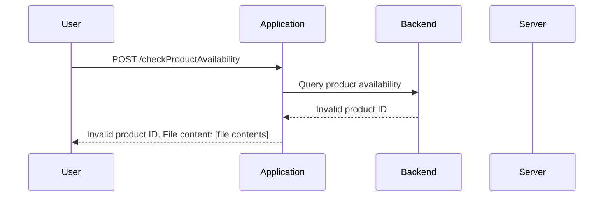

## Understanding the Lab Scenario

### The Lab Setup

In this lab, we will exploit an XXE vulnerability to retrieve the contents of a file on the server. The scenario involves a web application that accepts a product ID and a store ID as input parameters. The application then queries the backend to check the availability of the product at the specified store and returns the number of items in stock.

### The Vulnerability

The vulnerability arises because the application does not properly validate the input parameters, specifically the product ID. By injecting a malicious XML entity, we can trick the application into retrieving and displaying the contents of a file on the server.

### Step-by-Step Mechanics

1. **Identify the Input Parameters**: The application accepts `productID` and `storeID` as input parameters.
2. **Inject Malicious XML Entity**: Instead of providing a valid `productID`, we inject an XML entity that references an external resource.
3. **Trigger the Vulnerability**: The application processes the injected entity, leading to the retrieval of the file contents.

### Example Request and Response

Let's consider the following HTTP request:

```http
POST /checkProductAvailability HTTP/1.1
Host: vulnerableapp.com
Content-Type: application/xml

<request>
    <productId>&#x26;entity;</productId>
    <storeId>1</storeId>
</request>
```

Here, `&#x26;entity;` is a placeholder for the malicious XML entity.

The corresponding response might look like this:

```http
HTTP/1.1 200 OK
Content-Type: text/html

Invalid product ID. File content: [file contents]
```

### Mermaid Diagram: Attack Flow



---
<!-- nav -->
[[Web Security (PortSwigger)/08-XXE Injection/02-Lab 1 Exploiting XXE using external entities to retrieve files/10-Understanding XXE Injection|Understanding XXE Injection]] | [[Web Security (PortSwigger)/08-XXE Injection/02-Lab 1 Exploiting XXE using external entities to retrieve files/00-Overview|Overview]] | [[12-XXE Injection Attack Scenario|XXE Injection Attack Scenario]]
