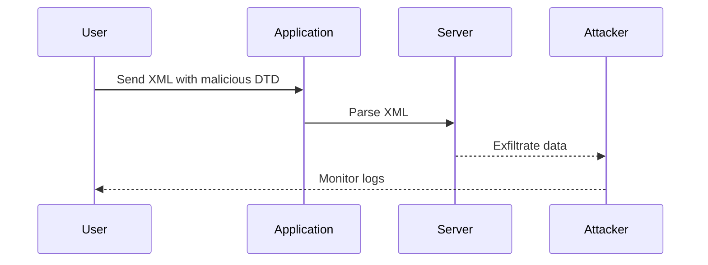

## Understanding External DTDs and XXE Injection

### What is an External DTD?

An **External Document Type Definition (DTD)** is a feature of XML that allows the definition of custom elements and attributes. An external DTD can be referenced in an XML document using a `DOCTYPE` declaration. This reference can point to an external resource, such as a URL, which can contain additional definitions and even executable commands.

```xml
<!DOCTYPE root [
    <!ENTITY xxe SYSTEM "http://example.com/dtd">
]>
```

In the above example, the `SYSTEM` keyword indicates that the entity `xxe` is defined by an external resource located at `http://example.com/dtd`.

### What is XXE Injection?

**XML External Entity (XXE) Injection** is a type of attack where an attacker can inject malicious content into an XML document that references an external DTD. This can lead to various security issues, including data exfiltration, denial of service, and remote code execution.

### Why Does XXE Matter?

XXE attacks are significant because they can exploit vulnerabilities in XML parsers that do not properly validate or sanitize input. This can result in unauthorized access to sensitive information or the ability to execute arbitrary commands on the server.

### How Does XXE Work Under the Hood?

When an XML parser encounters a reference to an external DTD, it fetches the DTD from the specified URL and processes it. If the DTD contains malicious content, such as a reference to a file on the server or a command to exfiltrate data, the parser may execute these commands.

#### Example of a Vulnerable XML Parser

Consider an XML parser that reads user input and processes it without proper validation:

```python
import xml.etree.ElementTree as ET

def parse_xml(xml_data):
    tree = ET.fromstring(xml_data)
    return tree

xml_data = '''
<!DOCTYPE root [
    <!ENTITY xxe SYSTEM "file:///etc/passwd">
]>
<root>&xxe;</root>
'''

parse_xml(xml_data)
```

In this example, the XML parser will attempt to read the `/etc/passwd` file and include its contents in the parsed XML.

### Real-World Examples of XXE Attacks

#### CVE-2018-11776: XXE in Apache Struts

Apache Struts is a popular Java framework for building web applications. In 2018, a critical vulnerability was discovered in Apache Struts that allowed attackers to perform XXE attacks. This vulnerability was exploited in several high-profile breaches.

#### CVE-2019-11510: XXE in Atlassian Confluence

Atlassian Confluence is a widely used collaboration tool. In 2019, a vulnerability was found that allowed attackers to perform XXE attacks, leading to data exfiltration and remote code execution.

### How to Exploit Blind XXE Using a Malicious External DTD

Blind XXE injection occurs when the attacker cannot directly observe the results of their attack but can infer them through other means, such as monitoring server logs.

#### Step-by-Step Exploitation Process

1. **Identify the Vulnerability**: Determine if the application is vulnerable to XXE by testing it with a simple payload.
   
2. **Craft the Payload**: Create an XML document that references an external DTD containing malicious content.

3. **Inject the Payload**: Submit the crafted XML document to the vulnerable application.

4. **Monitor the Results**: Observe the server logs to determine if the attack was successful.

#### Example Exploitation Scenario

Let's consider a scenario where an application accepts XML input and processes it without proper validation. We want to exfiltrate the contents of the `/etc/hostname` file.

1. **Identify the Vulnerability**:
   - Send a simple XXE payload to the application to confirm it is vulnerable.

2. **Craft the Payload**:
   - Create an XML document that references an external DTD.

```xml
<!DOCTYPE root [
    <!ENTITY xxe SYSTEM "file:///etc/hostname">
]>
<root>&xxe;</root>
```

3. **Inject the Payload**:
   - Submit the XML document to the application.

4. **Monitor the Results**:
   - Check the server logs to see if the contents of `/etc/hostname` were accessed.

### Full HTTP Request and Response Example

#### HTTP Request

```http
POST /process_xml HTTP/1.1
Host: vulnerable.example.com
Content-Type: application/xml

<!DOCTYPE root [
    <!ENTITY xxe SYSTEM "file:///etc/hostname">
]>
<root>&xxe;</root>
```

#### HTTP Response

```http
HTTP/1.1 200 OK
Date: Mon, 20 Mar 2023 12:00:00 GMT
Server: Apache/2.4.41 (Ubuntu)
Content-Length: 0
Content-Type: text/html; charset=UTF-8
```

### Common Pitfalls and Mistakes

1. **Improper Validation**: Failing to validate XML input can lead to XXE attacks.
2. **Disabling External Entities**: Not disabling external entities in the XML parser can expose the application to XXE attacks.
3. **Monitoring Logs**: Failing to monitor server logs can make it difficult to detect XXE attacks.

### How to Prevent / Defend Against XXE Injection

#### Detection

1. **Log Monitoring**: Regularly monitor server logs for suspicious activity.
2. **IDS/IPS**: Implement Intrusion Detection Systems (IDS) and Intrusion Prevention Systems (IPS) to detect and block XXE attacks.

#### Prevention

1. **Disable External Entities**: Configure the XML parser to disable external entities.
2. **Input Validation**: Validate all XML input to ensure it does not contain malicious content.
3. **Secure Coding Practices**: Follow secure coding practices to avoid introducing vulnerabilities.

#### Secure Coding Fixes

##### Vulnerable Code

```python
import xml.etree.ElementTree as ET

def parse_xml(xml_data):
    tree = ET.fromstring(xml_data)
    return tree

xml_data = '''
<!DOCTYPE root [
    <!ENTITY xxe SYSTEM "file:///etc/passwd">
]>
<root>&xxe;</root>
'''

parse_xml(xml_data)
```

##### Secure Code

```python
import defusedxml.ElementTree as ET

def parse_xml(xml_data):
    tree = ET.fromstring(xml_data)
    return tree

xml_data = '''
<!DOCTYPE root [
    <!ENTITY xxe SYSTEM "file:///etc/passwd">
]>
<root>&xxe;</root>
'''

parse_xml(xml_data)
```

In the secure code, we use `defusedxml.ElementTree`, which disables external entities by default.

### Configuration Hardening

#### XML Parser Configuration

Configure the XML parser to disable external entities:

```python
import defusedxml.ElementTree as ET

ET.XMLParser(dtd_validation=False, no_network=True)
```

### Mermaid Diagrams

#### Attack Chain Diagram



### Practice Labs

For hands-on practice with XXE injection, consider the following labs:

- **PortSwigger Web Security Academy**: Offers a comprehensive course on XXE injection.
- **OWASP Juice Shop**: A deliberately insecure web application for practicing web security techniques.
- **DVWA (Damn Vulnerable Web Application)**: A PHP/MySQL web application that demonstrates insecure coding practices.

These labs provide a safe environment to practice and understand XXE injection in depth.

### Conclusion

Understanding and preventing XXE injection is crucial for securing web applications. By following secure coding practices, validating input, and configuring XML parsers correctly, developers can mitigate the risks associated with XXE attacks. Regularly monitoring server logs and implementing IDS/IPS systems can help detect and respond to potential XXE attacks effectively.

---
<!-- nav -->
[[12-Setting Up the Environment|Setting Up the Environment]] | [[Web Security (PortSwigger)/08-XXE Injection/06-Lab 5 Exploiting blind XXE to exfiltrate data using a malicious external DTD/00-Overview|Overview]] | [[14-Understanding XML External Entities|Understanding XML External Entities]]
