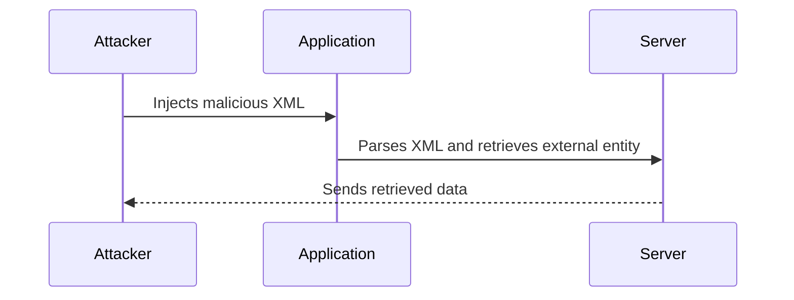

## XXE Injection Overview

### What is XXE Injection?

XXE stands for XML External Entity Injection, a type of attack that exploits vulnerabilities in the way an application processes XML input. This attack can lead to unauthorized access to sensitive information, denial of service, server-side request forgery (SSRF), and other malicious activities. The core issue arises when an application parses untrusted XML input without proper validation or sanitization, allowing an attacker to inject malicious XML entities.

### Why Does XXE Matter?

XXE attacks are significant because they can expose sensitive data, such as files on the server, internal network details, and even credentials. They can also be used to perform SSRF attacks, where an attacker tricks the server into making HTTP requests to internal services, potentially leading to further exploitation.

### How Does XXE Work?

At its core, XXE relies on the fact that many XML parsers support external entities, which are references to external resources. An attacker can craft a specially designed XML document that includes these external entities, causing the parser to fetch and process data from unintended sources.

### Real-World Examples

One notable example of an XXE attack is CVE-2018-11776, which affected the popular Java library Apache Struts. This vulnerability allowed attackers to execute arbitrary commands on the server by injecting malicious XML data. Another example is CVE-2019-11510, which affected the Jenkins CI server, allowing attackers to read arbitrary files on the server.

### XXE Attack Chain

To understand the attack chain, consider the following steps:

1. **Input Injection**: The attacker injects a specially crafted XML document into the application.
2. **XML Parsing**: The application parses the XML document, including any external entities.
3. **Data Retrieval**: The XML parser retrieves data from the specified external entity, often leading to unauthorized access to sensitive information.

---
<!-- nav -->
[[Web Security (PortSwigger)/08-XXE Injection/08-Lab 7 Exploiting XInclude to retrieve files/01-Introduction to XXE Injection|Introduction to XXE Injection]] | [[Web Security (PortSwigger)/08-XXE Injection/08-Lab 7 Exploiting XInclude to retrieve files/00-Overview|Overview]] | [[03-Exploiting XXE with XInclude|Exploiting XXE with XInclude]]
