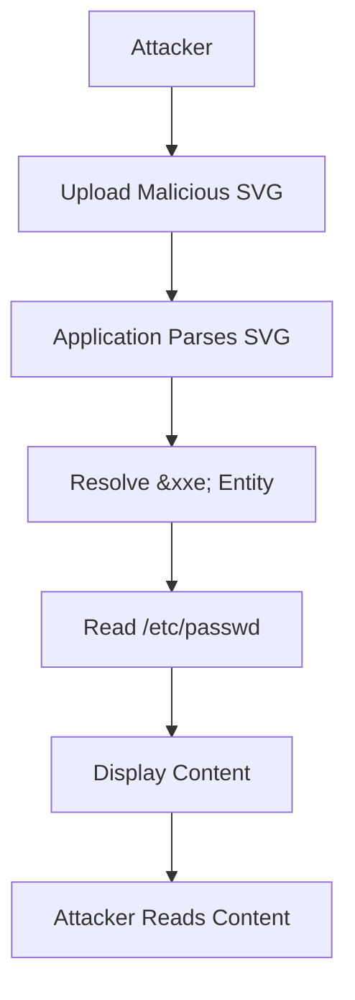

## Additional Depth and Variations

### Background Theory

#### XML Parsing and Processing

XML parsing involves reading an XML document and converting it into a structured format that can be processed by the application. XML processors typically use a Document Object Model (DOM) or a Simple API for XML (SAX) to parse and process XML documents.

#### XML Schema and DTD

XML Schema and DTD are used to define the structure and constraints of an XML document. A schema provides a more powerful and flexible way to define XML structures, while a DTD is simpler but less expressive.

### Recent Real-World Examples

#### CVE-2021-21972

CVE-2021-21972 affected the Jenkins Continuous Integration server. This vulnerability allowed attackers to exploit XXE injection to read sensitive files and perform SSRF attacks.

#### CVE-2022-22965

CVE-2022-22965 affected the Oracle WebLogic server. This vulnerability allowed attackers to exploit XXE injection to read sensitive files and perform SSRF attacks.

### Complete Code Examples

#### Vulnerable Code

```python
import xml.etree.ElementTree as ET

def process_svg(svg_content):
    tree = ET.fromstring(svg_content)
    # Process the SVG content
    return tree
```

#### Malicious Input

```xml
<?xml version="1.0" standalone="yes"?>
<!DOCTYPE test [
<!ENTITY xxe SYSTEM "file:///etc/passwd">
]>
<svg xmlns="http://www.w3.org/2000/svg" version="1.1" width="128" height="128">
  <text x="0" y="16" font-size="16">&xxe;</text>
</svg>
```

#### Secure Code

```python
from lxml import etree

def process_svg(svg_content):
    parser = etree.XMLParser(resolve_entities=False)
    tree = etree.fromstring(svg_content, parser=parser)
    # Process the SVG content
    return tree
```

### Mermaid Diagrams

#### XXE Injection Attack Chain



### Hands-On Labs

#### PortSwigger Web Security Academy

PortSwigger Web Security Academy offers a comprehensive lab on XXE injection. This lab guides you through the process of identifying and exploiting XXE vulnerabilities in a web application.

#### OWASP Juice Shop

OWASP Juice Shop is another excellent resource for practicing XXE injection. It includes several challenges that involve exploiting XML parsing vulnerabilities.

### Conclusion

XXE injection is a critical vulnerability that can have severe consequences if not properly mitigated. By understanding the underlying mechanisms and implementing robust security measures, you can protect your applications from such attacks. Always ensure that XML input is properly validated and that external entity resolution is disabled to prevent XXE injection.

---
<!-- nav -->
[[Web Security (PortSwigger)/08-XXE Injection/09-Lab 8 Exploiting XXE via image file upload/01-Introduction to XXE Injection|Introduction to XXE Injection]] | [[Web Security (PortSwigger)/08-XXE Injection/09-Lab 8 Exploiting XXE via image file upload/00-Overview|Overview]] | [[03-Detailed Explanation of the Lab Exercise|Detailed Explanation of the Lab Exercise]]
