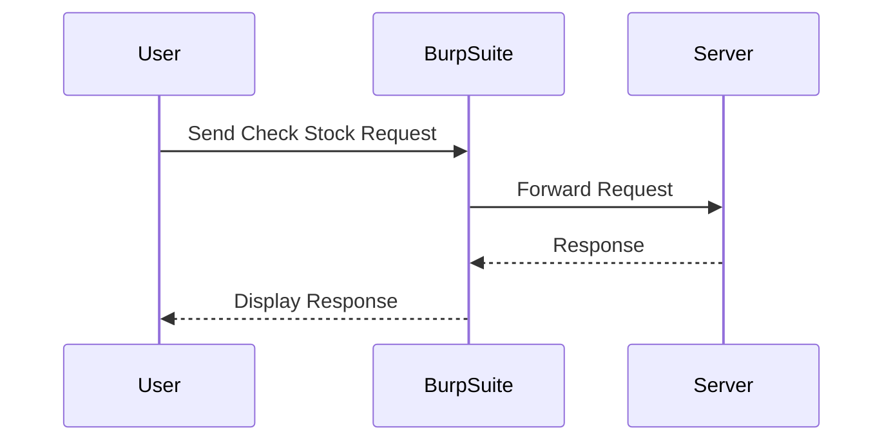

## Lab Setup and Initial Exploration

### Accessing the Lab Environment

To begin the lab, we will use Burp Suite, a popular tool for web application security testing. We will access the lab through the built-in browser in Burp Suite, ensuring that all our requests are intercepted by the Burp Proxy.

#### Step-by-Step Instructions

1. **Start Burp Suite**: Launch Burp Suite and ensure it is configured to intercept traffic.
2. **Access the Lab**: Open the built-in browser in Burp Suite and navigate to the lab environment.
3. **Intercept Requests**: Ensure that Burp Suite is set to intercept all HTTP requests.

### Identifying XML Input Parameters

The first step in exploiting an XXE vulnerability is to identify parameters in the application that accept XML input. Let's explore the application to find such parameters.

#### Exploring the Application

1. **Click on View Details**: Navigate to the section where XML input is accepted.
2. **Select Check Stock**: Click on the "Check Stock" option to send a request to the server.

#### Analyzing the Request

Once we have sent the request, we can analyze it in Burp Suite.



#### Inspecting the Request in Repeater

1. **Send Request to Repeater**: Right-click on the request and select "Send to Repeater".
2. **Analyze the Request**: In the Repeater tab, we can see that the request is a POST request to the `/product/stock` endpoint.

```http
POST /product/stock HTTP/1.1
Host: vulnerable-app.example.com
Content-Type: application/xml
Content-Length: 114

<?xml version="1.0"?>
<stockCheck>
  <productId>1</productId>
  <storeId>2</storeId>
</stockCheck>
```

### Understanding the XML Structure

The XML structure in the request includes two elements: `productId` and `storeId`. To exploit an XXE vulnerability, we need to modify this XML structure to include an external entity.

---
<!-- nav -->
[[09-Lab Setup Exploiting XXE to Retrieve Data|Lab Setup Exploiting XXE to Retrieve Data]] | [[Web Security (PortSwigger)/08-XXE Injection/10-Lab 9 Exploiting XXE to retrieve data by repurposing a local DTD/00-Overview|Overview]] | [[Web Security (PortSwigger)/08-XXE Injection/10-Lab 9 Exploiting XXE to retrieve data by repurposing a local DTD/11-Practice Labs|Practice Labs]]
