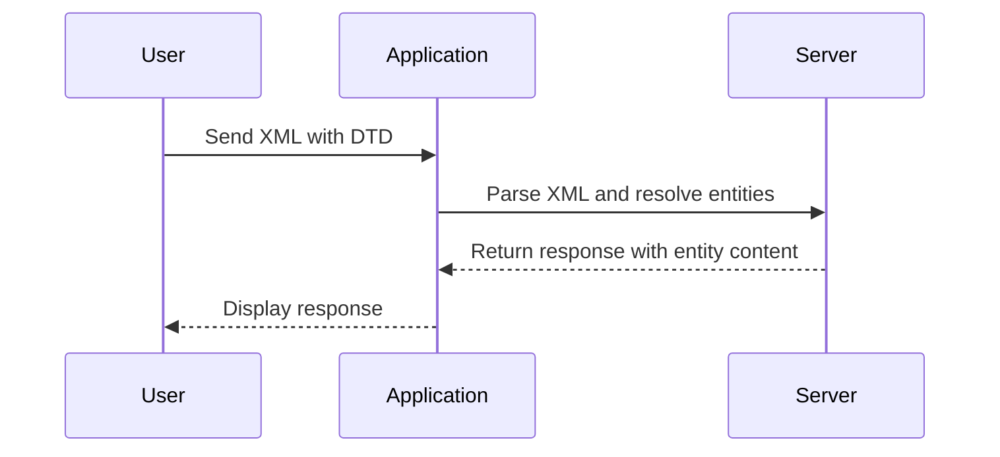

## Conclusion

XXE injection is a serious security vulnerability that can lead to severe consequences if not properly mitigated. By understanding the mechanics of XXE attacks, testing for vulnerabilities, and implementing secure coding practices and configuration hardening, you can significantly reduce the risk of XXE injection in your applications.

### Practice Labs

For hands-on practice with XXE injection, consider the following labs:

- **PortSwigger Web Security Academy**: Offers a comprehensive XXE injection lab.
- **OWASP Juice Shop**: Includes XXE injection challenges.
- **DVWA**: Provides a variety of web application security labs, including XXE injection.

By engaging with these labs, you can gain practical experience in identifying and mitigating XXE vulnerabilities.

This diagram illustrates the flow of an XXE injection attack, showing how the user sends an XML document with a DTD, the application parses it, and the server returns the content of the resolved entity.

By thoroughly understanding and practicing the concepts covered in this chapter, you will be well-equipped to defend against XXE injection attacks and ensure the security of your applications.

---
<!-- nav -->
[[18-XXE Injection Exploiting Vulnerabilities to Retrieve Data Using Local DTD Repurposing|XXE Injection Exploiting Vulnerabilities to Retrieve Data Using Local DTD Repurposing]] | [[Web Security (PortSwigger)/08-XXE Injection/10-Lab 9 Exploiting XXE to retrieve data by repurposing a local DTD/00-Overview|Overview]] | [[Web Security (PortSwigger)/08-XXE Injection/10-Lab 9 Exploiting XXE to retrieve data by repurposing a local DTD/20-Practice Questions & Answers|Practice Questions & Answers]]
