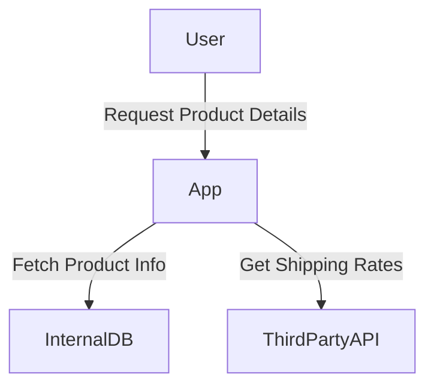

## Introduction to Server-Side Request Forgery (SSRF)

Server-Side Request Forgery (SSRF) is a type of web security vulnerability that allows an attacker to induce the server-side application to make HTTP requests to an arbitrary domain of the attacker’s choosing. This can lead to unauthorized data exfiltration, internal network reconnaissance, and exploitation of other vulnerabilities within the internal network. Understanding SSRF requires a deep dive into the architecture of web applications and the trust relationships between different components.

### Background Theory

To fully grasp SSRF, it is essential to understand the architecture of a typical web application and the interactions between various components. Consider a scenario where a web application is hosted on an internal network that is protected by a firewall. The application itself is public-facing, allowing users from the internet to access it and perform actions such as shopping online.

#### Modern Complex Application Architecture

A modern complex application often relies on other services to implement certain functionalities. These services can be either internal to the organization's network or external to it, such as third-party cloud systems. For instance:

- **Internal Services**: These could include databases, microservices, or other backend systems that are hosted within the organization's network.
- **External Services**: These might include third-party APIs, cloud storage services, or other external resources.

The application acts as a mediator between the user and these services. For security reasons, the only software allowed to communicate with these services is the application itself. This means that if a user attempts to communicate directly with an internal service or an external third-party system, the connection will be denied due to the firewall and network policies.

### Trust Relationships

The key concept in SSRF is the trust relationship between the application and the services it interacts with. There are two main types of trust relationships:

1. **Application to Internal Services**: The application trusts the internal services and can communicate with them freely.
2. **Application to External Services**: The application also trusts certain external services and can make requests to them.

These trust relationships are crucial because they allow the application to function correctly. However, they also introduce potential vulnerabilities if not properly managed.

### Example Scenario

Let's illustrate this with a concrete example. Suppose we have a shopping application that allows users to view product details. The application fetches product information from an internal database and also retrieves shipping rates from an external third-party API.



In this scenario, the application is responsible for making requests to both the internal database and the third-party API. The application trusts these services and can communicate with them without restrictions.

### Why SSRF Matters

SSRF vulnerabilities arise when an attacker can manipulate the application to make unintended HTTP requests to arbitrary domains. This can lead to several serious consequences:

1. **Data Exfiltration**: An attacker can trick the application into fetching sensitive data from internal servers or other restricted resources.
2. **Network Reconnaissance**: By inducing the application to make requests to various internal IP addresses, an attacker can map out the internal network topology.
3. **Exploiting Other Vulnerabilities**: Once an attacker has access to internal resources, they can potentially exploit other vulnerabilities within the network.

### Real-World Examples

Several high-profile breaches have been attributed to SSRF vulnerabilities. Here are a couple of recent examples:

1. **CVE-2021-21972**: This vulnerability was found in the Jenkins CI/CD platform. An attacker could exploit this vulnerability to read arbitrary files from the Jenkins master node, leading to potential data exfiltration and further exploitation.
   
   ```mermaid
graph TD
       Attacker -->|Exploit SSRF| Jenkins
       Jenkins -->|Read Files| MasterNode
```

2. **CVE-2021-21974**: Another vulnerability in Jenkins allowed attackers to execute arbitrary commands on the Jenkins master node by exploiting SSRF. This could lead to full compromise of the Jenkins environment.

   ```mermaid
graph TD
       Attacker -->|Exploit SSRF| Jenkins
       Jenkins -->|Execute Commands| MasterNode
```

### How SSRF Works Under the Hood

To understand how SSRF works, let's break down the steps involved in an SSRF attack:

1. **User Input**: The attacker manipulates user input to control the destination of the HTTP request made by the application.
2. **Application Processing**: The application processes the user input and constructs an HTTP request to the specified destination.
3. **HTTP Request**: The application sends the HTTP request to the specified destination, which could be an internal server or an external resource.
4. **Response Handling**: The application receives the response from the destination and processes it accordingly.

### Common Mistakes and Pitfalls

Developers often fall into common traps that can lead to SSRF vulnerabilities. Some of these include:

1. **Unvalidated User Input**: Failing to validate and sanitize user input that is used to construct HTTP requests.
2. **Hardcoded Trust Relationships**: Assuming that certain services are always trustworthy without proper validation.
3. **Inadequate Network Segmentation**: Not properly segmenting the network to isolate internal services from external access.

### How to Prevent / Defend Against SSRF

Preventing SSRF requires a combination of secure coding practices, network segmentation, and proper validation of user input. Here are some key strategies:

1. **Validate and Sanitize User Input**: Ensure that any user input used to construct HTTP requests is properly validated and sanitized. This includes checking for valid domain names, IP addresses, and port numbers.

   ```python
   import re

   def validate_url(url):
       # Regular expression to match a valid URL
       url_pattern = re.compile(
           r'^https?://'  # http:// or https://
           r'(?:(?:[A-Z0-9](?:[A-Z0-9-]{0,61}[A-Z0-9])?\.)+[A-Z]{2,6}\.?|'  # domain...
           r'localhost|'  # localhost...
           r'\d{1,3}\.\d{1,3}\.\d{1,3}\.\d{1,3})'  # ...or ip
           r'(?::\d+)?'  # optional port
           r'(?:/?|[/?]\S+)$', re.IGNORECASE)
       return bool(url_pattern.match(url))

   # Example usage
   url = "http://example.com"
   if validate_url(url):
       print("Valid URL")
   else:
       print("Invalid URL")
   ```

2. **Whitelist Approved Domains**: Maintain a whitelist of approved domains that the application is allowed to communicate with. Any attempt to communicate with a domain outside this whitelist should be blocked.

   ```python
   approved_domains = ["example.com", "api.example.com"]

   def is_approved_domain(url):
       parsed_url = urlparse(url)
       return parsed_url.netloc in approved_domains

   # Example usage
   url = "http://example.com"
   if is_approved_domain(url):
       print("Approved domain")
   else:
       print("Unauthorized domain")
   ```

3. **Network Segmentation**: Properly segment the network to isolate internal services from external access. This can be achieved using firewalls, VLANs, and other network security measures.

   ```mermaid
graph TD
       PublicFacingApp -->|Allowed Traffic| InternalServices
       PublicFacingApp -->|Blocked Traffic| ExternalNetwork
```

4. **Use Secure Libraries and Frameworks**: Utilize libraries and frameworks that provide built-in protections against SSRF. For example, many modern web frameworks offer mechanisms to validate and sanitize user input.

### Detection and Monitoring

Detecting SSRF vulnerabilities requires a combination of static analysis, dynamic testing, and continuous monitoring. Here are some techniques:

1. **Static Analysis**: Use tools like SonarQube, Fortify, or Veracode to scan the codebase for potential SSRF vulnerabilities.
2. **Dynamic Testing**: Perform penetration testing and fuzz testing to identify runtime vulnerabilities.
3. **Continuous Monitoring**: Implement logging and monitoring solutions to detect unusual HTTP requests and network traffic patterns.

### Secure Coding Practices

Secure coding practices are essential to prevent SSRF vulnerabilities. Here are some guidelines:

1. **Avoid Direct User Input in HTTP Requests**: Do not use user input directly to construct HTTP requests. Instead, use predefined constants or whitelisted values.
2. **Use Secure Libraries**: Leverage secure libraries and frameworks that provide built-in protections against SSRF.
3. **Implement Input Validation**: Always validate and sanitize user input to ensure it conforms to expected formats and values.

### Conclusion

Server-Side Request Forgery (SSRF) is a critical web security vulnerability that can lead to severe consequences if not properly managed. By understanding the underlying architecture, trust relationships, and common pitfalls, developers can implement robust defenses against SSRF attacks. Secure coding practices, network segmentation, and continuous monitoring are key to preventing and detecting SSRF vulnerabilities.

### Hands-On Practice Labs

For hands-on practice with SSRF vulnerabilities, consider the following labs:

- **PortSwigger Web Security Academy**: Offers comprehensive modules on SSRF and other web security topics.
- **OWASP Juice Shop**: A deliberately insecure web application for practicing web security skills.
- **DVWA (Damn Vulnerable Web Application)**: A PHP/MySQL web application that contains numerous security vulnerabilities.

By engaging with these labs, you can gain practical experience in identifying and mitigating SSRF vulnerabilities.

---
<!-- nav -->
[[Web Security (PortSwigger)/09-Server-Side Request Forgery (SSRF)/01-Server Side Request Forgery SSRF Complete Guide/00-Overview|Overview]] | [[02-What is an SSRF Vulnerability|What is an SSRF Vulnerability]]
