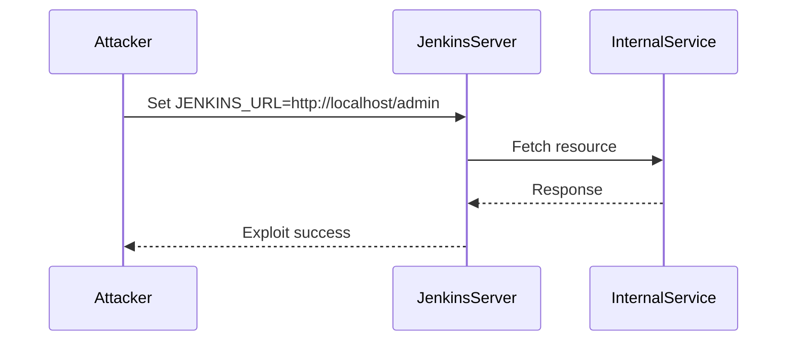
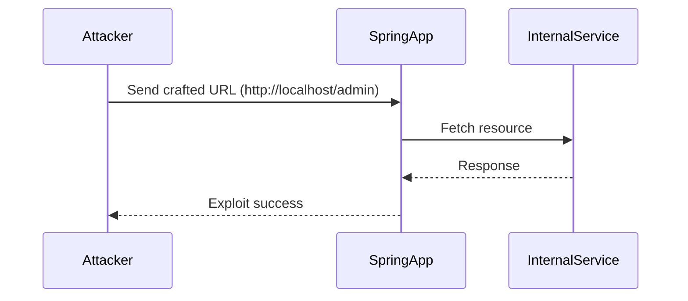

## Background Theory

### Network Segmentation and Internal Services

Network segmentation is a security practice where a network is divided into smaller segments to limit the spread of attacks and control access to sensitive resources. Internal services, such as administrative panels, databases, and monitoring tools, are often placed behind these segments to protect them from external threats.

However, if an application running on the same network segment has an SSRF vulnerability, an attacker can bypass the segmentation and access these internal services.

### Loopback Interface and Localhost

The loopback interface (`127.0.0.1` or `localhost`) is a special network interface that allows a computer to communicate with itself. Many applications use the loopback interface to access internal services without exposing them to the external network.

Developers often assume that only authenticated users can access the loopback interface, leading to the omission of additional authentication mechanisms for internal services. This assumption can be exploited through SSRF.

### Real-World Examples

#### CVE-2021-21972: Jenkins Pipeline Plugin SSRF

In 2021, a critical SSRF vulnerability was discovered in the Jenkins Pipeline plugin. The vulnerability allowed attackers to execute arbitrary commands on the Jenkins server by manipulating the `JENKINS_URL` environment variable.

**CVE Details:**
- **CVE ID:** CVE-2021-21972
- **Description:** Improper validation of the `JENKINS_URL` environment variable in the Jenkins Pipeline plugin.
- **Impact:** Attackers could execute arbitrary commands on the Jenkins server.

**Exploit Example:**

**Detection and Prevention:**

- **Detection:** Monitor for unusual activity on the loopback interface and internal services.
- **Prevention:** Validate and sanitize all user inputs used in requests. Implement strict access controls and network segmentation.

#### CVE-2022-22965: Spring Framework SSRF

In 2022, a SSRF vulnerability was found in the Spring Framework, affecting applications using the `RestTemplate` class. The vulnerability allowed attackers to send requests to arbitrary URLs, including internal services.

**CVE Details:**
- **CVE ID:** CVE-2022-22965
- **Description:** Improper validation of URLs in the `RestTemplate` class in the Spring Framework.
- **Impact:** Attackers could send requests to arbitrary URLs, including internal services.

**Exploit Example:**

**Detection and Prevention:**

- **Detection:** Monitor for unexpected outbound requests from the application.
- **Prevention:** Validate and sanitize all URLs used in requests. Implement strict access controls and network segmentation.

---
<!-- nav -->
[[03-Avoiding Raw Responses to Clients|Avoiding Raw Responses to Clients]] | [[Web Security (PortSwigger)/09-Server-Side Request Forgery (SSRF)/01-Server Side Request Forgery SSRF Complete Guide/00-Overview|Overview]] | [[05-Detailed Mechanics of SSRF|Detailed Mechanics of SSRF]]
