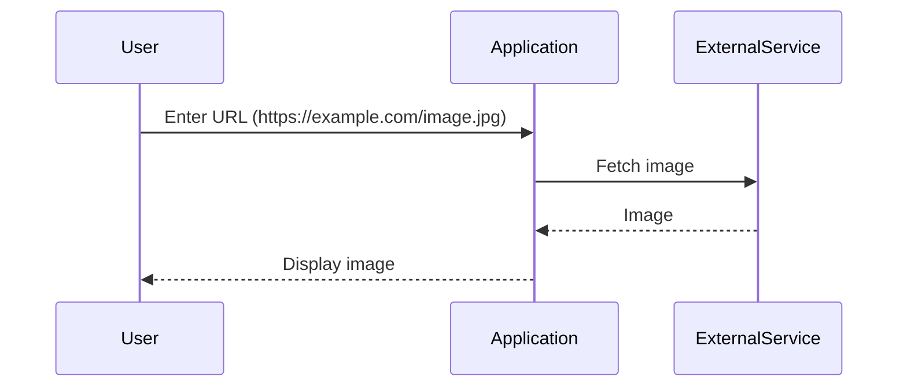

## Detailed Mechanics of SSRF

### Arbitrary URL Requests

One of the most common forms of SSRF occurs when an application allows users to supply arbitrary URLs. This can happen in various scenarios, such as fetching images, downloading files, or making API calls.

#### Example: Image Fetching Feature

Consider an application with a feature that allows users to fetch images from external sources. The application might have a form where users can enter a URL, and the application will fetch the image from that URL and display it.



If the application does not validate the URL, an attacker can provide a URL pointing to an internal service, such as `http://localhost/admin`.

#### Vulnerable Code Example

```python
# Vulnerable code example
def fetch_image(url):
    response = requests.get(url)
    return response.content

url = input("Enter the URL of the image: ")
image_data = fetch_image(url)
print(image_data)
```

In this example, the `fetch_image` function takes a URL as input and fetches the image from that URL. If the URL is not validated, an attacker can provide a URL pointing to an internal service.

#### Secure Code Example

To prevent SSRF, the application should validate and sanitize the URL before using it in a request.

```python
# Secure code example
import re

def fetch_image(url):
    if not re.match(r'^https://', url):
        raise ValueError("Invalid URL")
    response = requests.get(url)
    return response.content

url = input("Enter the URL of the image: ")
try:
    image_data = fetch_image(url)
    print(image_data)
except ValueError as e:
    print(e)
```

In this secure example, the `fetch_image` function checks if the URL starts with `https://` before making the request. This ensures that only HTTPS URLs are allowed, preventing SSRF.

### HTTP Headers and Responses

When dealing with SSRF, it is important to understand the HTTP headers and responses involved in the request and response cycle.

#### HTTP Request Example

```http
GET http://localhost/admin HTTP/1.1
Host: localhost
User-Agent: Mozilla/5.0
Accept: */*
```

In this example, the attacker crafts a request to the `http://localhost/admin` endpoint. The `Host` header specifies the target host, and the `User-Agent` header identifies the client making the request.

#### HTTP Response Example

```http
HTTP/1.1 200 OK
Date: Mon, 23 Jan 2023 12:00:00 GMT
Server: Apache/2.4.41 (Ubuntu)
Content-Type: text/html; charset=UTF-8
Content-Length: 1234

<!DOCTYPE html>
<html>
<head>
    <title>Admin Panel</title>
</head>
<body>
    <!-- Admin panel content -->
</body>
</html>
```

In this example, the server responds with a `200 OK` status code, indicating that the request was successful. The `Content-Type` header specifies the type of content being returned, and the `Content-Length` header indicates the length of the response body.

### Common Pitfalls and Mistakes

#### Lack of Validation and Sanitization

One of the most common mistakes in SSRF vulnerabilities is the lack of proper validation and sanitization of user inputs. Developers often assume that certain inputs are safe, leading to vulnerabilities.

#### Trusting Internal Services

Another common mistake is trusting internal services and assuming that they are secure. Internal services should be treated with the same level of security as external services, and proper access controls should be implemented.

#### Overlooking Loopback Interface

Many developers overlook the loopback interface (`127.0.0.1` or `localhost`) and assume that it is secure. However, if an application running on the same network segment has an SSRF vulnerability, an attacker can bypass the segmentation and access internal services.

### How to Prevent / Defend Against SSRF

#### Detection

To detect SSRF vulnerabilities, organizations should implement monitoring and logging mechanisms to track unusual activity on the loopback interface and internal services. This can help identify potential SSRF attacks and take appropriate action.

#### Prevention

To prevent SSRF vulnerabilities, organizations should implement the following measures:

1. **Validate and Sanitize Inputs**: Ensure that all user inputs used in requests are properly validated and sanitized. This includes validating URLs, IP addresses, and other inputs used in requests.
2. **Implement Access Controls**: Implement strict access controls and network segmentation to limit access to internal services. This can help prevent unauthorized access to sensitive resources.
3. **Use Secure Coding Practices**: Follow secure coding practices to prevent SSRF vulnerabilities. This includes validating and sanitizing inputs, implementing access controls, and using secure libraries and frameworks.

#### Secure-Coding Fixes

To demonstrate secure-coding fixes, let's consider the previous example of fetching images from external sources.

##### Vulnerable Code

```python
# Vulnerable code example
def fetch_image(url):
    response = requests.get(url)
    return response.content

url = input("Enter the URL of the image: ")
image_data = fetch_image(url)
print(image_data)
```

##### Secure Code

```python
# Secure code example
import re

def fetch_image(url):
    if not re.match(r'^https://', url):
        raise ValueError("Invalid URL")
    response = requests.get(url)
    return response.content

url = input("Enter the URL of the image: ")
try:
    image_data = fetch_image(url)
    print(image_data)
except ValueError as e:
    print(e)
```

In this secure example, the `fetch_image` function checks if the URL starts with `https://` before making the request. This ensures that only HTTPS URLs are allowed, preventing SSRF.

#### Configuration Hardening

To further harden the application against SSRF vulnerabilities, organizations should implement the following configuration hardening measures:

1. **Disable Unnecessary Features**: Disable unnecessary features and services that are not required for the application to function. This can help reduce the attack surface and prevent SSRF vulnerabilities.
2. **Use Secure Libraries and Frameworks**: Use secure libraries and frameworks that have been audited and tested for security vulnerabilities. This can help prevent SSRF vulnerabilities and other security issues.
3. **Implement Rate Limiting**: Implement rate limiting to prevent abuse of the application. This can help prevent SSRF attacks and other types of abuse.

### Complete Example: Full HTTP Request and Response

To demonstrate a complete example of an SSRF attack, let's consider the previous example of fetching images from external sources.

#### Vulnerable Application

```python
# Vulnerable application
import requests

def fetch_image(url):
    response = requests.get(url)
    return response.content

url = input("Enter the URL of the image: ")
image_data = fetch_image(url)
print(image_data)
```

#### Attacker's Request

```http
GET http://localhost/admin HTTP/1.1
Host: localhost
User-Agent: Mozilla/5.0
Accept: */*
```

#### Server's Response

```http
HTTP/1.1 200 OK
Date: Mon, 23 Jan 2023 12:00:00 GMT
Server: Apache/2.4.41 (Ubuntu)
Content-Type: text/html; charset=UTF-8
Content-Length: 1234

<!DOCTYPE html>
<html>
<head>
    <title>Admin Panel</title>
</head>
<body>
    <!-- Admin panel content -->
</body>
</html>
```

#### Expected Result

The attacker successfully accesses the admin panel and retrieves sensitive information.

#### Secure Application

```python
# Secure application
import re
import requests

def fetch_image(url):
    if not re.match(r'^https://', url):
        raise ValueError("Invalid URL")
    response = requests.get(url)
    return response.content

url = input("Enter the URL of the image: ")
try:
    image_data = fetch_image(url)
    print(image_data)
except ValueError as e:
    print(e)
```

#### Attacker's Request

```http
GET http://localhost/admin HTTP/1.1
Host: localhost
User-Agent: Mozilla/5.0
Accept: */*
```

#### Server's Response

```http
HTTP/1.1 400 Bad Request
Date: Mon, 23 Jan 2023 12:00:00 GMT
Server: Apache/2.4.41 (Ubuntu)
Content-Type: text/plain; charset=UTF-8
Content-Length: 20

Invalid URL
```

#### Expected Result

The attacker receives a `400 Bad Request` response, indicating that the URL is invalid.

### Practice Labs

To practice and gain hands-on experience with SSRF vulnerabilities, consider the following well-known labs:

- **PortSwigger Web Security Academy**: Offers a comprehensive SSRF module with interactive challenges and detailed explanations.
- **OWASP Juice Shop**: A deliberately insecure web application that includes SSRF vulnerabilities for educational purposes.
- **DVWA (Damn Vulnerable Web Application)**: A PHP/MySQL web application that includes various vulnerabilities, including SSRF.
- **WebGoat**: A deliberately insecure Java web application designed to teach web application security lessons.

These labs provide a safe environment to practice and learn about SSRF vulnerabilities and how to prevent them.

---
<!-- nav -->
[[Web Security (PortSwigger)/09-Server-Side Request Forgery (SSRF)/01-Server Side Request Forgery SSRF Complete Guide/04-Background Theory|Background Theory]] | [[Web Security (PortSwigger)/09-Server-Side Request Forgery (SSRF)/01-Server Side Request Forgery SSRF Complete Guide/00-Overview|Overview]] | [[06-Enforcing URL Schema, Port, and Destination with a Positive Allow List|Enforcing URL Schema, Port, and Destination with a Positive Allow List]]
