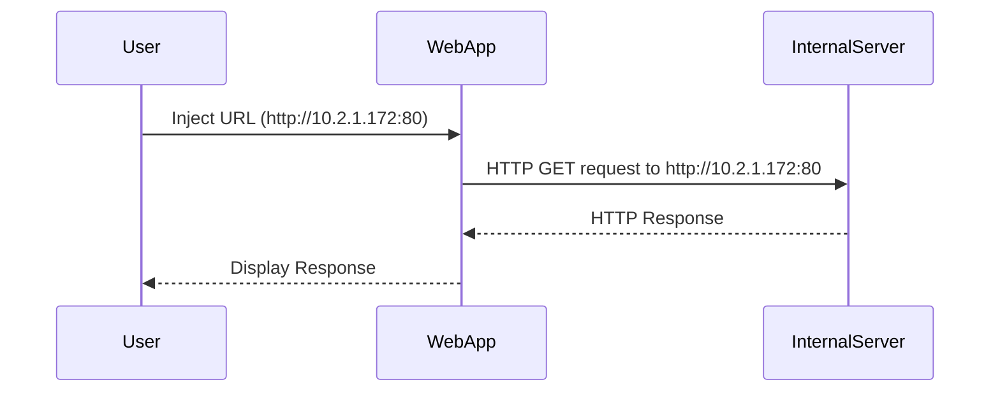

## Port Scanning with SSRF

One of the most common uses of SSRF vulnerabilities is to perform port scanning on the internal network. By inducing the server to make HTTP requests to different ports on internal IP addresses, an attacker can determine which servers are up and what services are running on those servers.

### Steps to Perform Port Scanning with SSRF

1. **Identify the Vulnerable Application**: Find a web application that uses user-supplied input to construct URLs for HTTP requests.
2. **Inject Internal IP Addresses**: Inject internal IP addresses into the URL to induce the server to make requests to those IP addresses.
3. **Monitor Responses**: Monitor the responses to determine which ports are open and which services are running.

#### Example of Port Scanning with SSRF

Suppose we have a web application that allows users to fetch data from an external API using a URL provided by the user. The application constructs the URL as follows:

```python
def fetch_data(url):
    response = requests.get(url)
    return response.text
```

An attacker can inject an internal IP address and port number into the URL to perform port scanning. For example, the attacker can inject `http://10.2.1.172:80`.

The server will then make an HTTP request to `http://10.2.1.172:80`, and the response will indicate whether the port is open and what service is running on that port.

### Real-World Example of Port Scanning with SSRF

In the case of the ColdFusion application mentioned in the lecture, an attacker can use SSRF to scan the internal network for servers running on Port 80 or Port 443. By injecting internal IP addresses into the URL, the server will make HTTP requests to those IP addresses, and the responses will indicate which servers are up and what services are running on those servers.

For example, the attacker can inject `http://10.2.1.172:80` into the URL, and the server will make an HTTP request to `http://10.2.1.172:80`. If the server responds with a valid HTTP response, it indicates that the server is up and running on Port 80.

### Mermaid Diagram of Port Scanning with SSRF



This diagram illustrates the process of port scanning with SSRF, where the user injects an internal IP address into the URL, the web application makes an HTTP request to that IP address, and the internal server responds with an HTTP response.

---
<!-- nav -->
[[11-How to Prevent  Defend Against SSRF|How to Prevent  Defend Against SSRF]] | [[Web Security (PortSwigger)/09-Server-Side Request Forgery (SSRF)/01-Server Side Request Forgery SSRF Complete Guide/00-Overview|Overview]] | [[13-Preventing and Mitigating SSRF Attacks|Preventing and Mitigating SSRF Attacks]]
