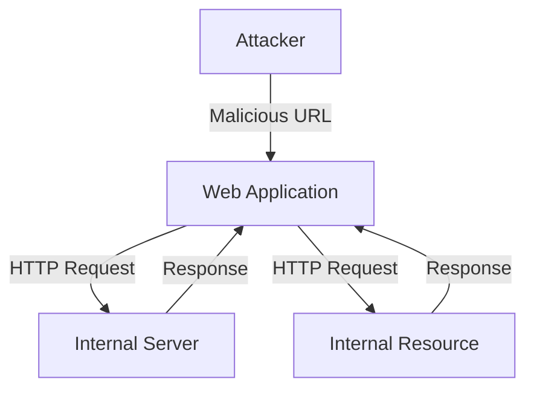
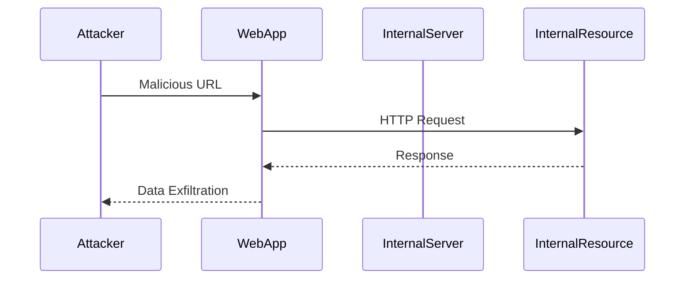

## Understanding Server-Side Request Forgery (SSRF)

### What is SSRF?

Server-Side Request Forgery (SSRF) is a type of web security vulnerability that allows an attacker to induce the server-side application to make HTTP requests to an arbitrary domain of the attacker's choosing. This can lead to unauthorized access to internal systems, data exfiltration, and other malicious activities. SSRF attacks occur when an application uses user-supplied input to construct URLs or other network requests without proper validation or sanitization.

### Why Does SSRF Matter?

SSRF matters because it can be used to bypass network segmentation and access resources that are not intended to be accessible from the internet. This can lead to significant security risks, such as:

- **Data Exfiltration**: An attacker can use SSRF to read sensitive files or databases that are located on internal servers.
- **Internal Network Reconnaissance**: An attacker can use SSRF to scan internal networks and discover services that are not exposed to the public internet.
- **Exploiting Internal Vulnerabilities**: An attacker can use SSRF to exploit vulnerabilities in internal systems that are not protected by external firewalls.

### How Does SSRF Work?

To understand how SSRF works, consider a scenario where a web application allows users to specify a URL to fetch data from. If the application does not properly validate the URL, an attacker can manipulate the URL to point to internal resources, such as `http://localhost` or `http://192.168.1.1`.

#### Example Scenario

Suppose a web application has a feature that allows users to check the status of a product by providing a URL to an inventory service. The application might have a function like this:

```python
def check_product_status(url):
    response = requests.get(url)
    return response.text
```

If an attacker can control the `url` parameter, they can inject a URL that points to an internal resource. For example, an attacker might provide the following URL:

```
http://localhost/admin/settings
```

This would cause the server to make a request to the local admin settings page, potentially exposing sensitive information.

### Real-World Examples

#### CVE-2021-21972: Jenkins Pipeline Plugin SSRF

In 2021, a critical SSRF vulnerability was discovered in the Jenkins Pipeline plugin (CVE-2021-21972). The vulnerability allowed attackers to craft malicious Jenkinsfiles that would cause the Jenkins server to make HTTP requests to arbitrary URLs. This could be used to read sensitive files, perform reconnaissance on the internal network, or even execute commands on the server.

#### CVE-2022-22965: Spring Framework SSRF

Another notable example is CVE-2022-22965, which affected the Spring Framework. This vulnerability allowed attackers to exploit SSRF by manipulating HTTP headers in a way that caused the server to make requests to internal resources. This could be used to read sensitive files or perform other malicious actions.

### Common Pitfalls

When dealing with SSRF, there are several common pitfalls that developers should be aware of:

1. **Improper Input Validation**: Failing to validate user-supplied input can allow attackers to inject malicious URLs.
2. **Using User Input Directly**: Using user input directly to construct URLs or network requests without proper sanitization can lead to SSRF.
3. **Disabling HTTP Redirections**: Disabling HTTP redirections can help prevent certain types of SSRF attacks, but it is not a complete solution.

### How to Prevent / Defend Against SSRF

#### Application Layer Defenses

1. **Input Validation**: Always validate user-supplied input to ensure it meets expected criteria. For example, if the input is supposed to be a URL, validate that it is a valid URL and does not contain characters that could be used to inject malicious content.

2. **Whitelist URLs**: Instead of using blacklists or regular expressions, use whitelists to specify the exact URLs that are allowed. This ensures that only trusted URLs can be used.

3. **Disable HTTP Redirections**: Disable HTTP redirections to prevent attackers from bypassing URL validation by using redirects.

4. **Use Secure Libraries**: Use secure libraries that have built-in protections against SSRF. For example, the `requests` library in Python has features that can help prevent SSRF.

#### Network Layer Defenses

1. **Segment Remote Resource Access Functionality**: Segment remote resource access functionality in separate networks to reduce the impact of SSRF. This means that even if an attacker can exploit an SSRF vulnerability, they will not be able to access sensitive internal resources.

2. **Firewall Rules**: Implement firewall rules that restrict outbound traffic to only trusted destinations. This can help prevent SSRF attacks from accessing internal resources.

3. **Network Segmentation**: Use network segmentation to isolate different parts of the network. This can help limit the damage that an attacker can cause if they exploit an SSRF vulnerability.

### Example Code and Diagrams

#### Vulnerable Code Example

Consider the following vulnerable code snippet:

```python
import requests

def check_product_status(url):
    response = requests.get(url)
    return response.text

# Example usage
url = "http://localhost/admin/settings"
print(check_product_status(url))
```

In this example, the `check_product_status` function takes a URL as input and makes an HTTP GET request to that URL. If an attacker can control the `url` parameter, they can inject a URL that points to an internal resource.

#### Secure Code Example

Here is a secure version of the same code:

```python
import requests
from urllib.parse import urlparse

def check_product_status(url):
    parsed_url = urlparse(url)
    if parsed_url.scheme not in ['http', 'https']:
        raise ValueError("Invalid URL scheme")
    if parsed_url.hostname != 'example.com':
        raise ValueError("Invalid hostname")
    response = requests.get(url)
    return response.text

# Example usage
url = "http://example.com/admin/settings"
print(check_product_status(url))
```

In this secure version, the `check_product_status` function validates the URL to ensure that it only contains trusted schemes and hostnames. This prevents attackers from injecting malicious URLs.

### Mermaid Diagrams

#### Network Topology Diagram



This diagram shows a typical network topology where an attacker can inject a malicious URL that causes the web application to make an HTTP request to an internal resource.

#### Attack Chain Diagram



This diagram shows the attack chain where an attacker injects a malicious URL, causing the web application to make an HTTP request to an internal resource, which results in data exfiltration.

### Practice Labs

For hands-on practice with SSRF, consider the following well-known labs:

- **PortSwigger Web Security Academy**: Offers a comprehensive set of labs covering various web security topics, including SSRF.
- **OWASP Juice Shop**: A deliberately insecure web application that includes SSRF vulnerabilities for educational purposes.
- **DVWA (Damn Vulnerable Web Application)**: Another intentionally vulnerable web application that includes SSRF challenges.

These labs provide a safe environment to practice identifying and mitigating SSRF vulnerabilities.

### Conclusion

Server-Side Request Forgery (SSRF) is a serious web security vulnerability that can have significant consequences if not properly mitigated. By understanding how SSRF works, recognizing common pitfalls, and implementing robust defenses at both the application and network layers, developers can protect their applications from these types of attacks.

---
<!-- nav -->
[[17-Testing for SSRF Vulnerabilities|Testing for SSRF Vulnerabilities]] | [[Web Security (PortSwigger)/09-Server-Side Request Forgery (SSRF)/01-Server Side Request Forgery SSRF Complete Guide/00-Overview|Overview]] | [[Web Security (PortSwigger)/09-Server-Side Request Forgery (SSRF)/01-Server Side Request Forgery SSRF Complete Guide/19-Conclusion|Conclusion]]
