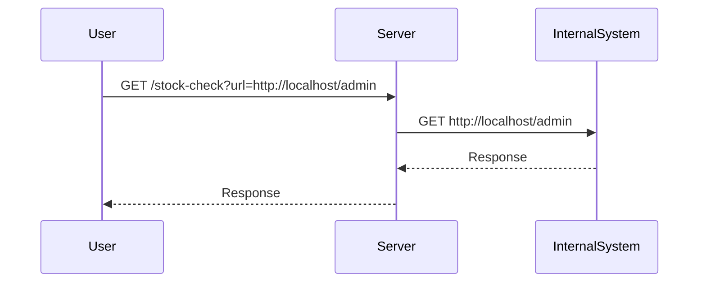
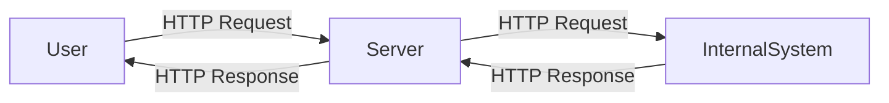

## Introduction to Server-Side Request Forgery (SSRF)

Server-Side Request Forgery (SSRF) is a type of web application vulnerability that allows an attacker to induce the server-side application to make HTTP requests to an arbitrary domain of the attacker’s choosing. This can lead to unauthorized access to internal systems, sensitive data exposure, and even remote code execution. The core issue lies in the fact that the server makes requests on behalf of the client, and if the input is not properly validated, it can be manipulated to target unintended resources.

### What is SSRF?

SSRF occurs when an application takes user input and uses it as part of an HTTP request made by the server. If the input is not sanitized or validated correctly, an attacker can manipulate the input to point to internal resources or other unintended targets. This can result in the server making requests to internal IP addresses, localhost, or even external domains controlled by the attacker.

#### Why Does SSRF Matter?

SSRF is significant because it can bypass traditional network security measures such as firewalls and intrusion detection systems. Since the requests originate from the server itself, they often appear legitimate and can easily traverse internal networks. This can lead to:

- **Data Exposure**: Internal systems may contain sensitive information that should not be accessible from the internet.
- **Internal Network Reconnaissance**: An attacker can use SSRF to map out internal network structures and identify vulnerable services.
- **Remote Code Execution**: In some cases, SSRF can be used to execute commands on the server or other internal systems.

### How SSRF Works Under the Hood

To understand SSRF, let's break down the typical scenario:

1. **User Input**: The application accepts user input, which is intended to be used as part of an HTTP request.
2. **Server Processing**: The server processes the input and constructs an HTTP request based on the user-provided data.
3. **Request Execution**: The server sends the constructed HTTP request to the specified destination.
4. **Response Handling**: The server receives the response and processes it accordingly.

If the user input is not properly validated, an attacker can manipulate the input to point to internal resources or other unintended targets.

### Real-World Examples of SSRF

Recent real-world examples of SSRF vulnerabilities include:

- **CVE-2021-21972**: A vulnerability in the Jenkins plugin `Blue Ocean` allowed attackers to perform SSRF attacks. By manipulating the `JENKINS_URL` environment variable, attackers could make requests to internal systems.
- **CVE-2020-14882**: A vulnerability in the `Apache Struts` framework allowed attackers to perform SSRF attacks. By manipulating the `Content-Type` header, attackers could make requests to internal systems.

These examples highlight the importance of proper validation and sanitization of user input to prevent SSRF attacks.

### Lab Setup: Basic SSRF Against a Local Server

In this lab, we will explore a basic SSRF vulnerability where the server makes requests to an internal system based on user input. The goal is to manipulate the input to access the admin interface and delete a specific user.

#### Lab Environment

The lab environment consists of a web application with a stock check feature. This feature fetches data from an internal system based on user input. The application is vulnerable to SSRF because it does not properly validate the input.

#### Accessing the Lab

To access the lab, follow these steps:

1. Visit the URL `https://portswigger.net/web-security`.
2. Sign up for an account if you don't already have one.
3. Log in to your account.
4. Navigate to the Academy section.
5. Select the learning path for Server-Side Request Forgery.
6. Click on the first lab titled "Basic SSRF against the local server".

### Vulnerable Feature: Stock Check Functionality

The vulnerable feature in this lab is the stock check functionality. The application allows users to input a URL, which the server then uses to fetch data from an internal system. The goal is to manipulate this input to access the admin interface and delete the user `Carlos`.

#### Understanding the Vulnerability

The vulnerability arises because the server does not properly validate the input URL. An attacker can manipulate the input to point to internal resources or other unintended targets. In this case, the attacker aims to access the admin interface at `http://localhost/admin` and delete the user `Carlos`.

### Exploiting the Vulnerability

To exploit the vulnerability, follow these steps:

1. **Identify the Vulnerable Parameter**: The vulnerable parameter is the stock check URL.
2. **Manipulate the Input**: Change the stock check URL to `http://localhost/admin`.
3. **Access the Admin Interface**: The server will make a request to `http://localhost/admin`, allowing the attacker to access the admin interface.
4. **Delete the User**: Once inside the admin interface, delete the user `Carlos`.

#### Full HTTP Request and Response

Let's look at the full HTTP request and response for this exploitation:

```http
GET /stock-check?url=http://localhost/admin HTTP/1.1
Host: vulnerable-app.example.com
User-Agent: Mozilla/5.0 (Windows NT 10.0; Win64; x64) AppleWebKit/537.36 (KHTML, like Gecko) Chrome/91.0.4472.124 Safari/537.36
Accept: text/html,application/xhtml+xml,application/xml;q=0.9,image/avif,image/webp,image/apng,*/*;q=0.8,application/signed-exchange;v=b3;q=0.9
Accept-Language: en-US,en;q=0.9
Connection: close

HTTP/1.1 200 OK
Date: Tue, 14 Sep 2021 12:00:00 GMT
Server: Apache/2.4.41 (Ubuntu)
Content-Type: text/html; charset=UTF-8
Content-Length: 1234
Connection: close

<!DOCTYPE html>
<html>
<head>
    <title>Admin Interface</title>
</head>
<body>
    <h1>Admin Interface</h1>
    <form action="/admin/delete-user" method="POST">
        <input type="text" name="username" value="Carlos">
        <input type="submit" value="Delete User">
    </form>
</body>
</html>
```

### How to Prevent / Defend Against SSRF

Preventing SSRF requires a combination of input validation, proper configuration, and secure coding practices. Here are some key strategies:

#### Input Validation

Ensure that user input is properly validated before being used in HTTP requests. This includes:

- **Whitelisting**: Only allow specific, trusted URLs.
- **Blacklisting**: Block known malicious or suspicious URLs.
- **Sanitization**: Remove or escape potentially harmful characters.

#### Secure Coding Practices

Implement secure coding practices to prevent SSRF:

- **Use HTTPS**: Ensure that all requests are made over HTTPS to prevent man-in-the-middle attacks.
- **Validate Hostnames**: Validate that the hostname in the URL is a valid external domain and not an internal IP address or `localhost`.
- **Rate Limiting**: Implement rate limiting to prevent abuse of the feature.

#### Configuration Hardening

Harden the server configuration to prevent SSRF:

- **Firewall Rules**: Configure firewall rules to block outgoing requests to internal IP addresses.
- **Network Segmentation**: Segment the network to isolate internal systems from the internet-facing servers.

#### Detection and Monitoring

Monitor for signs of SSRF attacks:

- **Log Analysis**: Analyze logs for unusual patterns of requests to internal systems.
- **IDS/IPS**: Use Intrusion Detection Systems (IDS) and Intrusion Prevention Systems (IPS) to detect and block SSRF attempts.

### Complete Example: Vulnerable vs. Secure Code

Here is a comparison of vulnerable and secure code for handling user input in an SSRF scenario:

#### Vulnerable Code

```python
import requests

def stock_check(url):
    response = requests.get(url)
    return response.text

# Example usage
user_input = "http://localhost/admin"
print(stock_check(user_input))
```

#### Secure Code

```python
import requests
import re

def stock_check(url):
    # Whitelist only external domains
    if not re.match(r'^https://[a-zA-Z0-9.-]+\.[a-zA-Z]{2,}$', url):
        raise ValueError("Invalid URL")
    
    response = requests.get(url)
    return response.text

# Example usage
user_input = "http://localhost/admin"
try:
    print(stock_check(user_input))
except ValueError as e:
    print(e)
```

### Mermaid Diagrams

#### Attack Chain Diagram



#### Network Topology Diagram



### Practice Labs

For hands-on practice with SSRF, consider the following labs:

- **PortSwigger Web Security Academy**: Offers a comprehensive set of labs covering various web security topics, including SSRF.
- **OWASP Juice Shop**: A deliberately insecure web application for practicing web security skills.
- **DVWA (Damn Vulnerable Web Application)**: A PHP/MySQL web application that is riddled with vulnerabilities for educational purposes.

By thoroughly understanding SSRF and practicing with real-world examples, you can better defend against this type of vulnerability in your applications.

---
<!-- nav -->
[[Web Security (PortSwigger)/09-Server-Side Request Forgery (SSRF)/02-Lab 1 Basic SSRF against the local server/00-Overview|Overview]] | [[Web Security (PortSwigger)/09-Server-Side Request Forgery (SSRF)/02-Lab 1 Basic SSRF against the local server/02-Practice Questions & Answers|Practice Questions & Answers]]
