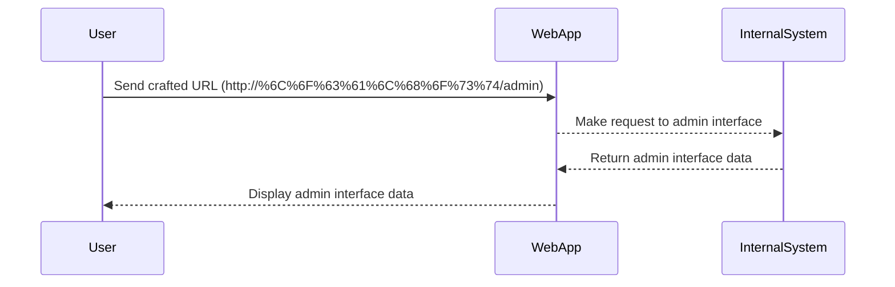

## Understanding Blacklist-Based Input Filters

Blacklist-based input filters are a common approach to mitigate SSRF vulnerabilities. These filters block specific patterns or domains that are known to be malicious. However, blacklists are inherently incomplete and can be bypassed using various techniques.

### How Blacklist-Based Filters Work

A blacklist-based filter works by checking the input against a list of known malicious patterns or domains. If the input matches any of these patterns, it is blocked. Otherwise, it is allowed to proceed.

#### Example Blacklist

Consider a simple blacklist that blocks the following patterns:

- `localhost`
- `127.0.0.1`
- `::1`

If the user input contains any of these patterns, the request is blocked.

### Bypassing Blacklist-Based Filters

Despite their simplicity, blacklist-based filters can be bypassed using various techniques. Some common bypass methods include:

- **URL Encoding**: Encode the banned characters to avoid detection.
- **IP Address Manipulation**: Use different representations of the same IP address.
- **Domain Name Manipulation**: Use alternative domain name representations.
- **HTTP Headers**: Manipulate HTTP headers to bypass filters.

#### Example Bypass Techniques

1. **URL Encoding**:
   - Original: `http://localhost/admin`
   - Encoded: `http://%6C%6F%63%61%6C%68%6F%73%74/admin`

2. **IP Address Manipulation**:
   - Original: `http://127.0.0.1/admin`
   - Alternative: `http://[::1]/admin`

3. **Domain Name Manipulation**:
   - Original: `http://localhost/admin`
   - Alternative: `http://loca.lhost/admin`

4. **HTTP Headers**:
   - Manipulate headers like `Host` to bypass filters.

### Complete Example

Let's walk through a complete example of exploiting an SSRF vulnerability with a blacklist-based input filter.

#### Step 1: Identify the Vulnerable Parameter

Identify the parameter that is vulnerable to SSRF. In this case, it is the stock check URL.

#### Step 2: Craft the Exploit

Craft the exploit to bypass the blacklist-based filter. For example, use URL encoding to bypass the filter.

```python
import requests

url = "http://%6C%6F%63%61%6C%68%6F%73%74/admin"
response = requests.get(url)
print(response.text)
```

#### Step 3: Execute the Exploit

Execute the exploit and observe the response. If successful, you should be able to access the admin interface and delete the user "Carlos."

### Mermaid Diagram: SSRF Attack Chain



---
<!-- nav -->
[[06-Server-Side Request Forgery (SSRF)|Server-Side Request Forgery (SSRF)]] | [[Web Security (PortSwigger)/09-Server-Side Request Forgery (SSRF)/04-Lab 3 SSRF with blacklist based input filter/00-Overview|Overview]] | [[08-Understanding URL Encoding|Understanding URL Encoding]]
