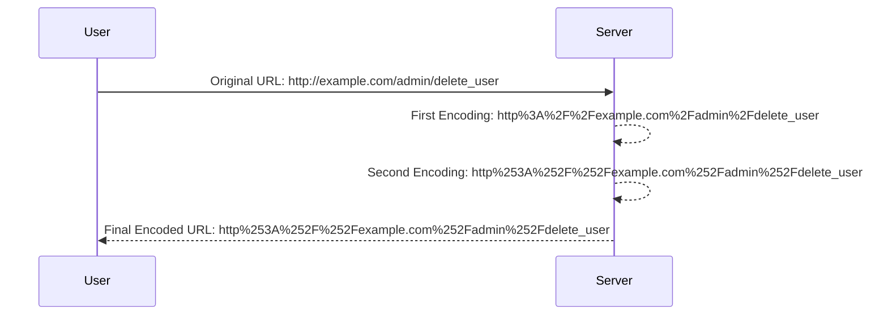

## Understanding URL Encoding

URL encoding is a mechanism used to encode special characters in URLs. Special characters, such as spaces and certain punctuation marks, are replaced with a percent sign followed by two hexadecimal digits representing the ASCII code of the character.

### Why URL Encoding Matters

URL encoding is crucial for ensuring that URLs are correctly interpreted by web servers and browsers. Without proper URL encoding, special characters can cause issues such as malformed URLs or unintended behavior.

### How URL Encoding Works

URL encoding replaces special characters with their corresponding percent-encoded values. For example, a space character is encoded as `%20`, and a forward slash is encoded as `%2F`.

#### Example of URL Encoding

Let's consider the URL `http://example.com/admin/delete_user`. If we need to URL encode this string, it would become `http%3A%2F%2Fexample.com%2Fadmin%2Fdelete_user`.

### Double URL Encoding

In some scenarios, double URL encoding may be necessary. Double URL encoding means encoding a string twice. For example, the URL `http://example.com/admin/delete_user` might first be encoded as `http%3A%2F%2Fexample.com%2Fadmin%2Fdelete_user`, and then encoded again as `http%253A%252F%252Fexample.com%252Fadmin%252Fdelete_user`.

### Practical Example

Let's walk through the practical example provided in the transcript:

```python
# Original URL
original_url = "http://example.com/admin/delete_user"

# First URL encoding
first_encoded_url = original_url.replace(":", "%3A").replace("/", "%2F")
print(first_encoded_url)  # Output: http%3A%2F%2Fexample.com%2Fadmin%2Fdelete_user

# Second URL encoding
second_encoded_url = first_encoded_url.replace("%", "%25")
print(second_encoded_url)  # Output: http%253A%252F%252Fexample.com%252Fadmin%252Fdelete_user
```

### Why Double URL Encoding is Necessary

Double URL encoding is often necessary when dealing with input filters that perform single URL decoding. By encoding the URL twice, we ensure that the final decoded URL matches the intended target.

### Diagram: URL Encoding Process



---
<!-- nav -->
[[07-Understanding Blacklist-Based Input Filters|Understanding Blacklist-Based Input Filters]] | [[Web Security (PortSwigger)/09-Server-Side Request Forgery (SSRF)/04-Lab 3 SSRF with blacklist based input filter/00-Overview|Overview]] | [[Web Security (PortSwigger)/09-Server-Side Request Forgery (SSRF)/04-Lab 3 SSRF with blacklist based input filter/09-Practice Questions & Answers|Practice Questions & Answers]]
