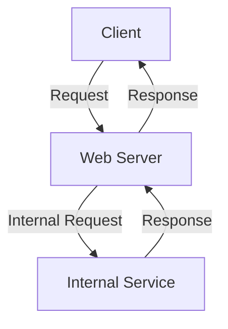
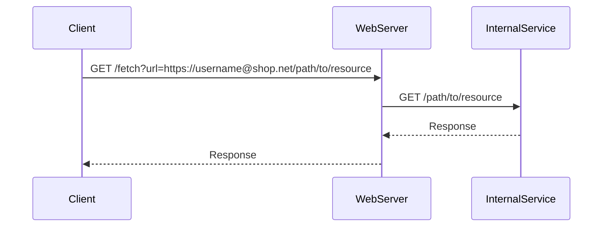

## Server-Side Request Forgery (SSRF)

### Introduction to SSRF

Server-Side Request Forgery (SSRF) is a type of web security vulnerability that allows an attacker to induce the server-side application to make HTTP requests to an arbitrary domain of the attacker’s choosing. This can lead to unauthorized access to internal systems, sensitive data exposure, and other malicious activities. SSRF attacks exploit the trust relationship between the server and the client, often leveraging misconfigurations or insufficient input validation.

### Understanding URL Parsing

To understand SSRF vulnerabilities, it is crucial to comprehend how URL parsing works. A Uniform Resource Locator (URL) is a string that identifies a resource on the internet. The structure of a URL includes several components such as the scheme (http, https), host (domain name or IP address), port, path, query parameters, and fragment identifier.

#### Example of a URL
```plaintext
https://www.example.com/path/to/resource?param1=value1&param2=value2#fragment
```

- **Scheme**: `https`
- **Host**: `www.example.com`
- **Port**: Default for HTTPS (443)
- **Path**: `/path/to/resource`
- **Query Parameters**: `param1=value1&param2=value2`
- **Fragment Identifier**: `fragment`

### URL Parsing Variants

Different programming languages and libraries may parse URLs slightly differently, leading to potential vulnerabilities. For instance, some parsers might interpret certain characters or patterns in ways that are not immediately obvious.

#### Example of URL Parsing Differences
Consider the following URL:
```plaintext
https://username@www.example.com/path/to/resource
```

In some parsers, the `username` part might be interpreted as a user credential, while others might treat it as part of the host. This ambiguity can be exploited in SSRF attacks.

### Whitelist-Based Input Filtering

Whitelist-based input filtering is a common defense mechanism used to prevent SSRF attacks. In this approach, the server only allows specific domains or IP addresses to be accessed. However, attackers can sometimes bypass these filters through clever URL manipulation.

#### Example of Whitelist Filtering
Suppose a server has a whitelist that only allows requests to `shop.net`. An attacker might try to exploit this by crafting a URL that appears to be valid but is actually interpreted differently by the URL parser.

### Exploiting URL Parsing Vulnerabilities

Let's delve into the specific scenario described in the lecture transcript. The server is configured to allow requests to `shop.net`, but an attacker tries to access an external service by manipulating the URL.

#### Example Scenario
The attacker crafts a URL like this:
```plaintext
https://username@shop.net/path/to/resource
```

The server's URL parser might interpret `username@shop.net` as a valid URL, where `username` is treated as a user credential and `shop.net` is the host. This could allow the attacker to bypass the whitelist filter and access an external service.

### Real-World Examples

Several real-world vulnerabilities and breaches have been attributed to SSRF attacks. Here are a few notable examples:

#### CVE-2021-21972: Amazon S3 SSRF Vulnerability
In 2021, a vulnerability was discovered in Amazon S3 that allowed attackers to perform SSRF attacks. By manipulating the `x-amz-meta-` metadata headers, attackers could induce the server to make requests to internal services, potentially exposing sensitive data.

#### CVE-2020-14882: Kubernetes API Server SSRF
Another significant SSRF vulnerability was found in the Kubernetes API server. Attackers could exploit this vulnerability to read sensitive files from the node filesystem by manipulating the `host` field in pod specifications.

### Detailed Example of SSRF Exploit

Let's walk through a detailed example of how an SSRF attack might be carried out, including the full HTTP request and response.

#### Vulnerable Code
```python
import requests

def fetch_data(url):
    response = requests.get(url)
    return response.text

url = "https://username@shop.net/path/to/resource"
data = fetch_data(url)
print(data)
```

#### Full HTTP Request
```http
GET /path/to/resource HTTP/1.1
Host: shop.net
User-Agent: python-requests/2.25.1
Accept-Encoding: gzip, deflate
Accept: */*
Connection: keep-alive
Authorization: Basic dXNlcm5hbWU6
```

#### Full HTTP Response
```http
HTTP/1.1 200 OK
Date: Mon, 01 Jan 2024 00:00:00 GMT
Content-Type: text/html; charset=UTF-8
Content-Length: 1234
Connection: keep-alive

<!DOCTYPE html>
<html>
<head>
    <title>Resource</title>
</head>
<body>
    <h1>Welcome to shop.net</h1>
    <p>This is a sample resource.</p>
</body>
</html>
```

### How to Prevent / Defend Against SSRF

#### Secure Coding Practices
1. **Validate and Sanitize Inputs**: Ensure that all inputs are validated against a strict whitelist of allowed domains.
2. **Use Secure Libraries**: Utilize libraries that have robust URL parsing capabilities and are regularly updated to patch vulnerabilities.
3. **Avoid External Requests**: Minimize the number of external requests made by the server. If possible, use internal APIs or services.

#### Example of Secure Code
```python
import requests

def fetch_data(url):
    allowed_domains = ["shop.net"]
    parsed_url = urlparse(url)
    
    if parsed_url.hostname not in allowed_domains:
        raise ValueError("Invalid domain")
    
    response = requests.get(url)
    return response.text

url = "https://shop.net/path/to/resource"
data = fetch_data(url)
print(data)
```

#### Configuration Hardening
1. **Network Segmentation**: Segment the network to limit the reachability of internal services from the internet-facing servers.
2. **Firewall Rules**: Implement firewall rules to restrict outbound traffic to only necessary destinations.
3. **Monitoring and Logging**: Monitor and log all external requests made by the server to detect and respond to potential SSRF attacks.

### Mermaid Diagrams

#### Network Topology


#### Attack Chain


### Practice Labs

For hands-on practice with SSRF vulnerabilities, consider the following well-known labs:

- **PortSwigger Web Security Academy**: Offers a comprehensive SSRF module with interactive challenges.
- **OWASP Juice Shop**: Contains various SSRF-related challenges and vulnerabilities.
- **DVWA (Damn Vulnerable Web Application)**: Provides a range of web application vulnerabilities, including SSRF.

By thoroughly understanding the concepts, mechanisms, and defenses related to SSRF, you can better protect your applications from these types of attacks.

---
<!-- nav -->
[[02-Bypassing Whitelist-Based Filtering|Bypassing Whitelist-Based Filtering]] | [[Web Security (PortSwigger)/09-Server-Side Request Forgery (SSRF)/05-Lab 4 SSRF with whitelist based input filter/00-Overview|Overview]] | [[04-Understanding Whitelist-Based Input Filtering|Understanding Whitelist-Based Input Filtering]]
