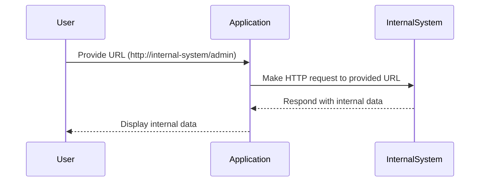

## Exploiting the Vulnerability

### Step-by-Step Exploitation

Let's walk through the steps to exploit the SSRF vulnerability in our lab:

1. **Identify the Vulnerable Endpoint**: Identify the endpoint in the application that accepts a URL as input and makes an HTTP request to that URL.
2. **Craft the Attack Payload**: Craft a URL that points to an internal system and includes a path to the admin interface.
3. **Submit the Payload**: Submit the crafted URL to the vulnerable endpoint.
4. **Bypass Defenses**: Bypass any defenses that the application has in place to prevent SSRF attacks.
5. **Access Internal Systems**: Access the internal system and retrieve sensitive data.

### Crafting the Attack Payload

In our lab, the vulnerable endpoint is `/product/next_product`. The application accepts a URL as input and makes an HTTP request to that URL. To exploit this, we need to craft a URL that points to an internal system and includes a path to the admin interface.

For example, the URL might look like this:

```
http://internal-system/admin
```

### Submitting the Payload

Once we have crafted the attack payload, we need to submit it to the vulnerable endpoint. In our lab, we will submit the URL to the `/product/next_product` endpoint.

```python
import requests

def fetch_data(url):
    response = requests.get(url)
    return response.text

# Example usage
url = "http://internal-system/admin"
data = fetch_data(url)
print(data)
```

### Bypassing Defenses

To bypass defenses, we need to ensure that the application does not validate the input URL. In our lab, the application validates the URL against a list of allowed domains. To bypass this, we can use URL encoding to obfuscate the URL.

For example, we can URL encode the URL to bypass the validation:

```python
from urllib.parse import quote

url = "http://internal-system/admin"
encoded_url = quote(url)
print(encoded_url)
```

### Accessing Internal Systems

Once we have submitted the crafted URL and bypassed any defenses, the application will make an HTTP request to the internal system and retrieve sensitive data.



---
<!-- nav -->
[[Web Security (PortSwigger)/09-Server-Side Request Forgery (SSRF)/06-Lab 5 SSRF with filter bypass via open redirection vulnerability/02-Detection and Prevention|Detection and Prevention]] | [[Web Security (PortSwigger)/09-Server-Side Request Forgery (SSRF)/06-Lab 5 SSRF with filter bypass via open redirection vulnerability/00-Overview|Overview]] | [[Web Security (PortSwigger)/09-Server-Side Request Forgery (SSRF)/06-Lab 5 SSRF with filter bypass via open redirection vulnerability/04-Understanding the Vulnerability|Understanding the Vulnerability]]
