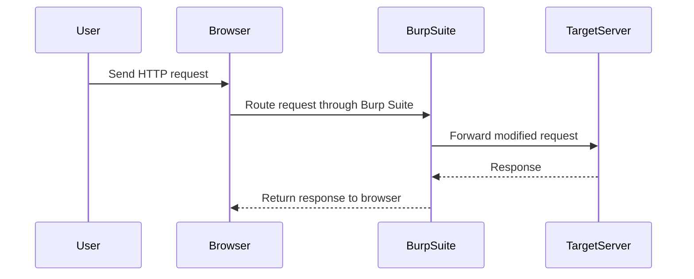

## Lab Setup and Tools

For this lab, we will be using Burp Suite Professional, specifically the Burp Collaborator feature. Burp Collaborator is a tool that helps in detecting out-of-band SSRF vulnerabilities by providing a unique domain that the server can be induced to contact. The unique domain is monitored by Burp Suite, allowing us to detect when the server makes a request to it.

### Setting Up Burp Suite

1. **Start Burp Suite**: Open Burp Suite Professional and ensure that the proxy is running.
2. **Configure FoxyProxy**: Set up FoxyProxy to route traffic through Burp Suite.
3. **Enable Intercept**: Turn on the intercept feature in the proxy tab to capture and modify HTTP requests.
4. **Use Repeater**: Use the Repeater tool to manually send and modify HTTP requests.

---
<!-- nav -->
[[Web Security (PortSwigger)/09-Server-Side Request Forgery (SSRF)/07-Lab 6 Blind SSRF with out of band detection/05-How to Prevent  Defend Against SSRF|How to Prevent  Defend Against SSRF]] | [[Web Security (PortSwigger)/09-Server-Side Request Forgery (SSRF)/07-Lab 6 Blind SSRF with out of band detection/00-Overview|Overview]] | [[Web Security (PortSwigger)/09-Server-Side Request Forgery (SSRF)/07-Lab 6 Blind SSRF with out of band detection/07-Real-World Examples|Real-World Examples]]
