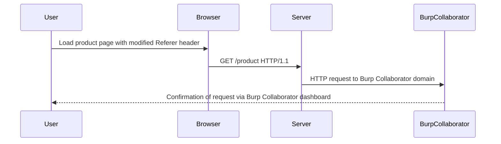

## Understanding the Vulnerability

### Vulnerable Parameter: Referer Header

In this lab, the vulnerable parameter is the `Referer` header. When a product page is loaded, the server reads the `Referer` header and uses it to make an HTTP request to the specified URL.

### Goal of the Lab

The objective is to manipulate the `Referer` header to cause the server to make an HTTP request to the Burp Collaborator server. This will allow us to confirm that the request was made successfully, even though the response is not returned to the attacker.

### HTTP Request and Response

Let's break down the HTTP request and response involved in this process:

#### HTTP Request

```http
GET /product HTTP/1.1
Host: vulnerable-website.com
Referer: http://burpcollaborator.example.com/
```

#### HTTP Response

```http
HTTP/1.1 200 OK
Date: Tue, 01 Aug 2023 12:00:00 GMT
Content-Type: text/html; charset=UTF-8
Content-Length: 1234
Connection: keep-alive

<!DOCTYPE html>
<html>
<head>
    <title>Product Page</title>
</head>
<body>
    <h1>Product Details</h1>
    <p>This is a product page.</p>
</body>
</html>
```

### Out-of-Band Detection

To confirm that the request was made successfully, we use an external service like Burp Collaborator. Burp Collaborator is a service provided by PortSwigger that allows you to detect when your server makes a request to a specific domain.

### Steps to Exploit the Vulnerability

1. **Set Up Burp Collaborator**: Obtain a unique domain from Burp Collaborator.
2. **Manipulate the Referer Header**: Modify the `Referer` header to point to the Burp Collaborator domain.
3. **Trigger the Request**: Load the product page with the modified `Referer` header.
4. **Detect the Request**: Check the Burp Collaborator dashboard to see if the request was made.

### Complete Example

Here is a complete example of how to exploit the vulnerability:

#### Step 1: Set Up Burp Collaborator

1. Open Burp Suite.
2. Go to the "Collaborator" tab.
3. Click on "Get a new client ID."
4. Copy the generated domain (e.g., `example-client-id.burpcollaborator.com`).

#### Step 2: Manipulate the Referer Header

Modify the `Referer` header to point to the Burp Collaborator domain:

```http
GET /product HTTP/1.1
Host: vulnerable-website.com
Referer: http://example-client-id.burpcollaborator.com/
```

#### Step 3: Trigger the Request

Load the product page with the modified `Referer` header. You can use tools like `curl` or a browser extension to modify the `Referer` header.

```bash
curl -H "Referer: http://example-client-id.burpcollaborator.com/" http://vulnerable-website.com/product
```

#### Step 4: Detect the Request

Check the Burp Collaborator dashboard to see if the request was made. If the request was successful, you should see an entry indicating that the server made a request to the Burp Collaborator domain.

### Mermaid Diagram: Attack Flow



---
<!-- nav -->
[[09-Understanding the Lab Exercise|Understanding the Lab Exercise]] | [[Web Security (PortSwigger)/09-Server-Side Request Forgery (SSRF)/07-Lab 6 Blind SSRF with out of band detection/00-Overview|Overview]] | [[Web Security (PortSwigger)/09-Server-Side Request Forgery (SSRF)/07-Lab 6 Blind SSRF with out of band detection/11-Practice Questions & Answers|Practice Questions & Answers]]
